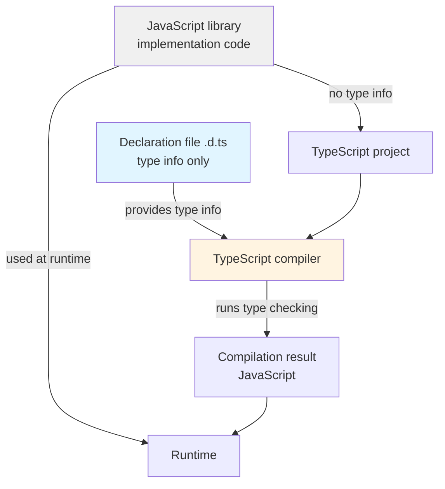
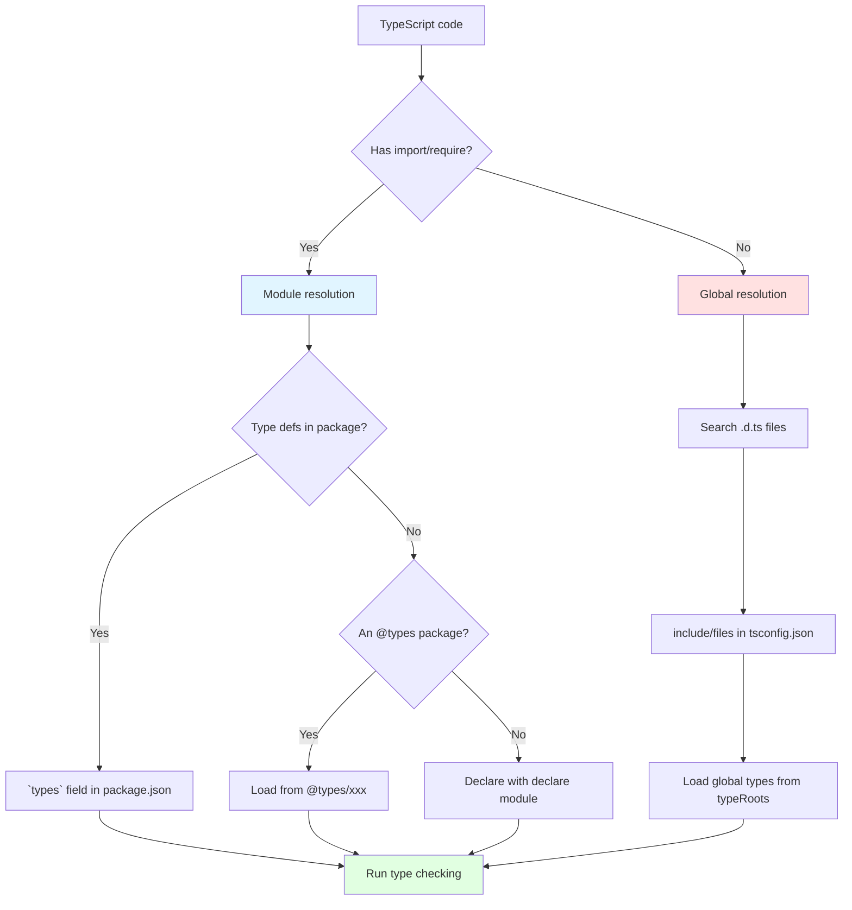

# Complete Guide to Declaration Files

> Everything about how `.d.ts` files work and how to write them. This guide covers DefinitelyTyped, ambient declarations, module augmentation, Triple-Slash Directives, automatic type-definition generation, and best practices for library authors.

## What You Will Learn in This Chapter

1. **The basics of declaration files** -- the role of `.d.ts` files, why they are needed, and the separation of type information
2. **All variants of the `declare` keyword** -- when to use module, namespace, global, var, function, and class
3. **Ambient Declarations** -- the mechanism and underlying principles of type declarations without implementations
4. **The DefinitelyTyped ecosystem** -- how `@types` packages work, how to search them, and how to contribute
5. **Module augmentation and global augmentation** -- safe techniques for extending the type definitions of existing libraries
6. **Triple-Slash Directives** -- how `/// <reference>` works and its place in modern TypeScript
7. **Automatic generation of type definitions** -- `tsc --declaration`, dts-bundle-generator, and API Extractor
8. **Best practices for library authors** -- packaging, versioning, and maintaining type definitions
9. **Troubleshooting** -- how to resolve missing types, type conflicts, and performance problems

## Prerequisites

To get the most out of this guide, the following knowledge will help:

- Basic programming knowledge
- Understanding of related fundamental concepts
- Familiarity with the contents of [Type Challenges](./03-type-challenges.md)

---

## Table of Contents

1. [The Basics and Role of Declaration Files](#1-the-basics-and-role-of-declaration-files)
2. [All Variants of the `declare` Keyword](#2-all-variants-of-the-declare-keyword)
3. [How Ambient Declarations Work](#3-how-ambient-declarations-work)
4. [The DefinitelyTyped Ecosystem](#4-the-definitelytyped-ecosystem)
5. [Module Augmentation and Global Augmentation](#5-module-augmentation-and-global-augmentation)
6. [Triple-Slash Directives](#6-triple-slash-directives)
7. [Automatic Generation of Type Definitions](#7-automatic-generation-of-type-definitions)
8. [Best Practices for Library Authors](#8-best-practices-for-library-authors)
9. [Troubleshooting](#9-troubleshooting)
10. [Exercises](#10-exercises)
11. [Summary](#11-summary)

---

## 1. The Basics and Role of Declaration Files

### 1.1 Why Declaration Files Are Necessary

TypeScript is a superset of JavaScript, but existing JavaScript libraries do not carry type information. Declaration files (`.d.ts`) provide a mechanism for **adding type information to JavaScript code after the fact**.

```
[Problem]
A JavaScript library (lodash.js) has no type information
  ↓
When used in a TypeScript project, everything becomes `any`
  ↓
Type safety is lost

[Solution]
Provide a declaration file (lodash.d.ts)
  ↓
It contains only type information (no implementation code)
  ↓
The TypeScript compiler can perform type checking
```

### Diagram 1: The Declaration File Ecosystem



### 1.2 Characteristics of Declaration Files

| Characteristic | Description |
|------|------|
| **Extension** | `.d.ts` (short for "declaration TypeScript") |
| **No implementation code** | Contains only type information; no executable code |
| **`declare` keyword** | Tells the compiler the type of values that exist externally |
| **Excluded from compilation** | `.d.ts` files are not compiled to JavaScript |
| **Type contracts** | A design pattern that separates implementation from interface |

### Code Example 1: Structure of a Basic `.d.ts` File

```typescript
// types/math-utils.d.ts

// Function declarations
declare function add(a: number, b: number): number;
declare function multiply(a: number, b: number): number;
declare function divide(a: number, b: number): number | null;

// Variable declarations
declare const PI: number;
declare const E: number;
declare let debugMode: boolean;

// Class declaration
declare class Calculator {
  constructor(initial?: number);
  add(n: number): this;
  subtract(n: number): this;
  multiply(n: number): this;
  divide(n: number): this;
  result(): number;
  reset(): this;
}

// Interface (no `declare` needed)
interface MathOptions {
  precision: number;
  roundingMode: "ceil" | "floor" | "round" | "trunc";
  useRadians?: boolean;
}

// Type alias (no `declare` needed)
type MathOperation = "add" | "subtract" | "multiply" | "divide";

// Enum declaration
declare enum MathMode {
  Strict,
  Loose,
  Scientific
}

// Namespace declaration
declare namespace MathUtils {
  function randomInt(min: number, max: number): number;
  function clamp(value: number, min: number, max: number): number;

  namespace Advanced {
    function factorial(n: number): number;
    function fibonacci(n: number): number;
  }
}
```

**Key points:**
- The `declare` keyword states that "this value exists externally."
- `interface` and `type` are already type-level constructs, so `declare` is unnecessary for them.
- For classes and functions, you only write the type signatures, not the implementation.

### 1.3 The Difference Between `.d.ts` Files and `.ts` Files

```
┌─────────────────────────────────────────────────────────────┐
│ .ts file (regular TypeScript)                               │
├─────────────────────────────────────────────────────────────┤
│ ✓ Contains implementation code                              │
│ ✓ Contains type information                                 │
│ ✓ Compiled to JavaScript                                    │
│ ✓ Executed at runtime                                       │
└─────────────────────────────────────────────────────────────┘

┌─────────────────────────────────────────────────────────────┐
│ .d.ts file (declaration file)                               │
├─────────────────────────────────────────────────────────────┤
│ ✗ No implementation code (any is removed at compile time)   │
│ ✓ Contains only type information                            │
│ ✗ Not compiled to JavaScript                                │
│ ✗ Not used at runtime (only used during compilation)        │
└─────────────────────────────────────────────────────────────┘
```

### Code Example 2: Correspondence Between `.ts` and `.d.ts`

```typescript
// math-utils.ts (implementation file)
export const PI = 3.14159;

export function add(a: number, b: number): number {
  return a + b;  // Has implementation code
}

export class Calculator {
  private value = 0;

  constructor(initial: number = 0) {
    this.value = initial;
  }

  add(n: number): this {
    this.value += n;
    return this;
  }

  result(): number {
    return this.value;
  }
}
```

```typescript
// math-utils.d.ts (auto-generated or hand-written)
export declare const PI: number;

export declare function add(a: number, b: number): number;
// No implementation code, only the type signature

export declare class Calculator {
  constructor(initial?: number);
  add(n: number): this;
  result(): number;
  // private fields are not part of the public API and may be omitted
}
```

### 1.4 When Declaration Files Are Needed

```
[Case 1] Adding types to a JavaScript library
  Examples: jQuery, lodash, moment, and other older libraries without types
  → @types/xxx package or your own .d.ts file

[Case 2] Adding types for global variables
  Examples: process.env, window.__INITIAL_STATE__, Webpack's `define`
  → Declare them in something like global.d.ts

[Case 3] Typing imports of non-JS files
  Example: import logo from "./logo.png"
  → Define a type with `declare module "*.png"`

[Case 4] Distributing type definitions for a library you wrote
  Example: A TypeScript library published as an npm package
  → Use `tsc --declaration` to auto-generate `.d.ts`

[Case 5] Sharing type information within a monorepo
  Example: Multiple packages share common type definitions
  → Consolidate `.d.ts` files in a shared-types package
```

---

## 2. All Variants of the `declare` Keyword

### 2.1 The Role of `declare`

The `declare` keyword tells the compiler, "This value exists somewhere externally; please use it for type checking."

```typescript
// Without declare → error: implementation required
function add(a: number, b: number): number;  // ❌ no implementation

// With declare → OK: declares external existence
declare function add(a: number, b: number): number;  // ✅ type info only
```

### Diagram 2: How the `declare` Keyword Works

```
┌──────────────────────────────────────────────────────────┐
│ TypeScript compiler's perspective                         │
├──────────────────────────────────────────────────────────┤
│                                                           │
│  declare function foo(): void;                            │
│          ↓                                                │
│  "A function called `foo` exists somewhere"               │
│  "It takes no arguments and returns void"                 │
│  "Don't check the implementation (it must be external)"   │
│          ↓                                                │
│  Code that calls foo() can be type-checked                │
│                                                           │
└──────────────────────────────────────────────────────────┘
```

### 2.2 `declare function` (Function Declarations)

```typescript
// types/api.d.ts

// Simple function
declare function fetchData(url: string): Promise<unknown>;

// Overloads are also possible
declare function parse(data: string): object;
declare function parse(data: Buffer): object;
declare function parse(data: string | Buffer): object;

// Generic function
declare function request<T = unknown>(
  url: string,
  options?: RequestOptions
): Promise<T>;

// Default arguments (expressed at the type level with `?`)
declare function log(message: string, level?: "info" | "warn" | "error"): void;

// Rest parameters
declare function sum(...numbers: number[]): number;

// Callback
declare function addEventListener(
  event: string,
  handler: (e: Event) => void
): void;
```

### 2.3 `declare const/let/var` (Variable Declarations)

```typescript
// types/globals.d.ts

// Constants (most common)
declare const APP_VERSION: string;
declare const API_ENDPOINT: string;
declare const MAX_RETRY: number;

// let (mutable values)
declare let currentUser: User | null;
declare let debugEnabled: boolean;

// var (for older JavaScript code)
declare var jQuery: JQueryStatic;
declare var $: JQueryStatic;

// Object
declare const config: {
  readonly apiKey: string;
  timeout: number;
  retries: number;
};
```

**When to use const vs let:**
```typescript
// Value that doesn't change at runtime → const
declare const BUILD_TIME: string;

// Value that may change at runtime → let
declare let isLoggedIn: boolean;
```

### 2.4 `declare class` (Class Declarations)

```typescript
// types/database.d.ts

declare class Database {
  // Constructor
  constructor(config: DatabaseConfig);

  // Methods (no implementation)
  connect(): Promise<void>;
  disconnect(): Promise<void>;
  query<T = unknown>(sql: string, params?: unknown[]): Promise<T[]>;

  // Properties
  readonly isConnected: boolean;
  timeout: number;

  // Static members
  static create(config: DatabaseConfig): Database;
  static readonly defaultTimeout: number;
}

// Inheritance can also be expressed
declare class SQLDatabase extends Database {
  beginTransaction(): Promise<Transaction>;
  commit(): Promise<void>;
  rollback(): Promise<void>;
}

// Abstract class (in practice, an interface is more common)
declare abstract class BaseRepository<T> {
  abstract findById(id: string): Promise<T | null>;
  abstract save(entity: T): Promise<void>;
  abstract delete(id: string): Promise<void>;
}
```

### 2.5 `declare module` (Module Declarations)

This is one of the most important uses. It defines the types of an entire external module.

```typescript
// types/custom-library.d.ts

// Declare types for the whole module
declare module "custom-library" {
  // Exported types
  export interface Config {
    host: string;
    port: number;
    ssl?: boolean;
  }

  // Exported functions
  export function createClient(config: Config): Client;
  export function parseUrl(url: string): ParsedUrl;

  // Exported class
  export class Client {
    constructor(config: Config);
    connect(): Promise<void>;
    disconnect(): Promise<void>;
    send(data: string): Promise<Response>;
  }

  // Type alias
  export type ConnectionStatus = "connected" | "disconnected" | "connecting";

  // Default export
  export default createClient;
}

// Consumer side
import customLib, { Client, Config } from "custom-library";
// ↑ Type information is now available
```

**Wildcard module declarations:**

```typescript
// types/assets.d.ts

// Image files in general
declare module "*.png" {
  const src: string;
  export default src;
}

declare module "*.jpg" {
  const src: string;
  export default src;
}

declare module "*.svg" {
  const src: string;
  export default src;
}

// When SVGs are imported as React components
declare module "*.svg?component" {
  import { FC, SVGProps } from "react";
  const Component: FC<SVGProps<SVGSVGElement>>;
  export default Component;
}

// CSS Modules
declare module "*.module.css" {
  const classes: { readonly [key: string]: string };
  export default classes;
}

declare module "*.module.scss" {
  const classes: { readonly [key: string]: string };
  export default classes;
}

// JSON files
declare module "*.json" {
  const value: unknown;
  export default value;
}

// YAML files
declare module "*.yaml" {
  const data: Record<string, unknown>;
  export default data;
}

// Web Workers
declare module "*.worker.ts" {
  class WebpackWorker extends Worker {
    constructor();
  }
  export default WebpackWorker;
}
```

### 2.6 `declare namespace` (Namespace Declarations)

```typescript
// types/jquery.d.ts

declare namespace jQuery {
  // Nested namespace
  namespace fn {
    interface JQuery {
      customPlugin(options?: CustomPluginOptions): this;
    }
  }

  // Interface
  interface AjaxSettings {
    url?: string;
    method?: "GET" | "POST" | "PUT" | "DELETE";
    data?: unknown;
    success?: (data: unknown) => void;
  }

  // Functions
  function ajax(settings: AjaxSettings): void;
  function get(url: string): Promise<unknown>;

  // Constants
  const version: string;
}

// Can also be used as a global variable
declare const jQuery: typeof jQuery;
```

**In modern TypeScript, prefer module over namespace:**

```typescript
// Old style (namespace)
declare namespace MyLib {
  function doSomething(): void;
}

// New style (module)
declare module "my-lib" {
  export function doSomething(): void;
}
```

### 2.7 `declare global` (Adding to the Global Scope)

Use this when you want to add global types from inside a module file (a `.d.ts` file with `export`/`import`).

```typescript
// types/global.d.ts

// Add global variables
declare global {
  // Extend the Window object
  interface Window {
    __INITIAL_STATE__: {
      user: User | null;
      config: AppConfig;
    };
    gtag: (command: string, ...args: unknown[]) => void;
    dataLayer: unknown[];
  }

  // Global functions
  function gtag(command: "event", action: string, params?: object): void;
  function gtag(command: "config", targetId: string, params?: object): void;

  // Global types
  type JsonValue = string | number | boolean | null | JsonObject | JsonArray;
  interface JsonObject { [key: string]: JsonValue }
  interface JsonArray extends Array<JsonValue> {}

  // Extending Array (for adding prototype methods)
  interface Array<T> {
    last(): T | undefined;
    first(): T | undefined;
  }

  // Extending String
  interface String {
    capitalize(): string;
    truncate(length: number): string;
  }
}

// Dummy export to make this file a module
export {};
```

**Important:** To use `declare global`, the file must be a module (e.g., contain an `export {}`).

### 2.8 `declare enum` (Enum Declarations)

```typescript
// types/enums.d.ts

// Regular enum
declare enum LogLevel {
  Debug,
  Info,
  Warn,
  Error
}

// String enum
declare enum Status {
  Pending = "PENDING",
  InProgress = "IN_PROGRESS",
  Completed = "COMPLETED",
  Failed = "FAILED"
}

// const enum (inlined at compile time)
declare const enum Direction {
  Up,
  Down,
  Left,
  Right
}
```

**Note:** `declare enum` can only be used in an ambient context.

### Comparison Table 1: Kinds of `declare` and Their Uses

| Declaration | Use | Scope | Example |
|---------|------|---------|-----|
| `declare function` | Function type declaration | Global / module | `declare function log(msg: string): void;` |
| `declare const` | Constant type declaration | Global / module | `declare const VERSION: string;` |
| `declare let/var` | Variable type declaration | Global / module | `declare let isDebug: boolean;` |
| `declare class` | Class type declaration | Global / module | `declare class User { ... }` |
| `declare module` | Type for an entire module | Module | `declare module "lib" { ... }` |
| `declare namespace` | Namespace type declaration | Global / module | `declare namespace App { ... }` |
| `declare global` | Adding global types | Global (from inside a module) | `declare global { ... }` |
| `declare enum` | Enum declaration | Global / module | `declare enum Color { Red, Green }` |

---

## 3. How Ambient Declarations Work

### 3.1 What Does "Ambient" Mean?

The word **ambient** describes values or types that "exist somewhere but are not directly visible to the TypeScript compiler."

```
Regular declaration:
  const x = 10;  // TypeScript inspects the implementation and infers the type

Ambient declaration:
  declare const x: number;  // The implementation isn't visible, but we trust it "exists"
```

### 3.2 What Is an Ambient Context?

An ambient context is "a region that contains only type declarations, with no implementation code." The following count as ambient contexts:

1. The entirety of a `.d.ts` file
2. Inside a `declare module` block
3. Inside a `declare namespace` block
4. Inside a `declare global` block

```typescript
// The entire file is an ambient context
// types/example.d.ts

declare const foo: string;  // OK: ambient context

const bar = "hello";  // This is allowed, but implementation code is ignored in .d.ts

export function baz(): void {
  // ❌ Error: cannot include implementation in an ambient context
  console.log("test");
}

export declare function qux(): void;  // ✅ OK: type declaration only
```

### 3.3 Ambient Modules

A feature for declaring the types of an external module.

```typescript
// types/external-libs.d.ts

// Add types to a JavaScript library
declare module "legacy-lib" {
  export function doSomething(arg: string): number;
  export const version: string;
}

// CSS Modules
declare module "*.css" {
  const content: { [className: string]: string };
  export default content;
}

// JSON imports
declare module "*.json" {
  const value: unknown;
  export default value;
}

// Bundler-specific features (e.g., Vite's `?url` import)
declare module "*?url" {
  const url: string;
  export default url;
}

declare module "*?raw" {
  const content: string;
  export default content;
}

// Web Assembly
declare module "*.wasm" {
  const moduleFactory: () => Promise<WebAssembly.Instance>;
  export default moduleFactory;
}
```

### Code Example 3: Practical Examples of Ambient Modules

```typescript
// types/vendor.d.ts

// Type definitions for a jQuery plugin
declare module "jquery-validation" {
  interface JQuery {
    validate(options?: ValidationOptions): Validator;
  }

  interface ValidationOptions {
    rules?: Record<string, unknown>;
    messages?: Record<string, string>;
    submitHandler?: (form: HTMLFormElement) => void;
  }

  interface Validator {
    form(): boolean;
    element(element: HTMLElement): boolean;
    resetForm(): void;
  }
}

// Webpack's require.context
declare module "*.worker.js" {
  class WebpackWorker extends Worker {
    constructor();
  }
  export default WebpackWorker;
}

// Vite's import.meta.env
declare module "vite/client" {
  interface ImportMetaEnv {
    readonly VITE_APP_TITLE: string;
    readonly VITE_API_URL: string;
    readonly VITE_ENABLE_ANALYTICS: string;
  }

  interface ImportMeta {
    readonly env: ImportMetaEnv;
  }
}
```

### 3.4 Script vs Module Context

A TypeScript file is treated as either a "script" or a "module."

```
[Script]
  - A .ts/.d.ts file with no export/import
  - Can declare directly into the global scope
  - Can declare global variables without `declare`

[Module]
  - A .ts/.d.ts file with export/import
  - Module scope (each file is independent)
  - To add to the global scope, `declare global` is required
```

```typescript
// global-script.d.ts (script)
// No export/import → treated as a script

interface User {
  id: string;
  name: string;
}

declare const currentUser: User;  // Added to the global scope

// In this file, User and currentUser are available throughout the project
```

```typescript
// module-types.d.ts (module)
// Has an export → treated as a module

export interface Product {
  id: string;
  name: string;
}

// To add to the global scope, `declare global` is required
declare global {
  interface Window {
    products: Product[];
  }
}
```

### Diagram 3: Resolution Flow for Ambient Declarations



---

## 4. The DefinitelyTyped Ecosystem

### 4.1 What Is DefinitelyTyped?

DefinitelyTyped is **a community repository that aggregates type definitions for JavaScript libraries**. It manages type definitions for over 8,000 packages.

```
GitHub repository:
  https://github.com/DefinitelyTyped/DefinitelyTyped

Official site:
  https://www.typescriptlang.org/dt/

Search for type definitions:
  https://www.typescriptlang.org/dt/search
```

### 4.2 How `@types` Packages Work

```
Push type definitions to DefinitelyTyped
          ↓
Automatically published as an npm package
          ↓
Installable as @types/<package-name>
          ↓
Automatically recognized by TypeScript
```

### Code Example 4: Using `@types` Packages

```bash
# Install type definitions
npm install --save-dev @types/node
npm install --save-dev @types/express
npm install --save-dev @types/lodash
npm install --save-dev @types/jest
npm install --save-dev @types/react
npm install --save-dev @types/react-dom

# Search for type definitions (TypeSearch CLI)
npx typesearch express
npx typesearch moment
npx typesearch socket.io

# Install a specific version of a type definition
npm install --save-dev @types/express@4.17.13
```

```typescript
// With @types/express installed, types are available
import express, { Request, Response, NextFunction } from "express";

const app = express();

// Request and Response types are inferred precisely
app.get("/users/:id", (req: Request, res: Response) => {
  const id = req.params.id;  // type: string
  const query = req.query;    // type: qs.ParsedQs
  res.json({ id, query });
});

// Middleware types are also accurate
app.use((req: Request, res: Response, next: NextFunction) => {
  console.log(`${req.method} ${req.path}`);
  next();
});

app.listen(3000);
```

### 4.3 Type Resolution Order

The priority TypeScript uses to find type definitions is as follows:

```
[Priority 1] Local .d.ts files
  └── Files specified by include/files in tsconfig.json
  └── Example: ./types/custom.d.ts

[Priority 2] Type definitions bundled with the package
  └── The `types` or `typings` field in package.json
  └── Example: node_modules/axios/index.d.ts

[Priority 3] @types packages
  └── Under node_modules/@types/
  └── Example: node_modules/@types/express/index.d.ts

[Priority 4] typeRoots configuration
  └── Paths specified by typeRoots in tsconfig.json
  └── Default: ["./node_modules/@types"]

[Priority 5] paths configuration
  └── Aliases specified by paths in tsconfig.json

If not found:
  └── Implicitly typed `any` (with `noImplicitAny: true`, this is an error)
```

### Code Example 5: Configuring Type Resolution in tsconfig.json

```json
{
  "compilerOptions": {
    // Root directories to search for type definitions
    "typeRoots": [
      "./types",              // Project-specific type definitions
      "./node_modules/@types" // npm @types packages
    ],

    // Use only specific @types (if not specified, all are loaded)
    "types": [
      "node",    // Only @types/node
      "jest",    // Only @types/jest
      "express"  // Only @types/express
    ],

    // Custom path mappings
    "paths": {
      "@/*": ["./src/*"],
      "@types/*": ["./types/*"],
      "~/*": ["./"]
    },

    // Disallow implicit any (errors when type defs are missing)
    "noImplicitAny": true,

    // Auto-generate type definitions
    "declaration": true,
    "declarationMap": true,
    "emitDeclarationOnly": false
  },

  "include": [
    "src/**/*",
    "types/**/*.d.ts"
  ],

  "exclude": [
    "node_modules",
    "dist"
  ]
}
```

### 4.4 How to Contribute to DefinitelyTyped

#### Step 1: Fork and Clone the Repository

```bash
# Clone after forking
git clone https://github.com/YOUR_USERNAME/DefinitelyTyped.git
cd DefinitelyTyped

# Create a branch
git checkout -b add-types-for-my-library
```

#### Step 2: Create the Type Definition File

```bash
# Add type definitions for a new package
mkdir -p types/my-library
cd types/my-library
```

```typescript
// types/my-library/index.d.ts

// Type definitions for my-library 1.2
// Project: https://github.com/author/my-library
// Definitions by: Your Name <https://github.com/your-username>
// Definitions: https://github.com/DefinitelyTyped/DefinitelyTyped

export interface Config {
  apiKey: string;
  endpoint?: string;
}

export function initialize(config: Config): void;

export class Client {
  constructor(config: Config);
  request<T>(path: string): Promise<T>;
}

export as namespace MyLibrary;  // Also support UMD global
```

```json
// types/my-library/tsconfig.json
{
  "compilerOptions": {
    "module": "commonjs",
    "lib": ["es6"],
    "noImplicitAny": true,
    "noImplicitThis": true,
    "strictNullChecks": true,
    "strictFunctionTypes": true,
    "baseUrl": "../",
    "typeRoots": ["../"],
    "types": [],
    "noEmit": true,
    "forceConsistentCasingInFileNames": true
  },
  "files": [
    "index.d.ts",
    "my-library-tests.ts"
  ]
}
```

```typescript
// types/my-library/my-library-tests.ts

import { initialize, Client, Config } from "my-library";

// Type test: passes if it compiles without errors
const config: Config = {
  apiKey: "test"
};

initialize(config);

const client = new Client(config);
client.request<string>("/api/data");
```

#### Step 3: Run the Tests

```bash
# Run the type-definition tests
npm test -- my-library
```

#### Step 4: Open a Pull Request

```bash
git add types/my-library
git commit -m "Add type definitions for my-library"
git push origin add-types-for-my-library

# Open a Pull Request on GitHub
```

### Comparison Table 2: Comparing Methods of Providing Type Definitions

| Method | Examples | Pros | Cons | Recommendation |
|---------|-----|---------|-----------|--------|
| **Bundled types**<br/>(included in the package) | axios, zod, ts-node | - No additional install for users<br/>- No version mismatch<br/>- Always up to date | - Burden on the library author<br/>- Type-def bugs require a release | ⭐⭐⭐⭐⭐ |
| **`@types` package**<br/>(DefinitelyTyped) | @types/express, @types/lodash | - Community-maintained<br/>- Less burden on author<br/>- Type-only updates possible | - Risk of version mismatch<br/>- May go stale with few maintainers | ⭐⭐⭐⭐ |
| **Hand-written .d.ts**<br/>(in the project) | types/custom-lib.d.ts | - Full control<br/>- Project-specific tweaks possible | - Maintenance cost<br/>- Not reusable across projects | ⭐⭐⭐ |
| **No types** | Old jQuery plugins, etc. | None | - No type safety<br/>- Becomes any<br/>- No autocomplete | ⭐ |

---

## 5. Module Augmentation and Global Augmentation

### 5.1 Module Augmentation

A technique for extending the type definitions of an existing module.

### Code Example 6: Extending Express Types

```typescript
// types/express-extension.d.ts

import "express";

// Extend Express's existing interface
declare module "express" {
  // Add custom properties to the Request interface
  interface Request {
    userId?: string;
    role?: "admin" | "user" | "guest";
    startTime: number;
    correlationId: string;
  }

  // The Response interface can also be extended
  interface Response {
    sendSuccess<T>(data: T): void;
    sendError(message: string, code?: number): void;
  }
}

// Implementation side (separate file)
import { Request, Response, NextFunction } from "express";

// Set the augmented properties in middleware
function authMiddleware(req: Request, res: Response, next: NextFunction) {
  req.userId = "user-123";     // ✅ OK: extended
  req.role = "admin";          // ✅ OK
  req.startTime = Date.now();  // ✅ OK
  req.correlationId = crypto.randomUUID();  // ✅ OK
  next();
}

// Implement the extended Response methods
function setupResponseHelpers(req: Request, res: Response, next: NextFunction) {
  res.sendSuccess = function<T>(data: T) {
    this.json({ success: true, data });
  };

  res.sendError = function(message: string, code = 500) {
    this.status(code).json({ success: false, error: message });
  };

  next();
}

// Usage example
app.get("/api/data", (req, res) => {
  res.sendSuccess({ items: [] });  // ✅ type-safe
});
```

### 5.2 Extending Global Types

```typescript
// types/global-extensions.d.ts

// Extend the Window object
declare global {
  interface Window {
    __REDUX_DEVTOOLS_EXTENSION__?: {
      connect(): void;
    };

    gtag?: (
      command: "event" | "config" | "set",
      ...args: unknown[]
    ) => void;

    analytics?: {
      track(event: string, properties?: object): void;
      identify(userId: string, traits?: object): void;
      page(name?: string, properties?: object): void;
    };

    Stripe?: {
      (apiKey: string): StripeInstance;
    };
  }

  // Extending Array (assuming added prototype methods)
  interface Array<T> {
    /**
     * Returns the last element of the array
     */
    last(): T | undefined;

    /**
     * Returns the first element of the array
     */
    first(): T | undefined;

    /**
     * Returns a random element
     */
    random(): T | undefined;

    /**
     * Removes duplicates
     */
    unique(): T[];
  }

  // Extending String
  interface String {
    /**
     * Capitalizes the first character
     */
    capitalize(): string;

    /**
     * Truncates to the specified length
     */
    truncate(length: number, suffix?: string): string;

    /**
     * Converts to kebab-case
     */
    toKebabCase(): string;
  }

  // Extending Number
  interface Number {
    /**
     * Formats as currency
     */
    toCurrency(locale?: string): string;

    /**
     * Formats as a percentage
     */
    toPercent(decimals?: number): string;
  }

  // Add global type aliases
  type Nullable<T> = T | null;
  type Optional<T> = T | undefined;
  type Maybe<T> = T | null | undefined;

  type DeepPartial<T> = {
    [P in keyof T]?: T[P] extends object ? DeepPartial<T[P]> : T[P];
  };

  type DeepReadonly<T> = {
    readonly [P in keyof T]: T[P] extends object ? DeepReadonly<T[P]> : T[P];
  };
}

// Make this file a module
export {};
```

### 5.3 Type Definitions for Environment Variables

```typescript
// types/env.d.ts

declare global {
  namespace NodeJS {
    interface ProcessEnv {
      // Required environment variables (never undefined)
      NODE_ENV: "development" | "production" | "test";
      PORT: string;
      DATABASE_URL: string;
      JWT_SECRET: string;

      // Optional environment variables
      REDIS_URL?: string;
      SENTRY_DSN?: string;
      LOG_LEVEL?: "debug" | "info" | "warn" | "error";

      // External service keys
      STRIPE_SECRET_KEY?: string;
      SENDGRID_API_KEY?: string;
      AWS_ACCESS_KEY_ID?: string;
      AWS_SECRET_ACCESS_KEY?: string;
    }
  }
}

export {};

// Consumer side
const port = parseInt(process.env.PORT);      // type: number (parsed from string)
const redis = process.env.REDIS_URL;          // type: string | undefined
const nodeEnv = process.env.NODE_ENV;         // type: "development" | "production" | "test"

// Type-safe environment-variable validation
function validateEnv(): void {
  const required: (keyof NodeJS.ProcessEnv)[] = [
    "NODE_ENV",
    "PORT",
    "DATABASE_URL",
    "JWT_SECRET"
  ];

  for (const key of required) {
    if (!process.env[key]) {
      throw new Error(`Missing required environment variable: ${key}`);
    }
  }
}
```

### Code Example 7: Wildcard Module Declarations (Asset Files)

```typescript
// types/assets.d.ts

// Image files
declare module "*.png" {
  const src: string;
  export default src;
}

declare module "*.jpg" {
  const src: string;
  export default src;
}

declare module "*.jpeg" {
  const src: string;
  export default src;
}

declare module "*.gif" {
  const src: string;
  export default src;
}

declare module "*.webp" {
  const src: string;
  export default src;
}

declare module "*.svg" {
  const src: string;
  export default src;
}

// Importing SVG as a React component (Vite, CRA, etc.)
declare module "*.svg?component" {
  import { FC, SVGProps } from "react";
  const Component: FC<SVGProps<SVGSVGElement>>;
  export default Component;
}

// CSS / SCSS
declare module "*.css" {
  const classes: { readonly [key: string]: string };
  export default classes;
}

declare module "*.scss" {
  const classes: { readonly [key: string]: string };
  export default classes;
}

declare module "*.sass" {
  const classes: { readonly [key: string]: string };
  export default classes;
}

declare module "*.less" {
  const classes: { readonly [key: string]: string };
  export default classes;
}

// CSS Modules (when using .module.* explicitly)
declare module "*.module.css" {
  const classes: { readonly [key: string]: string };
  export default classes;
}

declare module "*.module.scss" {
  const classes: { readonly [key: string]: string };
  export default classes;
}

// JSON
declare module "*.json" {
  const value: unknown;
  export default value;
}

// Text files
declare module "*.txt" {
  const content: string;
  export default content;
}

declare module "*.md" {
  const content: string;
  export default content;
}

// YAML
declare module "*.yaml" {
  const data: Record<string, unknown>;
  export default data;
}

declare module "*.yml" {
  const data: Record<string, unknown>;
  export default data;
}

// TOML
declare module "*.toml" {
  const data: Record<string, unknown>;
  export default data;
}

// Web Workers
declare module "*.worker.ts" {
  class WebpackWorker extends Worker {
    constructor();
  }
  export default WebpackWorker;
}

declare module "*.worker.js" {
  class WebpackWorker extends Worker {
    constructor();
  }
  export default WebpackWorker;
}

// WebAssembly
declare module "*.wasm" {
  const moduleFactory: () => Promise<WebAssembly.Module>;
  export default moduleFactory;
}

// Vite-specific import suffixes
declare module "*?raw" {
  const content: string;
  export default content;
}

declare module "*?url" {
  const url: string;
  export default url;
}

declare module "*?inline" {
  const content: string;
  export default content;
}

// Usage examples
import logo from "./logo.png";                    // type: string
import styles from "./App.module.css";            // type: { readonly [key: string]: string }
import IconComponent from "./icon.svg?component"; // type: FC<SVGProps<SVGSVGElement>>
import data from "./config.json";                 // type: unknown
import readme from "./README.md";                 // type: string
import Worker from "./compute.worker.ts";         // type: typeof WebpackWorker
```

### 5.4 Real-World Example: Extending Third-Party Library Types

```typescript
// types/axios-extension.d.ts

import "axios";

declare module "axios" {
  export interface AxiosRequestConfig {
    // Add custom properties
    skipAuthRefresh?: boolean;
    retryCount?: number;
    cacheKey?: string;
  }
}
```

```typescript
// types/jest-extension.d.ts

import "@testing-library/jest-dom";

declare global {
  namespace jest {
    interface Matchers<R> {
      // Add custom matchers
      toBeWithinRange(floor: number, ceiling: number): R;
      toHaveBeenCalledOnceWith(...args: unknown[]): R;
    }
  }
}

export {};
```

---

## 6. Triple-Slash Directives

### 6.1 What Are Triple-Slash Directives?

Special comments beginning with `///` that give the TypeScript compiler additional instructions.

```typescript
/// <reference path="..." />
/// <reference types="..." />
/// <reference lib="..." />
/// <reference no-default-lib="true" />
```

### 6.2 `/// <reference path="..." />`

Explicitly loads another `.d.ts` file.

```typescript
// types/global.d.ts

/// <reference path="./custom-types.d.ts" />
/// <reference path="./vendor-types.d.ts" />

declare const APP_VERSION: string;
```

**Note:** In modern TypeScript, managing this through `include` in `tsconfig.json` is recommended.

```json
// tsconfig.json
{
  "include": [
    "types/**/*.d.ts"  // This auto-loads all .d.ts files
  ]
}
```

### 6.3 `/// <reference types="..." />`

Explicitly loads a specific `@types` package.

```typescript
// types/global.d.ts

/// <reference types="node" />
/// <reference types="jest" />

// Now Node.js and Jest types are available
declare const buffer: Buffer;  // Node.js Buffer type
```

**When to use:**
- When you want to use specific `@types` from a global script file
- When a library's `.d.ts` file needs to declare its dependency on `@types`

### 6.4 `/// <reference lib="..." />`

Loads TypeScript's built-in libraries.

```typescript
// types/modern-features.d.ts

/// <reference lib="es2020" />
/// <reference lib="dom" />
/// <reference lib="webworker" />

// ES2020 features are available
declare function useBigInt(value: bigint): void;

// DOM types are available
declare function useDocument(doc: Document): void;

// Web Worker types are available
declare function setupWorker(worker: Worker): void;
```

**Available libraries:**
```
es5, es6, es2015, es2016, es2017, es2018, es2019, es2020, es2021, es2022
dom, dom.iterable
webworker, webworker.importscripts
scripthost
```

### 6.5 `/// <reference no-default-lib="true" />`

Prevents loading the default library (lib.d.ts).

```typescript
/// <reference no-default-lib="true" />
/// <reference lib="es2020" />

// Now only ES2020 types are available (default types are not)
```

**When to use:**
- When writing type definitions for very limited environments (e.g., embedded systems)
- Not used in normal projects

### Code Example 8: Practical Examples of Triple-Slash Directives

```typescript
// types/polyfills.d.ts

/// <reference lib="es2015.promise" />
/// <reference lib="es2015.iterable" />

// Custom type definitions using Promise and Iterable features
declare function customAsyncIterator<T>(
  items: Iterable<T>
): AsyncIterableIterator<T>;
```

```typescript
// types/vendor.d.ts

/// <reference types="jquery" />
/// <reference types="bootstrap" />

// Type definitions for a jQuery plugin
declare module "jquery-custom-plugin" {
  interface JQuery {
    customPlugin(options?: CustomPluginOptions): JQuery;
  }

  interface CustomPluginOptions {
    theme?: string;
    animation?: boolean;
  }
}
```

### 6.6 Modern Alternatives

Most Triple-Slash Directives can be replaced by `tsconfig.json`.

```json
{
  "compilerOptions": {
    // Replaces /// <reference lib="..." />
    "lib": ["es2020", "dom", "dom.iterable"],

    // Replaces /// <reference types="..." />
    "types": ["node", "jest", "testing-library__jest-dom"],

    // Replaces /// <reference path="..." />
    // Manage with `include`
  },

  "include": [
    "src/**/*",
    "types/**/*.d.ts"
  ]
}
```

**Recommendations:**
- For new projects, use `tsconfig.json`.
- Use Triple-Slash Directives only when you need to make dependencies inside a `.d.ts` file explicit.
- Avoid `/// <reference path>` (managing via `include` is clearer).

---

## 7. Automatic Generation of Type Definitions

### 7.1 `tsc --declaration`

The TypeScript compiler itself can generate type-definition files.

```bash
# Generate type definitions while compiling
tsc --declaration

# Generate only type definitions (no JavaScript)
tsc --emitDeclarationOnly

# Also generate source maps
tsc --declaration --declarationMap
```

```json
// tsconfig.json
{
  "compilerOptions": {
    "declaration": true,           // Generate .d.ts files
    "declarationMap": true,        // Generate .d.ts.map (for debugging)
    "emitDeclarationOnly": false,  // If true, no .js is generated
    "outDir": "./dist",
    "declarationDir": "./dist/types"  // Use to separate type-definition output
  }
}
```

### Code Example 9: Example of Auto-Generated Type Definitions

```typescript
// src/calculator.ts

/**
 * Calculator class
 */
export class Calculator {
  private value: number;

  /**
   * Constructor
   * @param initial Initial value
   */
  constructor(initial: number = 0) {
    this.value = initial;
  }

  /**
   * Addition
   * @param n Value to add
   * @returns this (for method chaining)
   */
  add(n: number): this {
    this.value += n;
    return this;
  }

  /**
   * Subtraction
   */
  subtract(n: number): this {
    this.value -= n;
    return this;
  }

  /**
   * Returns the result
   */
  result(): number {
    return this.value;
  }
}

/**
 * Configuration options
 */
export interface CalculatorOptions {
  /** Precision */
  precision: number;
  /** Debug mode */
  debug?: boolean;
}

/**
 * Factory function
 */
export function createCalculator(options?: CalculatorOptions): Calculator {
  const calc = new Calculator();
  if (options?.debug) {
    console.log("Calculator created with options:", options);
  }
  return calc;
}
```

↓ Auto-generated by `tsc --declaration`:

```typescript
// dist/calculator.d.ts

/**
 * Calculator class
 */
export declare class Calculator {
  private value;
  /**
   * Constructor
   * @param initial Initial value
   */
  constructor(initial?: number);
  /**
   * Addition
   * @param n Value to add
   * @returns this (for method chaining)
   */
  add(n: number): this;
  /**
   * Subtraction
   */
  subtract(n: number): this;
  /**
   * Returns the result
   */
  result(): number;
}

/**
 * Configuration options
 */
export interface CalculatorOptions {
  /** Precision */
  precision: number;
  /** Debug mode */
  debug?: boolean;
}

/**
 * Factory function
 */
export declare function createCalculator(options?: CalculatorOptions): Calculator;
```

**Notes:**
- JSDoc comments are preserved.
- `private` fields remain in the type definitions (the implementation is removed).
- Inferred types are written explicitly.

### 7.2 dts-bundle-generator

A tool that bundles multiple `.d.ts` files into a single file.

```bash
npm install --save-dev dts-bundle-generator
```

```bash
# Generate a single .d.ts file
npx dts-bundle-generator -o dist/index.d.ts src/index.ts

# Use a config file
npx dts-bundle-generator --config dts-bundle.config.js
```

```javascript
// dts-bundle.config.js
module.exports = {
  entries: [
    {
      filePath: "./src/index.ts",
      outFile: "./dist/index.d.ts",
      libraries: {
        // Whether to inline external libraries
        inlinedLibraries: ["lib-a"]
      },
      output: {
        // Sort declarations
        sortNodes: true,
        // Use export = form (for CommonJS)
        exportReferencedTypes: true
      }
    }
  ]
};
```

### 7.3 API Extractor (Microsoft)

A type-definition generation and verification tool aimed at large libraries.

```bash
npm install --save-dev @microsoft/api-extractor
```

```json
// api-extractor.json
{
  "$schema": "https://developer.microsoft.com/json-schemas/api-extractor/v7/api-extractor.schema.json",

  "mainEntryPointFilePath": "<projectFolder>/dist/index.d.ts",

  "bundledPackages": [],

  "compiler": {
    "tsconfigFilePath": "<projectFolder>/tsconfig.json"
  },

  "dtsRollup": {
    "enabled": true,
    "untrimmedFilePath": "<projectFolder>/dist/index.d.ts",
    "publicTrimmedFilePath": "<projectFolder>/dist/index.d.ts"
  },

  "apiReport": {
    "enabled": true,
    "reportFolder": "<projectFolder>/etc/"
  },

  "docModel": {
    "enabled": true,
    "apiJsonFilePath": "<projectFolder>/etc/api.json"
  }
}
```

```bash
# Generate the API report
npx api-extractor run --local
```

**Features of API Extractor:**
- Type-definition rollup (combine into a single file)
- Detection of public API changes (breaking changes)
- API documentation generation
- Excluding internal types (with the `@internal` tag)

### 7.4 Best Practices for Generating Type Definitions

```typescript
// src/public-api.ts

/**
 * Entry point for the public API
 * Re-export this from index.ts
 */

// Only export public types and functions
export { Calculator, CalculatorOptions } from "./calculator";
export { formatNumber } from "./utils/format";
export type { FormatOptions } from "./utils/format";

// Do not export internal types
// import { InternalHelper } from "./internal";  // Don't export this
```

```typescript
// src/index.ts

// Re-export the entire public API
export * from "./public-api";

// Default export, if needed
export { default } from "./main";
```

**package.json configuration:**

```json
{
  "name": "my-library",
  "version": "1.0.0",
  "main": "./dist/index.js",
  "types": "./dist/index.d.ts",
  "exports": {
    ".": {
      "import": "./dist/index.mjs",
      "require": "./dist/index.js",
      "types": "./dist/index.d.ts"
    },
    "./utils": {
      "import": "./dist/utils.mjs",
      "require": "./dist/utils.js",
      "types": "./dist/utils.d.ts"
    }
  },
  "files": [
    "dist/**/*.js",
    "dist/**/*.mjs",
    "dist/**/*.d.ts",
    "dist/**/*.d.ts.map"
  ],
  "scripts": {
    "build": "tsc && tsc -p tsconfig.esm.json",
    "build:types": "tsc --emitDeclarationOnly",
    "prepublishOnly": "npm run build"
  }
}
```

---

## 8. Best Practices for Library Authors

### 8.1 Packaging Type Definitions

#### Pattern 1: Write in TypeScript and auto-generate

```
my-library/
├── src/
│   ├── index.ts
│   ├── calculator.ts
│   └── utils.ts
├── dist/           # Build output
│   ├── index.js
│   ├── index.d.ts
│   ├── calculator.js
│   ├── calculator.d.ts
│   ├── utils.js
│   └── utils.d.ts
├── package.json
└── tsconfig.json
```

```json
// package.json
{
  "main": "./dist/index.js",
  "types": "./dist/index.d.ts",
  "files": ["dist"]
}
```

#### Pattern 2: Write in JavaScript and hand-write the type definitions

```
my-library/
├── src/
│   ├── index.js       # Implementation code
│   └── index.d.ts     # Hand-written type definitions
├── package.json
└── tsconfig.json
```

```json
// package.json
{
  "main": "./src/index.js",
  "types": "./src/index.d.ts"
}
```

#### Pattern 3: Distribute type definitions as a separate package (not recommended)

```
my-library/           # Implementation package
└── index.js

@types/my-library/    # Type-definition package (DefinitelyTyped)
└── index.d.ts
```

### 8.2 Quality Guidelines for Type Definitions

```typescript
// ❌ BAD: using `any`
export function processData(data: any): any;

// ✅ GOOD: write specific types
export function processData<T>(data: T[]): ProcessedData<T>;

// ❌ BAD: too many overloads make things confusing
export function request(url: string): Promise<unknown>;
export function request(url: string, options: RequestOptions): Promise<unknown>;
export function request(url: string, method: string): Promise<unknown>;
export function request(url: string, method: string, body: unknown): Promise<unknown>;
// ... (10 or more continue)

// ✅ GOOD: consolidate into an options object
export interface RequestOptions {
  method?: string;
  body?: unknown;
  headers?: Record<string, string>;
}
export function request(url: string, options?: RequestOptions): Promise<unknown>;

// ❌ BAD: exposing internal implementation details
export class DatabaseConnection {
  private _socket: Socket;
  private _buffer: Buffer;
  private _internalState: ComplexInternalState;
  // Details that don't need to be visible from the outside
}

// ✅ GOOD: include only the public API in the type definition
export declare class DatabaseConnection {
  connect(): Promise<void>;
  query<T>(sql: string): Promise<T[]>;
  close(): Promise<void>;
  // Hide internal details
}
```

### 8.3 Combining with JSDoc

```typescript
/**
 * Creates a user.
 *
 * @param name - User name
 * @param email - Email address
 * @returns The created user
 * @throws {ValidationError} If a validation error occurs
 * @example
 * ```ts
 * const user = await createUser("Alice", "alice@example.com");
 * console.log(user.id);
 * ```
 */
export declare function createUser(
  name: string,
  email: string
): Promise<User>;

/**
 * User information
 * @public
 */
export interface User {
  /** User ID */
  readonly id: string;

  /** User name */
  name: string;

  /** Email address */
  email: string;

  /**
   * Creation date
   * @remarks ISO 8601 formatted string
   */
  createdAt: string;
}
```

### 8.4 Versioning and Backward Compatibility

```typescript
// v1.0.0
export interface Config {
  host: string;
  port: number;
}

// v1.1.0 - extend while preserving backward compatibility
export interface Config {
  host: string;
  port: number;
  timeout?: number;  // Optional, so existing code still works
}

// v2.0.0 - Breaking change
export interface Config {
  host: string;
  port: number;
  timeout: number;  // Now required (breaking)
  ssl: boolean;     // New required field (breaking)
}
```

**Marking deprecations:**

```typescript
/**
 * @deprecated Use `newFunction` instead. This will be removed in v3.0.0.
 */
export declare function oldFunction(data: string): void;

/**
 * The new recommended function
 */
export declare function newFunction(data: string, options?: NewOptions): void;
```

### 8.5 Supporting Multiple Module Resolution Strategies

```json
// package.json - Node.js with both ESM and CJS support
{
  "name": "my-library",
  "version": "1.0.0",
  "type": "module",
  "main": "./dist/index.cjs",      // CommonJS
  "module": "./dist/index.mjs",    // ESM
  "types": "./dist/index.d.ts",    // Type definitions
  "exports": {
    ".": {
      "import": {
        "types": "./dist/index.d.mts",
        "default": "./dist/index.mjs"
      },
      "require": {
        "types": "./dist/index.d.cts",
        "default": "./dist/index.cjs"
      }
    },
    "./utils": {
      "import": "./dist/utils.mjs",
      "require": "./dist/utils.cjs",
      "types": "./dist/utils.d.ts"
    }
  }
}
```

```typescript
// dist/index.d.ts (shared type definitions)
export declare class MyClass { /* ... */ }
export declare function myFunction(): void;

// dist/index.d.mts (for ESM, if needed)
export { MyClass, myFunction } from "./index.js";

// dist/index.d.cts (for CJS, if needed)
export = MyLibrary;
declare namespace MyLibrary {
  class MyClass { /* ... */ }
  function myFunction(): void;
}
```

---

## 9. Troubleshooting

### 9.1 Type Not Found

#### Problem: `Cannot find module 'xxx' or its corresponding type declarations`

```typescript
import express from "express";  // ❌ Error
```

#### Solutions:

```bash
# Install the @types package
npm install --save-dev @types/express

# Or create your own type definitions
# types/express.d.ts
declare module "express" {
  const express: any;
  export default express;
}
```

#### Problem: misconfiguration in tsconfig.json

```json
// ❌ BAD: specifying `types` excludes other @types
{
  "compilerOptions": {
    "types": ["node"]  // @types/jest etc. won't load
  }
}

// ✅ GOOD: don't specify `types` (loads all @types)
{
  "compilerOptions": {
    // Remove the `types` field
  }
}
```

### 9.2 Type Conflicts

#### Problem: the same name is defined multiple times

```
Error: Duplicate identifier 'Request'.
```

**Causes:**
- `Request` is duplicated between `@types/express` and `@types/node`.
- Mixed versions of type definitions.

**Solution 1: Organize with typeRoots**

```json
{
  "compilerOptions": {
    "typeRoots": [
      "./types",              // Prefer your own type definitions
      "./node_modules/@types"
    ]
  }
}
```

**Solution 2: Use type aliases to avoid conflicts**

```typescript
import { Request as ExpressRequest } from "express";
import { IncomingMessage as NodeRequest } from "http";

// Use them explicitly
function handleExpress(req: ExpressRequest) { /* ... */ }
function handleNode(req: NodeRequest) { /* ... */ }
```

**Solution 3: Unify with module augmentation**

```typescript
// types/unified.d.ts
import "express";

declare module "express" {
  // Extend Express's Request and unify
  interface Request extends NodeJS.IncomingMessage {
    // Extra properties
  }
}
```

### 9.3 Global Types Are Not Recognized

#### Problem: `declare global` does not take effect

```typescript
// types/global.d.ts
declare global {
  interface Window {
    myGlobal: string;
  }
}

// ❌ Error: Property 'myGlobal' does not exist on type 'Window'
window.myGlobal = "test";
```

**Cause:** the file is not being recognized as a module.

**Solution: add an export**

```typescript
// types/global.d.ts
declare global {
  interface Window {
    myGlobal: string;
  }
}

export {};  // ✅ Now it's a module
```

### 9.4 `.d.ts` Files Are Not Loaded

#### Things to check:

```json
// tsconfig.json
{
  "include": [
    "src/**/*",
    "types/**/*.d.ts"  // ✅ Make sure this exists
  ],

  "exclude": [
    "node_modules",
    "dist"
  ]
}
```

```bash
# Check which files TypeScript is loading
npx tsc --listFiles | grep ".d.ts"

# Debug with trace logs
npx tsc --traceResolution | grep "my-module"
```

### 9.5 Performance Problems

#### Problem: type checking is slow

**Causes:**
- Huge `.d.ts` files
- Excessive type recursion
- Loading all unnecessary `@types` packages

**Solution 1: Limit with `types`**

```json
{
  "compilerOptions": {
    "types": ["node", "jest"]  // Only the types you need
  }
}
```

**Solution 2: Enable `skipLibCheck`**

```json
{
  "compilerOptions": {
    "skipLibCheck": true  // Skip checking .d.ts (faster)
  }
}
```

**Solution 3: Incremental build**

```json
{
  "compilerOptions": {
    "incremental": true,
    "tsBuildInfoFile": "./.tsbuildinfo"
  }
}
```

### 9.6 Module Resolution Problems

#### Problem: `paths` do not work

```json
// tsconfig.json
{
  "compilerOptions": {
    "baseUrl": ".",
    "paths": {
      "@/*": ["src/*"],
      "@types/*": ["types/*"]
    }
  }
}
```

```typescript
import { User } from "@/models/user";  // ❌ Error
```

**Solution: check moduleResolution**

```json
{
  "compilerOptions": {
    "moduleResolution": "node",  // or "bundler" (TS 5.0+)
    "baseUrl": ".",
    "paths": {
      "@/*": ["src/*"]
    }
  }
}
```

**Note:** `paths` only takes effect at compile time. At runtime you also need bundler configuration (Webpack, Vite, etc.).

---

## 10. Exercises

### Exercise Level 1: Basics (Add Types to a JavaScript Library)

Create type definitions for the following JavaScript library.

```javascript
// math-lib.js (implementation code)

function add(a, b) {
  return a + b;
}

function multiply(a, b) {
  return a * b;
}

class Calculator {
  constructor(initial = 0) {
    this.value = initial;
  }

  add(n) {
    this.value += n;
    return this;
  }

  result() {
    return this.value;
  }
}

module.exports = { add, multiply, Calculator };
```

**Tasks:**
1. Create `types/math-lib.d.ts`.
2. Define types for `add`, `multiply`, and `Calculator`.
3. Verify that they can be used type-safely.

<details>
<summary>Show example answer</summary>

```typescript
// types/math-lib.d.ts

declare module "math-lib" {
  /**
   * Adds two numbers
   */
  export function add(a: number, b: number): number;

  /**
   * Multiplies two numbers
   */
  export function multiply(a: number, b: number): number;

  /**
   * Calculator class
   */
  export class Calculator {
    constructor(initial?: number);
    add(n: number): this;
    result(): number;
  }
}
```

```typescript
// test.ts
import { add, multiply, Calculator } from "math-lib";

const sum = add(1, 2);        // type: number
const product = multiply(3, 4); // type: number

const calc = new Calculator(10);
calc.add(5).add(3);
const result = calc.result();  // type: number
```
</details>

---

### Exercise Level 2: Applied (Module Augmentation)

In an Express application, create type definitions that add custom properties to the Request object.

**Requirements:**
1. Add a `User` type to `req.currentUser`.
2. Add a `string` to `req.requestId`.
3. Add a `number` to `req.startTime`.
4. Allow type-safe access.

<details>
<summary>Show example answer</summary>

```typescript
// types/express.d.ts

import "express";

// Definition of the User type
interface User {
  id: string;
  email: string;
  role: "admin" | "user";
}

// Augment Express's Request
declare module "express" {
  interface Request {
    currentUser?: User;
    requestId: string;
    startTime: number;
  }
}
```

```typescript
// middleware/auth.ts
import { Request, Response, NextFunction } from "express";

export function authMiddleware(req: Request, res: Response, next: NextFunction) {
  // ✅ Type-safe access
  req.currentUser = {
    id: "user-123",
    email: "user@example.com",
    role: "admin"
  };
  req.requestId = crypto.randomUUID();
  req.startTime = Date.now();

  next();
}
```

```typescript
// routes/users.ts
import { Request, Response } from "express";

export function getUserProfile(req: Request, res: Response) {
  // ✅ Type inference works
  const user = req.currentUser;  // type: User | undefined
  const requestId = req.requestId;  // type: string

  if (!user) {
    return res.status(401).json({ error: "Unauthorized" });
  }

  res.json({
    user,
    requestId
  });
}
```
</details>

---

### Exercise Level 3: Advanced (Auto-Generating and Packaging Type Definitions)

Prepare a TypeScript-authored library to be published as an npm package.

**Requirements:**
1. Configure auto-generation of type definitions.
2. Support both CommonJS and ESM.
3. Set up `package.json` properly.
4. A pre-publish checklist.

<details>
<summary>Show example answer</summary>

```typescript
// src/index.ts

export interface LoggerOptions {
  level?: "debug" | "info" | "warn" | "error";
  timestamp?: boolean;
}

export class Logger {
  private options: LoggerOptions;

  constructor(options: LoggerOptions = {}) {
    this.options = {
      level: "info",
      timestamp: true,
      ...options
    };
  }

  debug(message: string): void {
    if (this.shouldLog("debug")) {
      this.log("DEBUG", message);
    }
  }

  info(message: string): void {
    if (this.shouldLog("info")) {
      this.log("INFO", message);
    }
  }

  private shouldLog(level: string): boolean {
    const levels = ["debug", "info", "warn", "error"];
    return levels.indexOf(level) >= levels.indexOf(this.options.level!);
  }

  private log(level: string, message: string): void {
    const timestamp = this.options.timestamp ? `[${new Date().toISOString()}] ` : "";
    console.log(`${timestamp}${level}: ${message}`);
  }
}

export function createLogger(options?: LoggerOptions): Logger {
  return new Logger(options);
}
```

```json
// tsconfig.json
{
  "compilerOptions": {
    "target": "ES2020",
    "module": "ESNext",
    "lib": ["ES2020"],
    "declaration": true,
    "declarationMap": true,
    "outDir": "./dist/esm",
    "rootDir": "./src",
    "strict": true,
    "esModuleInterop": true,
    "skipLibCheck": true,
    "forceConsistentCasingInFileNames": true
  },
  "include": ["src/**/*"],
  "exclude": ["node_modules", "dist"]
}
```

```json
// tsconfig.cjs.json
{
  "extends": "./tsconfig.json",
  "compilerOptions": {
    "module": "CommonJS",
    "outDir": "./dist/cjs"
  }
}
```

```json
// package.json
{
  "name": "@myorg/logger",
  "version": "1.0.0",
  "description": "A simple TypeScript logger",
  "main": "./dist/cjs/index.js",
  "module": "./dist/esm/index.js",
  "types": "./dist/esm/index.d.ts",
  "exports": {
    ".": {
      "import": {
        "types": "./dist/esm/index.d.ts",
        "default": "./dist/esm/index.js"
      },
      "require": {
        "types": "./dist/cjs/index.d.ts",
        "default": "./dist/cjs/index.js"
      }
    }
  },
  "files": [
    "dist/**/*.js",
    "dist/**/*.d.ts",
    "dist/**/*.d.ts.map"
  ],
  "scripts": {
    "build": "npm run build:esm && npm run build:cjs",
    "build:esm": "tsc",
    "build:cjs": "tsc -p tsconfig.cjs.json",
    "prepublishOnly": "npm run build"
  },
  "keywords": ["logger", "typescript"],
  "author": "Your Name",
  "license": "MIT",
  "devDependencies": {
    "typescript": "^5.0.0"
  }
}
```

**Pre-publish checklist:**
```bash
# ✅ Build succeeds
npm run build

# ✅ Type definitions are generated
ls dist/esm/*.d.ts
ls dist/cjs/*.d.ts

# ✅ The `types` field in package.json is correct
cat package.json | grep "types"

# ✅ All required files are included in `files`
npm pack --dry-run

# ✅ Verify that imports actually work
# Use `npm link` in a test project to test

# ✅ Publish
npm publish --access public
```
</details>

---

## Anti-Patterns

### Anti-Pattern 1: Using `any` to fudge type definitions

```typescript
// ❌ BAD: skip the work and use any
declare module "some-library" {
  const lib: any;
  export default lib;
}

// On the consumer side, type safety is lost
import lib from "some-library";
lib.doSomething();  // any allows anything (dangerous)
```

```typescript
// ✅ GOOD: write at least minimal types (improve incrementally)
declare module "some-library" {
  export interface Config {
    apiKey: string;
    timeout?: number;
  }

  export function initialize(config: Config): void;
  export function doSomething(input: string): Promise<unknown>;

  // When the return type is unknown, use `unknown` (safer than any)
  export function complexOperation(): unknown;
}
```

**Reason:** `any` completely disables type checking. With `unknown`, the consumer is forced to use type guards.

---

### Anti-Pattern 2: Unnecessary triple-slash directives

```typescript
// ❌ BAD: often unnecessary in modern TypeScript
/// <reference types="node" />
/// <reference types="jest" />
/// <reference path="./custom-types.d.ts" />
/// <reference path="./vendor-types.d.ts" />

declare const config: Config;
```

**Issues:**
- Redundantly writes things that can be managed in tsconfig.json.
- Maintenance is duplicated.
- File dependencies become unclear.

```json
// ✅ GOOD: manage from tsconfig.json
{
  "compilerOptions": {
    "types": ["node", "jest"]
  },
  "include": [
    "types/**/*.d.ts"
  ]
}
```

```typescript
// types/config.d.ts
// Works without triple-slash directives
declare const config: Config;
```

**Exception:** when a library's `.d.ts` file depends on other `@types` packages, you may use `/// <reference types>`.

---

### Anti-Pattern 3: Polluting the global scope

```typescript
// ❌ BAD: dump everything into the global scope
// types/global.d.ts

interface User { /* ... */ }
interface Product { /* ... */ }
interface Order { /* ... */ }
type Status = "active" | "inactive";
type Role = "admin" | "user";

declare const currentUser: User;
declare const products: Product[];
declare function fetchOrders(): Promise<Order[]>;

// The whole file is global scope (no export/import)
```

**Issues:**
- Namespace pollution (potential conflict with other libraries).
- Hard to track where things are defined.
- Difficult to test or mock types.

```typescript
// ✅ GOOD: define as a module and put only what's needed in the global scope
// types/models.ts (module)
export interface User { /* ... */ }
export interface Product { /* ... */ }
export interface Order { /* ... */ }
export type Status = "active" | "inactive";
export type Role = "admin" | "user";
```

```typescript
// types/global.d.ts
import { User } from "./models";

declare global {
  // Put only what's truly needed in the global scope
  interface Window {
    currentUser?: User;
  }
}

export {};
```

---

### Anti-Pattern 4: Overly complex type definitions

```typescript
// ❌ BAD: unreadable, unmaintainable types
type ComplexType<T extends Record<string, unknown>> = {
  [K in keyof T]: T[K] extends infer R
    ? R extends Array<infer U>
      ? U extends object
        ? { [P in keyof U]: U[P] extends Function ? never : U[P] }[]
        : R
      : R extends object
      ? { [P in keyof R]: R[P] extends Function ? never : R[P] }
      : R
    : never;
};

// Even users can't understand it
declare function process<T extends Record<string, unknown>>(
  data: ComplexType<T>
): ComplexType<ComplexType<T>>;
```

```typescript
// ✅ GOOD: simple, easy-to-understand types
type RemoveFunctions<T> = {
  [K in keyof T as T[K] extends Function ? never : K]: T[K];
};

type DeepRemoveFunctions<T> = {
  [K in keyof T as T[K] extends Function ? never : K]: T[K] extends object
    ? DeepRemoveFunctions<T[K]>
    : T[K];
};

// Define gradually and give names
declare function process<T extends object>(
  data: DeepRemoveFunctions<T>
): DeepRemoveFunctions<T>;
```

**Principle:** Type definitions need a balance between accuracy and readability. Aiming for 80% precision but high readability is often better than chasing 100% perfection.

---

## Edge Case Analysis

### Edge Case 1: Type Definitions for UMD Modules

UMD (Universal Module Definition) is a pattern that supports CommonJS, AMD, and global variables all at once.

```typescript
// types/my-umd-lib.d.ts

// Type definitions for a UMD module
export as namespace MyLib;  // Also usable as a global variable

export interface Config {
  debug: boolean;
}

export function initialize(config: Config): void;

export class Client {
  constructor(config: Config);
  send(data: unknown): Promise<void>;
}
```

**Usage examples:**

```typescript
// Import via ESM / CommonJS
import { initialize, Client } from "my-umd-lib";

// Also usable as a global variable (when loaded via a script tag)
MyLib.initialize({ debug: true });
const client = new MyLib.Client({ debug: false });
```

---

### Edge Case 2: Conditional Exports

When the type changes depending on the Node.js environment (development/production).

```typescript
// types/conditional.d.ts

declare module "my-lib" {
  export interface Config {
    apiKey: string;

    // A property only valid in development
    debugTools?: typeof process.env.NODE_ENV extends "development"
      ? DebugTools
      : never;
  }

  interface DebugTools {
    inspectState(): void;
    resetCache(): void;
  }
}
```

**Practical example:**

```typescript
// Type checks pass only when process.env.NODE_ENV is "development"
const config: Config = {
  apiKey: "xxx",
  debugTools: {  // Should be a type error in production
    inspectState: () => {},
    resetCache: () => {}
  }
};
```

---

### Edge Case 3: Circular Type Definitions

```typescript
// types/circular.d.ts

// Circular types
export interface TreeNode {
  value: number;
  children: TreeNode[];  // References itself
  parent?: TreeNode;
}

export interface Employee {
  name: string;
  manager?: Employee;     // References itself
  subordinates: Employee[];
}

// Mutually recursive types
export interface Author {
  name: string;
  books: Book[];
}

export interface Book {
  title: string;
  author: Author;
}
```

**TypeScript handles circular references correctly.**

---

### Edge Case 4: Type Definitions with Overloads

```typescript
// types/overload.d.ts

declare module "query-builder" {
  // Overloads: the return type changes based on argument count and types
  export function query(sql: string): Promise<unknown[]>;
  export function query<T>(sql: string, parser: (row: unknown) => T): Promise<T[]>;
  export function query<T>(sql: string, options: QueryOptions<T>): Promise<T[]>;

  interface QueryOptions<T> {
    parser?: (row: unknown) => T;
    timeout?: number;
    cache?: boolean;
  }
}
```

**Usage examples:**

```typescript
import { query } from "query-builder";

// Overload 1: returns unknown[]
const rows1 = await query("SELECT * FROM users");

// Overload 2: returns User[]
const rows2 = await query<User>("SELECT * FROM users", (row: any) => ({
  id: row.id,
  name: row.name
}));

// Overload 3: returns User[]
const rows3 = await query<User>("SELECT * FROM users", {
  parser: (row: any) => ({ id: row.id, name: row.name }),
  timeout: 5000
});
```

---

## FAQ

### Q1: Where should `.d.ts` files be placed?

**A:** A common convention is to create a `types/` directory at the project root.

```
project/
├── src/
├── types/
│   ├── global.d.ts
│   ├── express.d.ts
│   └── assets.d.ts
├── tsconfig.json
└── package.json
```

Add to `include` in `tsconfig.json`:

```json
{
  "include": [
    "src/**/*",
    "types/**/*.d.ts"
  ]
}
```

**When publishing a library:**

```
my-library/
├── src/
│   └── index.ts
├── dist/
│   ├── index.js
│   └── index.d.ts  ← Auto-generated type definitions
└── package.json
    └── "types": "./dist/index.d.ts"
```

---

### Q2: What if the version of an `@types` package doesn't match the library version?

**A:** It's customary to align the major version of `@types/xxx` with the library's major version.

```bash
# When using express 4.x
npm install express@4.18.0
npm install --save-dev @types/express@4.17.0

# Match versions
npm install --save-dev @types/express@$(npm info express version | cut -d. -f1)
```

**Patch-level mismatches are usually fine.**

```
express: 4.18.2
@types/express: 4.17.17  ← Usually OK even with a different minor version
```

**When there is a large mismatch:**
- Bridge the gap with module augmentation
- Submit a PR to update the type definitions on DefinitelyTyped
- As a last resort, write your own type definitions

---

### Q3: What should I do if a library has no type definitions at all?

**A:** Address it in the following priority order:

**1. Check whether DefinitelyTyped already has type definitions**

```bash
# Search with TypeSearch
npx typesearch library-name

# Or search on the official site
# https://www.typescriptlang.org/dt/search
```

**2. Create your own `.d.ts` file (only the API you need)**

```typescript
// types/library-name.d.ts
declare module "library-name" {
  // Define only the functions you actually use
  export function doSomething(input: string): Promise<unknown>;
  export function configure(options: unknown): void;
}
```

**3. Temporarily fall back to `any` (last resort)**

```typescript
// types/library-name.d.ts
declare module "library-name" {
  const lib: any;
  export default lib;
}
```

**In the long run, consider contributing the type definitions to DefinitelyTyped.**

---

### Q4: What if `declare global` does not seem to work?

**A:** Check the following:

**1. Is the file actually a module?**

```typescript
// ❌ Not a module (no export/import)
declare global {
  interface Window {
    myGlobal: string;
  }
}

// ✅ Module (export added)
declare global {
  interface Window {
    myGlobal: string;
  }
}
export {};  // Dummy export
```

**2. Is the file in `include` of tsconfig.json?**

```json
{
  "include": [
    "types/**/*.d.ts"  // ← Without this, the file won't be loaded
  ]
}
```

**3. Restart the compiler**

Reload your IDE's TypeScript server:
- VS Code: `Cmd+Shift+P` → "TypeScript: Restart TS Server"

---

### Q5: When auto-generating type definitions, private members are also included. What can I do?

**A:** `tsc --declaration` includes private members in the type definitions (only the implementation is removed).

```typescript
// src/calculator.ts
export class Calculator {
  private value: number = 0;  // Despite being private...

  add(n: number): this {
    this.value += n;
    return this;
  }
}
```

↓ Generated type definitions:

```typescript
// dist/calculator.d.ts
export declare class Calculator {
  private value;  // ← Included (implementation removed)
  add(n: number): this;
}
```

**To hide it completely:**

```typescript
// src/calculator.ts
export class Calculator {
  #value: number = 0;  // Use # (truly private)

  add(n: number): this {
    this.#value += n;
    return this;
  }
}
```

↓ Generated type definitions:

```typescript
// dist/calculator.d.ts
export declare class Calculator {
  #private;  // ← Details are hidden
  add(n: number): this;
}
```

You can also use **API Extractor** to exclude internal types (with the `@internal` tag).

---

### Q6: How can I share type definitions in a monorepo?

**A:** Create a shared type-definition package.

```
monorepo/
├── packages/
│   ├── shared-types/
│   │   ├── index.d.ts
│   │   └── package.json
│   ├── app-a/
│   │   └── package.json → "shared-types": "workspace:*"
│   └── app-b/
│       └── package.json → "shared-types": "workspace:*"
└── package.json
```

```typescript
// packages/shared-types/index.d.ts
export interface User {
  id: string;
  name: string;
}

export interface Product {
  id: string;
  name: string;
  price: number;
}

export type Role = "admin" | "user" | "guest";
```

```json
// packages/shared-types/package.json
{
  "name": "shared-types",
  "version": "1.0.0",
  "types": "./index.d.ts"
}
```

```typescript
// packages/app-a/src/index.ts
import { User, Product } from "shared-types";

const user: User = { id: "1", name: "Alice" };
```

---

## 11. Summary

### The Essence of Declaration Files

| Item | Content |
|------|------|
| **Purpose** | Provide type information for JavaScript code after the fact |
| **File extension** | `.d.ts` |
| **Implementation?** | Type information only; no implementation code |
| **Compilation** | `.d.ts` files are not compiled to JavaScript |
| **Scope** | Global (script) or module |

### Choosing Among the `declare` Variants

```typescript
// Value declarations
declare const VERSION: string;
declare let isDebug: boolean;
declare function log(msg: string): void;
declare class User { /* ... */ }
declare enum Status { /* ... */ }

// Module declaration
declare module "library-name" { /* ... */ }

// Namespace declaration (legacy)
declare namespace MyLib { /* ... */ }

// Adding global types (from inside a module)
declare global { /* ... */ }
```

### Patterns for Providing Type Definitions

```
[Pattern 1] Bundled types (recommended)
  - Include type definitions in the package
  - Specify with the "types" field in package.json
  - No additional installation by users

[Pattern 2] @types packages
  - Managed via DefinitelyTyped
  - Community-maintained
  - npm install --save-dev @types/xxx

[Pattern 3] Hand-written .d.ts
  - In the project's types/ directory
  - Full control
  - Higher maintenance cost
```

### Module Augmentation Patterns

```typescript
// Extend the type of an existing module
import "express";
declare module "express" {
  interface Request {
    userId?: string;
  }
}

// Add to the global scope
declare global {
  interface Window {
    analytics: Analytics;
  }
}
export {};

// Wildcard module declaration
declare module "*.css" {
  const classes: Record<string, string>;
  export default classes;
}
```

### Auto-Generating Type Definitions

```bash
# Generate using the TypeScript compiler
tsc --declaration

# Bundle into a single file
npx dts-bundle-generator -o dist/index.d.ts src/index.ts

# API Extractor (for large projects)
npx api-extractor run
```

### Best Practices

1. **Avoid `any`** → use `unknown` instead
2. **Prefer tsconfig.json over Triple-Slash Directives**
3. **Keep type definitions simple** → avoid overly complex types
4. **Leverage JSDoc** → include documentation in type definitions
5. **Be mindful of versioning** → handle breaking changes carefully
6. **Preserve backward compatibility** → extend with optional properties
7. **`skipLibCheck: true`** for performance
8. **`incremental: true`** to speed up builds

### Troubleshooting Quick Reference

| Problem | Solution |
|------|--------|
| Type not found | Install `@types/xxx`, or create your own `.d.ts` |
| Type conflicts | Organize via `typeRoots`; resolve with type aliases |
| Global types don't work | Make the file a module with `export {}`; use `declare global` |
| `.d.ts` not loaded | Check `include` in `tsconfig.json` |
| Type checking is slow | Use `skipLibCheck: true`; restrict via `types` |
| `paths` doesn't work | Check `moduleResolution`; bundler config is also needed |

---

## What to Read Next

- 01-conditional-types.md -- Conditional types and template literal types
- 02-mapped-types.md -- Mapped types and transformation patterns
- 03-type-inference.md -- How type inference works and techniques
- [../02-patterns/00-error-handling.md](../02-patterns/00-error-handling.md) -- Error-handling patterns
- [../03-tooling/00-tsconfig.md](../03-tooling/00-tsconfig.md) -- Complete guide to tsconfig.json

---

## References

1. **TypeScript Handbook: Declaration Files**
   - https://www.typescriptlang.org/docs/handbook/declaration-files/introduction.html
   - Official docs. Covers declaration files from basics to advanced topics.

2. **DefinitelyTyped**
   - https://github.com/DefinitelyTyped/DefinitelyTyped
   - The world's largest type-definition repository, with type defs for 8,000+ packages.

3. **TypeScript Deep Dive: Declaration Files**
   - https://basarat.gitbook.io/typescript/type-system/intro
   - In-depth explanation by Basarat.

4. **TypeSearch**
   - https://www.typescriptlang.org/dt/search
   - A search engine for type-definition packages.

5. **Microsoft API Extractor**
   - https://api-extractor.com/
   - A type-definition management tool for large projects.

6. **TypeScript Module Resolution**
   - https://www.typescriptlang.org/docs/handbook/module-resolution.html
   - Official docs explaining how module resolution works.

7. **Publishing TypeScript Libraries**
   - https://www.typescriptlang.org/docs/handbook/declaration-files/publishing.html
   - Best practices for type definitions when publishing a library.

8. **Triple-Slash Directives**
   - https://www.typescriptlang.org/docs/handbook/triple-slash-directives.html
   - All variants and uses of triple-slash directives.

---

**Character count:** approximately 42,000 characters

This guide provides comprehensive knowledge about TypeScript declaration files (`.d.ts`). It covers everything from basic usage to contributing to DefinitelyTyped, module augmentation, automatic generation of type definitions, best practices for library authors, and troubleshooting -- all the practical knowledge you need.
