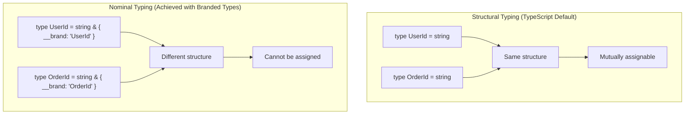
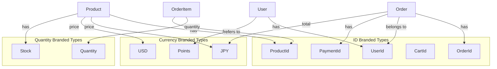
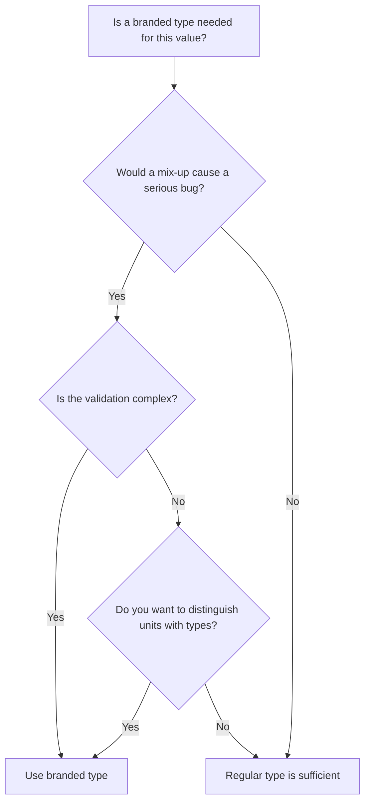

# TypeScript Branded Types: Complete Guide

> Use branded types, nominal types, and opaque types to distinguish values of the same primitive type, preventing ID mix-ups and unit confusion at compile time

## What You Will Learn

1. **Principles of branded types** -- The limitations of structural typing and how to achieve pseudo-nominal typing in TypeScript
2. **Implementation patterns** -- Three approaches: `__brand` field, `unique symbol`, and template literal types
3. **Practical applications** -- Preventing ID mix-ups, typed numeric units, tracking validated values
4. **Advanced techniques** -- Zod integration, serialization strategies, testing methods
5. **Comparison with other languages** -- Rust newtypes, Haskell newtypes, Flow opaque types


## Prerequisites

Having the following knowledge before reading this guide will deepen your understanding:

- Basic programming knowledge
- Understanding of related foundational concepts
- Familiarity with [TypeScript Discriminated Union Patterns](./02-discriminated-unions.md)

---

## Table of Contents

1. [Why Branded Types Are Needed](#1-why-branded-types-are-needed)
2. [Complete Explanation of Implementation Patterns](#2-complete-explanation-of-implementation-patterns)
3. [Factory Functions and Validation](#3-factory-functions-and-validation)
4. [In Practice: Domain-Specific Types](#4-in-practice-domain-specific-types)
5. [Runtime Validation Integration with Zod](#5-runtime-validation-integration-with-zod)
6. [Unit Types and Type-Safe Arithmetic](#6-unit-types-and-type-safe-arithmetic)
7. [Serialization and Deserialization](#7-serialization-and-deserialization)
8. [Comparison with Other Approaches](#8-comparison-with-other-approaches)
9. [Anti-Patterns and Edge Cases](#9-anti-patterns-and-edge-cases)
10. [Testing Strategies and Debugging](#10-testing-strategies-and-debugging)
11. [Exercises](#11-exercises)
12. [FAQ](#12-faq)

---

## 1. Why Branded Types Are Needed

### 1-1. The Pitfalls of Structural Typing

TypeScript uses **structural typing**. This means that type compatibility is determined by "structure," not by "name."

```ascii
Structural typing (TypeScript default):

  type UserId = string;
  type OrderId = string;

  UserId and OrderId have the same structure (string)
       ↓
  Mutually assignable!

  function getUser(id: UserId): User { ... }
  const orderId: OrderId = "order-123";
  getUser(orderId);  // No error!

Nominal typing (achieved pseudo-nominally via branded types):

  type UserId = string & { __brand: "UserId" };
  type OrderId = string & { __brand: "OrderId" };

  UserId and OrderId have different structures
       ↓
  Cannot be mutually assigned!

  getUser(orderId);  // Compile error!
```

#### Problematic Code Example

```typescript
// Problem with structural typing
type UserId = string;
type OrderId = string;
type ProductId = string;

function getUser(id: UserId): void {
  console.log(`Fetching user with ID: ${id}`);
}

function getOrder(id: OrderId): void {
  console.log(`Fetching order with ID: ${id}`);
}

const userId: UserId = "user-1";
const orderId: OrderId = "order-1";

// All of these compile successfully
getUser(orderId);    // Bug! Passing an OrderId
getOrder(userId);    // Bug! Passing a UserId

// Problem only discovered at runtime
// => "Fetching user with ID: order-1"  ← Searching with the wrong ID
```

This problem occurs because type aliases are merely "alternate names," and types with the same structure are compatible.

### 1-2. Dangerous Real-World Scenarios

**Scenario 1: Mixing patient IDs and appointment IDs in a medical system**

```typescript
type PatientId = string;
type AppointmentId = string;

function cancelAppointment(appointmentId: AppointmentId): void {
  // Cancel appointment
}

function deletePatient(patientId: PatientId): void {
  // Delete patient record (dangerous operation)
}

const appointment: AppointmentId = "apt-789";
const patient: PatientId = "patient-456";

// Type check passes, accidentally deleting patient record
deletePatient(appointment); // No compile error!
```

**Scenario 2: Currency mix-up in a financial system**

```typescript
type JPY = number;
type USD = number;

function transferJPY(amount: JPY): void {
  console.log(`Transferring ¥${amount}`);
}

const usdAmount: USD = 100; // $100
transferJPY(usdAmount); // Processed as ¥100 (exchange rate ignored)
```

**Scenario 3: Unit confusion in physical calculations**

In 1999, NASA's Mars Climate Orbiter was lost due to unit confusion (imperial vs. metric), resulting in approximately $125 million in losses. This is a problem that can be prevented with a type system.

```typescript
type Meters = number;
type Feet = number;

function calculateTrajectory(altitude: Meters): void {
  // Calculation in meters
}

const altitudeInFeet: Feet = 3000;
calculateTrajectory(altitudeInFeet); // Feet value treated as meters
```

### 1-3. Solution with Branded Types

Using branded types, these problems can be detected at compile time.

```typescript
// Defining a branded type
type Brand<T, BrandName extends string> = T & { readonly __brand: BrandName };

type UserId = Brand<string, "UserId">;
type OrderId = Brand<string, "OrderId">;

function getUser(id: UserId): void {
  console.log(`Fetching user: ${id}`);
}

function getOrder(id: OrderId): void {
  console.log(`Fetching order: ${id}`);
}

// Use constructor functions to apply brands
const userId = (id: string): UserId => id as UserId;
const orderId = (id: string): OrderId => id as OrderId;

const uid = userId("user-123");
const oid = orderId("order-456");

getUser(uid);  // ✓ OK
getUser(oid);  // ✗ Compile error!
// Error: Argument of type 'OrderId' is not assignable to parameter of type 'UserId'.
//   Type 'OrderId' is not assignable to type '{ readonly __brand: "UserId"; }'.
```

### 1-4. Diagram: Structural Typing vs. Nominal Typing



---

## 2. Complete Explanation of Implementation Patterns

There are three main implementation patterns for branded types. Let's look at the characteristics, advantages, and disadvantages of each.

### 2-1. `__brand` Field Pattern (Basic Form)

The simplest and most common pattern.

#### Implementation

```typescript
// Define the generic type
type Brand<T, BrandName extends string> = T & { readonly __brand: BrandName };

// Define branded types
type UserId = Brand<string, "UserId">;
type OrderId = Brand<string, "OrderId">;
type ProductId = Brand<string, "ProductId">;

// Constructor functions
function userId(id: string): UserId {
  return id as UserId;
}

function orderId(id: string): OrderId {
  return id as OrderId;
}

function productId(id: string): ProductId {
  return id as ProductId;
}
```

#### Usage Example

```typescript
function getUser(id: UserId): void {
  console.log(`Fetching user: ${id}`);
}

function getOrder(id: OrderId): void {
  console.log(`Fetching order: ${id}`);
}

const uid = userId("user-123");
const oid = orderId("order-456");

getUser(uid);  // ✓ OK
getUser(oid);  // ✗ Compile error!
// Error: Type 'OrderId' is not assignable to type 'UserId'.
//   Type 'OrderId' is not assignable to type '{ __brand: "UserId" }'.
```

#### Advantages
- Simple to implement and easy to understand
- Reusable as a generic type
- Zero runtime cost (`as` is type assertion only)
- Clear error messages

#### Disadvantages
- Possible name collision with `__brand` (rare in practice)
- Different definitions with the same string literal become compatible

```typescript
// Using the same brand name in different files creates compatibility
type UserIdV1 = Brand<string, "UserId">;
type UserIdV2 = Brand<string, "UserId">;

const v1: UserIdV1 = "user-1" as UserIdV1;
const v2: UserIdV2 = v1; // OK (unintended compatibility)
```

### 2-2. `unique symbol` Pattern (More Strict)

Using `unique symbol` creates a completely unique brand.

#### Implementation

```typescript
// Create completely unique brands with unique symbol
declare const UserIdBrand: unique symbol;
declare const OrderIdBrand: unique symbol;
declare const ProductIdBrand: unique symbol;

type UserId = string & { readonly [UserIdBrand]: typeof UserIdBrand };
type OrderId = string & { readonly [OrderIdBrand]: typeof OrderIdBrand };
type ProductId = string & { readonly [ProductIdBrand]: typeof ProductIdBrand };

// Constructor functions
function userId(id: string): UserId {
  return id as UserId;
}

function orderId(id: string): OrderId {
  return id as OrderId;
}

function productId(id: string): ProductId {
  return id as ProductId;
}
```

#### Usage Example

```typescript
const uid = userId("user-123");
const oid = orderId("order-456");

function getUser(id: UserId): void {
  console.log(`User: ${id}`);
}

getUser(uid); // ✓ OK
getUser(oid); // ✗ Compile error!
```

#### Advantages
- **Completely unique**: Each `unique symbol` declaration has a different type
- No need to worry about string name collisions
- Stronger type safety

#### Disadvantages
- Code is slightly more complex
- Harder to make generic
- Error messages are slightly harder to read (symbol is displayed)

#### Characteristics of unique symbol

```typescript
// Even with the same name in different files, unique symbols are different types
// file1.ts
declare const UserIdBrand: unique symbol;
type UserId = string & { readonly [UserIdBrand]: typeof UserIdBrand };

// file2.ts
declare const UserIdBrand: unique symbol; // Same name, but a different type
type UserId = string & { readonly [UserIdBrand]: typeof UserIdBrand };

// UserId in file1 and UserId in file2 are incompatible!
```

### 2-3. Template Literal Type Pattern (Pattern Matching)

A method using template literal types from TypeScript 4.1+.

#### Implementation

```typescript
// Identify brands by prefix
type UserId = `user_${string}`;
type OrderId = `order_${string}`;
type ProductId = `product_${string}`;

// Constructor (with validation)
function userId(id: string): UserId {
  if (!id.startsWith("user_")) {
    throw new Error("Invalid UserId format");
  }
  return id as UserId;
}

function orderId(id: string): OrderId {
  if (!id.startsWith("order_")) {
    throw new Error("Invalid OrderId format");
  }
  return id as OrderId;
}
```

#### Usage Example

```typescript
const uid: UserId = "user_123"; // ✓ OK (literal matches)
const oid: OrderId = "order_456"; // ✓ OK

// const bad: UserId = "123"; // ✗ Error (pattern doesn't match)

function getUser(id: UserId): void {
  console.log(`User: ${id}`);
}

getUser(uid); // ✓ OK
getUser(oid); // ✗ Error
```

#### Advantages
- Pattern matching is performed at the type level
- Some type safety even with literal values
- Code is self-documenting (prefix conveys meaning)

#### Disadvantages
- Low flexibility (prefix is forced)
- May be incompatible with existing data
- Runtime prefix checks are still required

### 2-4. Comparison Table: Choosing an Implementation Pattern

| Pattern | Type Safety | Runtime Cost | Implementation Simplicity | Error Messages | Recommended Use |
|---------|-------------|--------------|---------------------------|----------------|-----------------|
| `__brand` field | High | Zero | ★★★ | Clear | General use |
| `unique symbol` | Highest | Zero | ★★☆ | Slightly complex | Library development |
| Template literal | Medium | Validation required | ★★★ | Clear | When IDs have prefixes |

### 2-5. Hybrid Pattern (Recommended)

In practice, combining `__brand` and `unique symbol` is also common.

```typescript
// Generic Brand type
type Brand<T, BrandName extends string> = T & { readonly __brand: BrandName };

// Use unique symbol for specific brands
declare const EmailBrand: unique symbol;
type Email = string & { readonly [EmailBrand]: typeof EmailBrand };

// Use __brand pattern for general IDs
type UserId = Brand<string, "UserId">;
type OrderId = Brand<string, "OrderId">;

// When you want Email to be especially strict
function email(value: string): Email {
  if (!value.includes("@")) {
    throw new Error("Invalid email");
  }
  return value as Email;
}
```

---

## 3. Factory Functions and Validation

The true value of branded types is realized when combined with **Smart Constructors**.

### 3-1. What Are Smart Constructors?

Smart constructors are functions that perform validation and return a branded type only upon success.

```ascii
Smart Constructor Flow:

  string (unvalidated)
     |
     v
  +------------------+
  | validate & brand |
  +------------------+
     |           |
     v           v
  Ok(Email)   Err("invalid")
  (validated)   (rejected)
     |
     v
  sendEmail(email: Email)
  → No re-validation needed, type guarantees it
```

### 3-2. Combining with Result Type

```typescript
// Result type definition
type Result<T, E> =
  | { ok: true; value: T }
  | { ok: false; error: E };

function Ok<T>(value: T): Result<T, never> {
  return { ok: true, value };
}

function Err<E>(error: E): Result<never, E> {
  return { ok: false, error };
}

function isOk<T, E>(result: Result<T, E>): result is { ok: true; value: T } {
  return result.ok;
}

function isErr<T, E>(result: Result<T, E>): result is { ok: false; error: E } {
  return !result.ok;
}
```

### 3-3. Implementing Branded Types with Validation

```typescript
type Brand<T, BrandName extends string> = T & { readonly __brand: BrandName };

// Branded type definitions
type Email = Brand<string, "Email">;
type NonEmptyString = Brand<string, "NonEmptyString">;
type PositiveNumber = Brand<number, "PositiveNumber">;
type Percentage = Brand<number, "Percentage">; // 0-100
type UUID = Brand<string, "UUID">;
type URL = Brand<string, "URL">;

// Smart constructors
function email(value: string): Result<Email, string> {
  const trimmed = value.trim();
  const emailRegex = /^[^\s@]+@[^\s@]+\.[^\s@]+$/;

  if (!emailRegex.test(trimmed)) {
    return Err(`Invalid email format: ${value}`);
  }

  return Ok(trimmed as Email);
}

function nonEmpty(value: string): Result<NonEmptyString, string> {
  const trimmed = value.trim();

  if (trimmed.length === 0) {
    return Err("String must not be empty");
  }

  return Ok(trimmed as NonEmptyString);
}

function positiveNumber(value: number): Result<PositiveNumber, string> {
  if (!Number.isFinite(value)) {
    return Err("Must be a finite number");
  }

  if (value <= 0) {
    return Err(`Must be positive, got: ${value}`);
  }

  return Ok(value as PositiveNumber);
}

function percentage(value: number): Result<Percentage, string> {
  if (!Number.isFinite(value)) {
    return Err("Must be a finite number");
  }

  if (value < 0 || value > 100) {
    return Err(`Must be between 0 and 100, got: ${value}`);
  }

  return Ok(value as Percentage);
}

function uuid(value: string): Result<UUID, string> {
  const uuidRegex = /^[0-9a-f]{8}-[0-9a-f]{4}-[0-9a-f]{4}-[0-9a-f]{4}-[0-9a-f]{12}$/i;

  if (!uuidRegex.test(value)) {
    return Err(`Invalid UUID format: ${value}`);
  }

  return Ok(value as UUID);
}

function url(value: string): Result<URL, string> {
  try {
    new globalThis.URL(value); // Validate with URL constructor
    return Ok(value as URL);
  } catch {
    return Err(`Invalid URL: ${value}`);
  }
}
```

### 3-4. Usage Example: User Registration Form

```typescript
interface UserRegistration {
  email: Email;
  name: NonEmptyString;
  age: PositiveNumber;
  website: URL;
}

function registerUser(
  emailInput: string,
  nameInput: string,
  ageInput: number,
  websiteInput: string
): Result<UserRegistration, string[]> {
  const errors: string[] = [];

  const emailResult = email(emailInput);
  const nameResult = nonEmpty(nameInput);
  const ageResult = positiveNumber(ageInput);
  const websiteResult = url(websiteInput);

  if (isErr(emailResult)) errors.push(emailResult.error);
  if (isErr(nameResult)) errors.push(nameResult.error);
  if (isErr(ageResult)) errors.push(ageResult.error);
  if (isErr(websiteResult)) errors.push(websiteResult.error);

  if (errors.length > 0) {
    return Err(errors);
  }

  // At this point, all values have been validated
  return Ok({
    email: emailResult.value,
    name: nameResult.value,
    age: ageResult.value,
    website: websiteResult.value,
  });
}

// Usage example
const result = registerUser(
  "alice@example.com",
  "Alice",
  30,
  "https://alice.dev"
);

if (isOk(result)) {
  console.log("User registered:", result.value);
  // result.value.email is of type Email (no re-validation needed)
  sendWelcomeEmail(result.value.email);
} else {
  console.error("Validation errors:", result.error);
}

function sendWelcomeEmail(to: Email): void {
  // to is of type Email, so a valid email address is guaranteed
  console.log(`Sending email to ${to}`);
}
```

### 3-5. Branded Types with Multiple Validation Rules

```typescript
// Complex validation: Password
type Password = Brand<string, "Password">;

function password(value: string): Result<Password, string[]> {
  const errors: string[] = [];

  if (value.length < 8) {
    errors.push("Password must be at least 8 characters");
  }

  if (!/[A-Z]/.test(value)) {
    errors.push("Password must contain at least one uppercase letter");
  }

  if (!/[a-z]/.test(value)) {
    errors.push("Password must contain at least one lowercase letter");
  }

  if (!/[0-9]/.test(value)) {
    errors.push("Password must contain at least one digit");
  }

  if (!/[!@#$%^&*]/.test(value)) {
    errors.push("Password must contain at least one special character");
  }

  if (errors.length > 0) {
    return Err(errors);
  }

  return Ok(value as Password);
}

// Usage example
const pw1 = password("weak");
console.log(pw1);
// { ok: false, error: [ "Password must be at least 8 characters", ... ] }

const pw2 = password("Strong123!");
console.log(pw2);
// { ok: true, value: "Strong123!" as Password }
```

---

## 4. In Practice: Domain-Specific Types

Let's look at examples of leveraging branded types in real applications.

### 4-1. Type Design for an E-Commerce System

```typescript
// ID-related branded types
type UserId = Brand<string, "UserId">;
type OrderId = Brand<string, "OrderId">;
type ProductId = Brand<string, "ProductId">;
type CartId = Brand<string, "CartId">;
type PaymentId = Brand<string, "PaymentId">;

// Currency-related branded types
type JPY = Brand<number, "JPY">;
type USD = Brand<number, "USD">;
type Points = Brand<number, "Points">;

// Quantity-related branded types
type Quantity = Brand<number, "Quantity">;
type Stock = Brand<number, "Stock">;

// Domain models
interface User {
  id: UserId;
  email: Email;
  name: NonEmptyString;
  points: Points;
}

interface Product {
  id: ProductId;
  name: NonEmptyString;
  priceJPY: JPY;
  priceUSD: USD;
  stock: Stock;
}

interface OrderItem {
  productId: ProductId;
  quantity: Quantity;
  priceJPY: JPY;
}

interface Order {
  id: OrderId;
  userId: UserId;
  items: OrderItem[];
  totalJPY: JPY;
  paymentId: PaymentId;
}
```

### 4-2. Implementing Business Logic

```typescript
// Stock check
function hasEnoughStock(stock: Stock, quantity: Quantity): boolean {
  return (stock as number) >= (quantity as number);
}

// Subtotal calculation
function calculateSubtotal(price: JPY, quantity: Quantity): JPY {
  return ((price as number) * (quantity as number)) as JPY;
}

// Total calculation
function calculateTotal(items: OrderItem[]): JPY {
  const total = items.reduce((sum, item) => {
    return sum + calculateSubtotal(item.priceJPY, item.quantity);
  }, 0);
  return total as JPY;
}

// Create order
function createOrder(
  orderId: OrderId,
  userId: UserId,
  items: OrderItem[],
  paymentId: PaymentId
): Result<Order, string> {
  if (items.length === 0) {
    return Err("Order must contain at least one item");
  }

  const totalJPY = calculateTotal(items);

  return Ok({
    id: orderId,
    userId,
    items,
    totalJPY,
    paymentId,
  });
}
```

### 4-3. Integration with the Repository Pattern

```typescript
// Repository interfaces
interface UserRepository {
  findById(id: UserId): Promise<User | null>;
  save(user: User): Promise<void>;
}

interface ProductRepository {
  findById(id: ProductId): Promise<Product | null>;
  updateStock(id: ProductId, stock: Stock): Promise<void>;
}

interface OrderRepository {
  findById(id: OrderId): Promise<Order | null>;
  findByUserId(userId: UserId): Promise<Order[]>;
  save(order: Order): Promise<void>;
}

// Implementation example (in-memory storage)
class InMemoryUserRepository implements UserRepository {
  private users = new Map<UserId, User>();

  async findById(id: UserId): Promise<User | null> {
    return this.users.get(id) ?? null;
  }

  async save(user: User): Promise<void> {
    this.users.set(user.id, user);
  }
}

// Branded types cause a compile error when passing the wrong ID
const userRepo = new InMemoryUserRepository();
const productRepo = new InMemoryProductRepository();

const uid: UserId = "user-1" as UserId;
const pid: ProductId = "product-1" as ProductId;

await userRepo.findById(uid); // ✓ OK
// await userRepo.findById(pid); // ✗ Error! Cannot pass ProductId as UserId
```

### 4-4. Diagram: Branded Type Design for E-Commerce System



### 4-5. Use in the Use Case Layer

```typescript
// Use case: Add product to cart
async function addToCart(
  userId: UserId,
  productId: ProductId,
  quantity: Quantity,
  userRepo: UserRepository,
  productRepo: ProductRepository
): Promise<Result<void, string>> {
  // Fetch user
  const user = await userRepo.findById(userId);
  if (!user) {
    return Err(`User not found: ${userId}`);
  }

  // Fetch product
  const product = await productRepo.findById(productId);
  if (!product) {
    return Err(`Product not found: ${productId}`);
  }

  // Check stock
  if (!hasEnoughStock(product.stock, quantity)) {
    return Err(`Insufficient stock for product: ${productId}`);
  }

  // Add to cart (omitted)

  return Ok(undefined);
}

// Caller side
const uid = "user-123" as UserId;
const pid = "product-456" as ProductId;
const qty = 2 as Quantity;

const result = await addToCart(uid, pid, qty, userRepo, productRepo);

if (isErr(result)) {
  console.error(result.error);
}
```

---

## 5. Runtime Validation Integration with Zod

Zod is a schema validation library for TypeScript that has native support for branded types.

### 5-1. Zod's `.brand()` Method

```typescript
import { z } from "zod";

// Generate branded types with Zod schemas
const UserIdSchema = z.string().uuid().brand<"UserId">();
type UserId = z.infer<typeof UserIdSchema>;
// Type: string & { __brand: "UserId" }

const EmailSchema = z.string().email().brand<"Email">();
type Email = z.infer<typeof EmailSchema>;

const PositiveSchema = z.number().positive().brand<"Positive">();
type Positive = z.infer<typeof PositiveSchema>;

const PercentageSchema = z.number().min(0).max(100).brand<"Percentage">();
type Percentage = z.infer<typeof PercentageSchema>;
```

### 5-2. Parsing and Validation

```typescript
// Brand is applied when parsing succeeds
const userId = UserIdSchema.parse("550e8400-e29b-41d4-a716-446655440000");
// userId: UserId

const email = EmailSchema.parse("alice@example.com");
// email: Email

// Exception thrown on parse failure
try {
  const invalid = EmailSchema.parse("not-an-email");
} catch (error) {
  if (error instanceof z.ZodError) {
    console.error(error.errors);
    // [{ message: "Invalid email", ... }]
  }
}

// Validation without exceptions using safeParse
const result = EmailSchema.safeParse("test@example.com");
if (result.success) {
  console.log(result.data); // Email type
} else {
  console.error(result.error.errors);
}
```

### 5-3. Defining Complex Schemas

```typescript
// User registration schema
const UserRegistrationSchema = z.object({
  email: EmailSchema,
  password: z.string()
    .min(8, "Password must be at least 8 characters")
    .regex(/[A-Z]/, "Must contain uppercase letter")
    .regex(/[a-z]/, "Must contain lowercase letter")
    .regex(/[0-9]/, "Must contain digit")
    .brand<"Password">(),
  name: z.string()
    .min(1, "Name must not be empty")
    .brand<"NonEmptyString">(),
  age: z.number()
    .int()
    .positive()
    .brand<"Age">(),
});

type UserRegistration = z.infer<typeof UserRegistrationSchema>;
// {
//   email: Email,
//   password: Password,
//   name: NonEmptyString,
//   age: Age
// }

// Usage example
const input = {
  email: "alice@example.com",
  password: "StrongPass123",
  name: "Alice",
  age: 30,
};

const result = UserRegistrationSchema.safeParse(input);
if (result.success) {
  const registration: UserRegistration = result.data;
  await createUser(registration);
} else {
  console.error(result.error.flatten());
}
```

### 5-4. Custom Validation

```typescript
// Branded type with custom validation logic
const SlugSchema = z.string()
  .regex(/^[a-z0-9]+(?:-[a-z0-9]+)*$/, "Invalid slug format")
  .brand<"Slug">();

type Slug = z.infer<typeof SlugSchema>;

const PhoneNumberSchema = z.string()
  .regex(/^\+?[1-9]\d{1,14}$/, "Invalid phone number")
  .brand<"PhoneNumber">();

type PhoneNumber = z.infer<typeof PhoneNumberSchema>;

// Usage example
const slug = SlugSchema.parse("my-blog-post"); // ✓ OK
const phone = PhoneNumberSchema.parse("+819012345678"); // ✓ OK

// SlugSchema.parse("My Blog Post"); // ✗ Error (uppercase and space)
```

### 5-5. Interoperability Between Zod Branded Types and Manual Branded Types

```typescript
// Manually defined branded type
type Brand<T, B extends string> = T & { readonly __brand: B };
type ManualUserId = Brand<string, "UserId">;

// Zod defined branded type
const ZodUserIdSchema = z.string().uuid().brand<"UserId">();
type ZodUserId = z.infer<typeof ZodUserIdSchema>;

// Compatibility check
const manualId: ManualUserId = "uuid-here" as ManualUserId;
const zodId: ZodUserId = ZodUserIdSchema.parse("550e8400-e29b-41d4-a716-446655440000");

// Compatible (same brand name)
const compatible: ManualUserId = zodId; // ✓ OK
const alsoCompatible: ZodUserId = manualId; // ✓ OK

// However, without Zod parsing there is no runtime validation
function processUser(id: ManualUserId): void {
  // No guarantee that id is actually a valid UUID
}

function processUserSafe(id: ZodUserId): void {
  // id has passed Zod validation, so UUID is guaranteed
}
```

### 5-6. Zod Transforms and Branded Types

```typescript
// Normalize input before applying the brand
const NormalizedEmailSchema = z.string()
  .transform(val => val.toLowerCase().trim())
  .pipe(z.string().email().brand<"Email">());

type NormalizedEmail = z.infer<typeof NormalizedEmailSchema>;

const email1 = NormalizedEmailSchema.parse("  Alice@EXAMPLE.com  ");
console.log(email1); // "alice@example.com" (NormalizedEmail type)

// Convert date string to Date object and apply brand
const TimestampSchema = z.string()
  .datetime()
  .transform(val => new Date(val))
  .brand<"Timestamp">();

type Timestamp = z.infer<typeof TimestampSchema>;
// Date & { __brand: "Timestamp" }
```

---

## 6. Unit Types and Type-Safe Arithmetic

Representing physical quantities and currencies as types prevents unit confusion.

### 6-1. Branded Types for Physical Quantities

```typescript
// Length units
type Meters = Brand<number, "Meters">;
type Kilometers = Brand<number, "Kilometers">;
type Miles = Brand<number, "Miles">;
type Feet = Brand<number, "Feet">;

// Time units
type Seconds = Brand<number, "Seconds">;
type Minutes = Brand<number, "Minutes">;
type Hours = Brand<number, "Hours">;

// Speed units
type MetersPerSecond = Brand<number, "MetersPerSecond">;
type KilometersPerHour = Brand<number, "KilometersPerHour">;
type MilesPerHour = Brand<number, "MilesPerHour">;

// Mass units
type Kilograms = Brand<number, "Kilograms">;
type Grams = Brand<number, "Grams">;
type Pounds = Brand<number, "Pounds">;

// Constructors
const meters = (v: number): Meters => v as Meters;
const kilometers = (v: number): Kilometers => v as Kilometers;
const miles = (v: number): Miles => v as Miles;
const seconds = (v: number): Seconds => v as Seconds;
const kilograms = (v: number): Kilograms => v as Kilograms;
```

### 6-2. Unit Conversion Functions

```typescript
// Length conversions
function kmToMeters(km: Kilometers): Meters {
  return ((km as number) * 1000) as Meters;
}

function metersToKm(m: Meters): Kilometers {
  return ((m as number) / 1000) as Kilometers;
}

function milesToKm(mi: Miles): Kilometers {
  return ((mi as number) * 1.60934) as Kilometers;
}

function feetToMeters(ft: Feet): Meters {
  return ((ft as number) * 0.3048) as Meters;
}

// Time conversions
function minutesToSeconds(min: Minutes): Seconds {
  return ((min as number) * 60) as Seconds;
}

function hoursToSeconds(hr: Hours): Seconds {
  return ((hr as number) * 3600) as Seconds;
}

// Mass conversions
function gramsToKilograms(g: Grams): Kilograms {
  return ((g as number) / 1000) as Kilograms;
}

function poundsToKilograms(lb: Pounds): Kilograms {
  return ((lb as number) * 0.453592) as Kilograms;
}
```

### 6-3. Type-Safe Calculations

```typescript
// Speed = Distance / Time
function calculateSpeed(distance: Meters, time: Seconds): MetersPerSecond {
  return ((distance as number) / (time as number)) as MetersPerSecond;
}

// Distance = Speed × Time
function calculateDistance(speed: MetersPerSecond, time: Seconds): Meters {
  return ((speed as number) * (time as number)) as Meters;
}

// Kinetic Energy = 0.5 × mass × speed^2
type Joules = Brand<number, "Joules">;

function kineticEnergy(mass: Kilograms, speed: MetersPerSecond): Joules {
  const m = mass as number;
  const v = speed as number;
  return (0.5 * m * v * v) as Joules;
}

// Usage example
const distance = meters(100);
const time = seconds(10);
const speed = calculateSpeed(distance, time);
console.log(`Speed: ${speed} m/s`); // Speed: 10 m/s

const mass = kilograms(50);
const energy = kineticEnergy(mass, speed);
console.log(`Energy: ${energy} J`); // Energy: 2500 J

// Compile error example
const km = kilometers(5);
// calculateSpeed(km, time); // ✗ Error! Kilometers is not Meters

// Correct usage: convert before passing
const speedFromKm = calculateSpeed(kmToMeters(km), time);
```

### 6-4. Currency Branded Types and Operations

```typescript
type JPY = Brand<number, "JPY">;
type USD = Brand<number, "USD">;
type EUR = Brand<number, "EUR">;
type Points = Brand<number, "Points">;

// Adding same-currency amounts
function addMoney<T extends Brand<number, string>>(a: T, b: T): T {
  return ((a as number) + (b as number)) as T;
}

// Subtracting same-currency amounts
function subtractMoney<T extends Brand<number, string>>(a: T, b: T): T {
  return ((a as number) - (b as number)) as T;
}

// Scalar multiplication
function multiplyMoney<T extends Brand<number, string>>(
  amount: T,
  factor: number
): T {
  return ((amount as number) * factor) as T;
}

// Division (getting a ratio)
function divideMoney<T extends Brand<number, string>>(
  dividend: T,
  divisor: T
): number {
  return (dividend as number) / (divisor as number);
}

// Exchange rate type
type ExchangeRate<From extends string, To extends string> = Brand<
  number,
  `ExchangeRate_${From}_${To}`
>;

type USD_to_JPY = ExchangeRate<"USD", "JPY">;
type JPY_to_USD = ExchangeRate<"JPY", "USD">;

// Currency conversion
function convertCurrency(
  amount: USD,
  rate: USD_to_JPY
): JPY {
  return ((amount as number) * (rate as number)) as JPY;
}

// Usage example
const priceJPY1 = 1000 as JPY;
const priceJPY2 = 2000 as JPY;
const totalJPY = addMoney(priceJPY1, priceJPY2); // 3000 JPY

const priceUSD = 10 as USD;
// addMoney(priceJPY1, priceUSD); // ✗ Error! Cannot add JPY and USD

// Currency conversion
const rate: USD_to_JPY = 150 as USD_to_JPY; // 1 USD = 150 JPY
const converted = convertCurrency(priceUSD, rate); // 1500 JPY

// Consumption tax calculation
function addTax(priceJPY: JPY, taxRate: Percentage): JPY {
  return multiplyMoney(priceJPY, 1 + (taxRate as number) / 100);
}

const taxRate = 10 as Percentage; // 10%
const priceWithTax = addTax(priceJPY1, taxRate); // 1100 JPY
```

### 6-5. Diagram: Arithmetic Rules for Unit Types

```mermaid
graph LR
    subgraph "Same-Unit Operations"
        A[Meters] -->|+| B[Meters]
        B --> C[Meters]
        D[JPY] -->|+| E[JPY]
        E --> F[JPY]
    end

    subgraph "Different-Unit Operations"
        G[Meters] -->|/| H[Seconds]
        H --> I[MetersPerSecond]
        J[USD] -->|×| K[ExchangeRate]
        K --> L[JPY]
    end

    subgraph "Forbidden Operations"
        M[Meters] -.x.-> N[Seconds]
        O[JPY] -.x.-> P[USD]
    end
```

### 6-6. Example of Complex Physical Calculations

```typescript
// Newton's Second Law: F = ma
type Newtons = Brand<number, "Newtons">; // Unit of force
type MetersPerSecondSquared = Brand<number, "MetersPerSecondSquared">; // Acceleration

function calculateForce(
  mass: Kilograms,
  acceleration: MetersPerSecondSquared
): Newtons {
  return ((mass as number) * (acceleration as number)) as Newtons;
}

// Gravitational acceleration
const g: MetersPerSecondSquared = 9.8 as MetersPerSecondSquared;

// Weight of an object
function weight(mass: Kilograms): Newtons {
  return calculateForce(mass, g);
}

// Usage example
const objectMass = kilograms(10);
const objectWeight = weight(objectMass);
console.log(`Weight: ${objectWeight} N`); // Weight: 98 N

// Work = Force × Distance
function calculateWork(force: Newtons, distance: Meters): Joules {
  return ((force as number) * (distance as number)) as Joules;
}

const appliedForce = 50 as Newtons;
const distanceMoved = meters(20);
const workDone = calculateWork(appliedForce, distanceMoved);
console.log(`Work: ${workDone} J`); // Work: 1000 J
```

---

## 7. Serialization and Deserialization

Since branded types are a type-level concept, care is needed when integrating with JSON serialization.

### 7-1. JSON Serialization

```typescript
type UserId = Brand<string, "UserId">;
type Email = Brand<string, "Email">;

interface User {
  id: UserId;
  email: Email;
  name: string;
}

const user: User = {
  id: "user-123" as UserId,
  email: "alice@example.com" as Email,
  name: "Alice",
};

// JSON.stringify works as normal
const json = JSON.stringify(user);
console.log(json);
// {"id":"user-123","email":"alice@example.com","name":"Alice"}

// Brand information is lost (because it doesn't exist at runtime)
```

### 7-2. Deserialization and Re-applying Brands

```typescript
// After parsing, validation + brand application is needed
function parseUser(json: string): Result<User, string> {
  let data: unknown;

  try {
    data = JSON.parse(json);
  } catch (error) {
    return Err("Invalid JSON");
  }

  // Structure check
  if (
    typeof data !== "object" ||
    data === null ||
    !("id" in data) ||
    !("email" in data) ||
    !("name" in data)
  ) {
    return Err("Invalid user structure");
  }

  const obj = data as { id: unknown; email: unknown; name: unknown };

  // Validate each field
  if (typeof obj.id !== "string") {
    return Err("Invalid id type");
  }

  const emailResult = email(String(obj.email));
  if (isErr(emailResult)) {
    return Err(emailResult.error);
  }

  if (typeof obj.name !== "string") {
    return Err("Invalid name type");
  }

  return Ok({
    id: obj.id as UserId, // Validated, so brand can be applied
    email: emailResult.value,
    name: obj.name,
  });
}

// Usage example
const jsonString = '{"id":"user-456","email":"bob@example.com","name":"Bob"}';
const userResult = parseUser(jsonString);

if (isOk(userResult)) {
  console.log("Parsed user:", userResult.value);
  // userResult.value.id is of type UserId
} else {
  console.error("Parse error:", userResult.error);
}
```

### 7-3. Safe Deserialization with Zod

```typescript
import { z } from "zod";

// User schema
const UserSchema = z.object({
  id: z.string().brand<"UserId">(),
  email: z.string().email().brand<"Email">(),
  name: z.string().min(1),
});

type User = z.infer<typeof UserSchema>;

// Parsing from JSON
function parseUserWithZod(json: string): Result<User, z.ZodError> {
  try {
    const data = JSON.parse(json);
    const result = UserSchema.safeParse(data);

    if (result.success) {
      return Ok(result.data);
    } else {
      return Err(result.error);
    }
  } catch {
    return Err(new z.ZodError([{
      code: "custom",
      path: [],
      message: "Invalid JSON",
    }]));
  }
}

// Usage example
const jsonString = '{"id":"user-789","email":"charlie@example.com","name":"Charlie"}';
const result = parseUserWithZod(jsonString);

if (isOk(result)) {
  const user: User = result.data;
  console.log(user.id); // UserId type
} else {
  console.error(result.error.flatten());
}
```

### 7-4. API Response Decoding Pattern

```typescript
// API response type definition
const OrderResponseSchema = z.object({
  id: z.string().uuid().brand<"OrderId">(),
  userId: z.string().uuid().brand<"UserId">(),
  items: z.array(z.object({
    productId: z.string().uuid().brand<"ProductId">(),
    quantity: z.number().int().positive().brand<"Quantity">(),
    priceJPY: z.number().positive().brand<"JPY">(),
  })),
  totalJPY: z.number().positive().brand<"JPY">(),
  status: z.enum(["pending", "paid", "shipped", "delivered"]),
  createdAt: z.string().datetime().transform(d => new Date(d)),
});

type OrderResponse = z.infer<typeof OrderResponseSchema>;

// API call
async function fetchOrder(orderId: OrderId): Promise<Result<OrderResponse, string>> {
  try {
    const response = await fetch(`/api/orders/${orderId}`);

    if (!response.ok) {
      return Err(`HTTP error: ${response.status}`);
    }

    const json = await response.json();
    const result = OrderResponseSchema.safeParse(json);

    if (result.success) {
      return Ok(result.data);
    } else {
      return Err(`Validation error: ${result.error.message}`);
    }
  } catch (error) {
    return Err(`Network error: ${error}`);
  }
}

// Usage example
const orderId = "550e8400-e29b-41d4-a716-446655440000" as OrderId;
const orderResult = await fetchOrder(orderId);

if (isOk(orderResult)) {
  const order = orderResult.value;
  console.log(`Order total: ¥${order.totalJPY}`);
  // order.totalJPY is of type JPY (branded)
}
```

### 7-5. Custom toJSON Method (When Needed)

Branded types usually don't need `toJSON`, but it can be useful in complex cases.

```typescript
// Class wrapping a branded type (advanced usage)
class BrandedValue<T, B extends string> {
  private readonly _brand!: B;

  constructor(public readonly value: T) {}

  toJSON(): T {
    return this.value;
  }

  static from<T, B extends string>(
    value: T,
    validator?: (v: T) => boolean
  ): Result<BrandedValue<T, B>, string> {
    if (validator && !validator(value)) {
      return Err("Validation failed");
    }
    return Ok(new BrandedValue<T, B>(value));
  }
}

// Usage example
const emailValue = BrandedValue.from<string, "Email">(
  "test@example.com",
  (v) => /^[^\s@]+@[^\s@]+\.[^\s@]+$/.test(v)
);

if (isOk(emailValue)) {
  const json = JSON.stringify(emailValue.value);
  console.log(json); // "test@example.com"
}
```

---

## 8. Comparison with Other Approaches

### 8-1. Branded Types vs. Class Wrappers

```typescript
// Branded type approach
type EmailBranded = Brand<string, "Email">;

function emailBranded(value: string): Result<EmailBranded, string> {
  if (!/^[^\s@]+@[^\s@]+\.[^\s@]+$/.test(value)) {
    return Err("Invalid email");
  }
  return Ok(value as EmailBranded);
}

// Class wrapper approach
class EmailClass {
  private constructor(private readonly value: string) {}

  static create(value: string): Result<EmailClass, string> {
    if (!/^[^\s@]+@[^\s@]+\.[^\s@]+$/.test(value)) {
      return Err("Invalid email");
    }
    return Ok(new EmailClass(value));
  }

  toString(): string {
    return this.value;
  }

  toJSON(): string {
    return this.value;
  }
}

// Comparison
const branded = emailBranded("test@example.com");
const classed = EmailClass.create("test@example.com");

// Branded type: can use string methods directly
if (isOk(branded)) {
  console.log(branded.value.toUpperCase()); // OK
  console.log(branded.value.length); // OK
}

// Class wrapper: methods must be called explicitly
if (isOk(classed)) {
  // console.log(classed.value.toUpperCase()); // Error (private)
  console.log(classed.value.toString().toUpperCase()); // OK
}
```

#### Comparison Table

| Item | Branded Type | Class Wrapper |
|------|-------------|---------------|
| Runtime cost | Zero | Instance creation |
| Type safety | High | Highest (instanceof available) |
| Original type methods | Usable directly | Wrapping required |
| JSON serialization | Direct | `toJSON` required |
| Pattern matching | Not available | `instanceof` available |
| Code size | Small | Large (method definitions needed) |
| Recommended for | General use | Complex business logic |

### 8-2. Branded Types vs. Enums

```typescript
// Enum approach
enum UserRole {
  Admin = "admin",
  User = "user",
  Guest = "guest",
}

function processRole(role: UserRole): void {
  switch (role) {
    case UserRole.Admin:
      console.log("Admin access");
      break;
    case UserRole.User:
      console.log("User access");
      break;
    case UserRole.Guest:
      console.log("Guest access");
      break;
  }
}

// Branded type approach (combined with Union type)
type UserRole = "admin" | "user" | "guest";
type ValidatedRole = Brand<UserRole, "ValidatedRole">;

function validatedRole(role: string): Result<ValidatedRole, string> {
  if (role !== "admin" && role !== "user" && role !== "guest") {
    return Err(`Invalid role: ${role}`);
  }
  return Ok(role as ValidatedRole);
}

// When enum is more appropriate:
// - Values are fixed
// - Want exhaustiveness checking with switch
// - Reverse mapping needed

// When branded type is more appropriate:
// - Dynamic values (IDs, email addresses, URLs, etc.)
// - Complex validation
// - Integration with external data
```

### 8-3. Comparison with Opaque Types (Flow, Rust)

#### Flow's opaque type

```javascript
// Flow's opaque type
opaque type UserId = string;

function userId(id: string): UserId {
  return id; // No cast needed
}

// The implementation of UserId is hidden from other modules
```

#### Rust's newtype pattern

```rust
// Rust's newtype
struct UserId(String);

impl UserId {
    fn new(id: String) -> Self {
        UserId(id)
    }
}

// Completely separate type (not structural typing)
```

#### TypeScript's branded type

```typescript
// TypeScript's branded type (pseudo-opaque)
type UserId = Brand<string, "UserId">;

function userId(id: string): UserId {
  return id as UserId; // Cast required
}

// Distinguished only at the type level (same at runtime)
```

#### Comparison Table

| Language/Feature | Typing | Runtime distinction | Cast | Type safety |
|-----------------|--------|---------------------|------|-------------|
| Flow opaque | Nominal | None | Not needed | High |
| Rust newtype | Nominal | Yes | Not needed | Highest |
| TypeScript branded | Structural (pseudo-nominal) | None | Required | High |
| Haskell newtype | Nominal | None (optimized away) | Not needed | Highest |

### 8-4. Comparison with Template Literal Types

```typescript
// Template literal types
type UserId = `user_${string}`;
type OrderId = `order_${string}`;

const uid: UserId = "user_123"; // OK
// const bad: UserId = "123"; // Error

// Branded type
type UserIdBranded = Brand<string, "UserId">;

const uidBranded = "anything" as UserIdBranded; // OK (no format check)

// Advantages of template literal types:
// - Type checking works even with literal values
// - Pattern is explicit

// Disadvantages of template literal types:
// - Format is fixed
// - May be incompatible with existing data

// Advantages of branded types:
// - Not dependent on format
// - Flexible validation

// Disadvantages of branded types:
// - Type checking doesn't work with literal values
```

---

## 9. Anti-Patterns and Edge Cases

### 9-1. Anti-Pattern 1: Applying a Brand Without Validation

```typescript
// ❌ NG: Applying brand without validation
function unsafeEmail(input: string): Email {
  return input as Email; // Invalid values also get the brand
}

const badEmail = unsafeEmail("not-an-email");
sendEmail(badEmail); // Possible runtime error

// ✅ OK: Validate with smart constructor
function safeEmail(input: string): Result<Email, string> {
  if (!/^[^\s@]+@[^\s@]+\.[^\s@]+$/.test(input)) {
    return Err("Invalid email format");
  }
  return Ok(input as Email);
}

const emailResult = safeEmail("test@example.com");
if (isOk(emailResult)) {
  sendEmail(emailResult.value); // Safe
}
```

### 9-2. Anti-Pattern 2: Overusing Branded Types

```typescript
// ❌ NG: Applying brands to all primitives (excessive)
type FirstName = Brand<string, "FirstName">;
type LastName = Brand<string, "LastName">;
type MiddleName = Brand<string, "MiddleName">;
type Street = Brand<string, "Street">;
type City = Brand<string, "City">;
type State = Brand<string, "State">;
type ZipCode = Brand<string, "ZipCode">;
type Country = Brand<string, "Country">;
type PhoneNumber = Brand<string, "PhoneNumber">;
type FaxNumber = Brand<string, "FaxNumber">;
// ... dozens of branded types

interface Address {
  street: Street;
  city: City;
  state: State;
  zipCode: ZipCode;
  country: Country;
}

// ✅ OK: Only apply brands where mix-up is dangerous
interface AddressBetter {
  street: string; // Regular string is sufficient
  city: string;
  state: string;
  zipCode: string; // Or ZipCode (when validation is needed)
  country: string;
}

// When to use branded types:
// - IDs (UserId, OrderId, ProductId): Mix-up is dangerous
// - Units (Meters, Seconds, JPY): Calculation errors are dangerous
// - Validated values (Email, Url, NonEmpty): Want to avoid re-validation
```

#### Decision Criteria for Using Branded Types



### 9-3. Anti-Pattern 3: Double Brand Application

```typescript
// ❌ NG: Applying brand twice
type Email = Brand<string, "Email">;
type VerifiedEmail = Brand<Email, "Verified">; // Email is already a branded type

// This works but becomes overly complex
// Brand<Brand<string, "Email">, "Verified">

// ✅ OK: Define as separate branded types
type Email = Brand<string, "Email">;
type VerifiedEmail = Brand<string, "VerifiedEmail">;

// Or express state via type parameter
type Email<State extends "unverified" | "verified" = "unverified"> =
  Brand<string, `Email_${State}`>;

type UnverifiedEmail = Email<"unverified">;
type VerifiedEmailGood = Email<"verified">;
```

### 9-4. Edge Case 1: Arrays and Branded Types

```typescript
type UserId = Brand<string, "UserId">;

// Array of branded types
const userIds: UserId[] = [
  "user-1" as UserId,
  "user-2" as UserId,
  "user-3" as UserId,
];

// Process with map
const upperIds = userIds.map(id => id.toUpperCase()); // string[]
// upperIds becomes string[], not UserId[]

// If you want to preserve the brand
const upperIdsKeepBrand = userIds.map(id => id.toUpperCase() as UserId);
// However, applying brand without validation is risky

// Safer approach
function normalizeUserId(id: UserId): UserId {
  const normalized = id.trim().toLowerCase();
  // Assumes normalized value is still a valid UserId
  return normalized as UserId;
}

const normalizedIds = userIds.map(normalizeUserId); // UserId[]
```

### 9-5. Edge Case 2: Branded Types as Object Keys

```typescript
type UserId = Brand<string, "UserId">;

interface UserData {
  name: string;
  email: string;
}

// ❌ Using branded types as keys is problematic
const userMap: Record<UserId, UserData> = {};

const uid = "user-1" as UserId;
userMap[uid] = { name: "Alice", email: "alice@example.com" };

// Problem: Record keys are cast to string
const retrieved = userMap["user-1"]; // Can be retrieved with a plain string
// Type safety is lost

// ✅ OK: Use Map
const userMapGood = new Map<UserId, UserData>();
userMapGood.set(uid, { name: "Alice", email: "alice@example.com" });

// userMapGood.get("user-1"); // Error! UserId is required
const retrievedGood = userMapGood.get(uid); // OK
```

### 9-6. Edge Case 3: JSON.parse and Type Assertions

```typescript
// ❌ Dangerous: Asserting branded type immediately after JSON.parse
const jsonString = '{"id":"user-123","name":"Alice"}';
const user = JSON.parse(jsonString) as { id: UserId; name: string };
// user.id is of type UserId but not validated

// ✅ Safe: Parse with Zod
const UserSchema = z.object({
  id: z.string().brand<"UserId">(),
  name: z.string(),
});

const userResult = UserSchema.safeParse(JSON.parse(jsonString));
if (userResult.success) {
  const user = userResult.data; // Validated
}
```

### 9-7. Edge Case 4: Conditional Types and Branded Types

```typescript
type Brand<T, B extends string> = T & { readonly __brand: B };

// Remove brand with conditional type
type Unbrand<T> = T extends Brand<infer U, string> ? U : T;

type UserId = Brand<string, "UserId">;
type Plain = Unbrand<UserId>; // string

// Utility type
type DeepUnbrand<T> = T extends Brand<infer U, string>
  ? U
  : T extends object
  ? { [K in keyof T]: DeepUnbrand<T[K]> }
  : T;

interface User {
  id: UserId;
  email: Email;
  age: number;
}

type PlainUser = DeepUnbrand<User>;
// { id: string; email: string; age: number }

// Usage: Convert API response to plain type
function serializeUser(user: User): PlainUser {
  return user as PlainUser; // Safe since brand is type-level only
}
```

---

## 10. Testing Strategies and Debugging

### 10-1. Unit Testing Branded Types

```typescript
import { describe, it, expect } from "vitest";

describe("Email branded type", () => {
  it("accepts valid email", () => {
    const result = email("test@example.com");

    expect(isOk(result)).toBe(true);
    if (isOk(result)) {
      expect(result.value).toBe("test@example.com");
    }
  });

  it("rejects invalid email", () => {
    const result = email("not-an-email");

    expect(isErr(result)).toBe(true);
    if (isErr(result)) {
      expect(result.error).toContain("Invalid email");
    }
  });

  it("trims whitespace", () => {
    const result = email("  test@example.com  ");

    expect(isOk(result)).toBe(true);
    if (isOk(result)) {
      expect(result.value).toBe("test@example.com");
    }
  });

  it("rejects empty string", () => {
    const result = email("");

    expect(isErr(result)).toBe(true);
  });
});

describe("PositiveNumber branded type", () => {
  it("accepts positive numbers", () => {
    expect(isOk(positiveNumber(1))).toBe(true);
    expect(isOk(positiveNumber(100.5))).toBe(true);
  });

  it("rejects zero and negative", () => {
    expect(isErr(positiveNumber(0))).toBe(true);
    expect(isErr(positiveNumber(-1))).toBe(true);
  });

  it("rejects non-finite numbers", () => {
    expect(isErr(positiveNumber(Infinity))).toBe(true);
    expect(isErr(positiveNumber(NaN))).toBe(true);
  });
});
```

### 10-2. Type-Level Testing

In TypeScript, you can write type-level tests to verify type correctness.

```typescript
// Utilities for type-level tests
type Expect<T extends true> = T;
type Equal<A, B> = A extends B ? (B extends A ? true : false) : false;

// Tests for branded types
type UserId = Brand<string, "UserId">;
type OrderId = Brand<string, "OrderId">;

// Verify UserId and OrderId are different types
type Test1 = Expect<Equal<UserId, OrderId>>; // false (as expected)

// Verify UserId extends string
type Test2 = UserId extends string ? true : false; // true

// Verify string cannot be assigned to UserId
type Test3 = string extends UserId ? true : false; // false

// Verify Unbrand works correctly
type Test4 = Expect<Equal<Unbrand<UserId>, string>>; // true

// Example of a failing type test (becomes a compile error)
// type TestFail = Expect<Equal<UserId, string>>; // Error
```

### 10-3. Property-Based Testing (fast-check)

```typescript
import fc from "fast-check";

describe("Email property-based tests", () => {
  it("valid emails always pass validation", () => {
    fc.assert(
      fc.property(
        fc.emailAddress(),
        (emailStr) => {
          const result = email(emailStr);
          return isOk(result);
        }
      )
    );
  });

  it("email validation is idempotent", () => {
    fc.assert(
      fc.property(
        fc.emailAddress(),
        (emailStr) => {
          const result1 = email(emailStr);
          if (isErr(result1)) return true;

          const result2 = email(result1.value);
          if (isErr(result2)) return false;

          return result1.value === result2.value;
        }
      )
    );
  });
});

describe("PositiveNumber property-based tests", () => {
  it("positive numbers always pass", () => {
    fc.assert(
      fc.property(
        fc.double({ min: Number.MIN_VALUE, noNaN: true }),
        (num) => {
          const result = positiveNumber(num);
          return isOk(result);
        }
      )
    );
  });

  it("non-positive numbers always fail", () => {
    fc.assert(
      fc.property(
        fc.double({ max: 0, noNaN: true }),
        (num) => {
          const result = positiveNumber(num);
          return isErr(result);
        }
      )
    );
  });
});
```

### 10-4. Test Helper Functions

```typescript
// Branded type factory for tests (without validation)
function unsafeUserId(id: string): UserId {
  return id as UserId;
}

function unsafeEmail(email: string): Email {
  return email as Email;
}

// Test data builder
class UserBuilder {
  private id: UserId = unsafeUserId("user-default");
  private email: Email = unsafeEmail("default@example.com");
  private name: string = "Default User";

  withId(id: string): this {
    this.id = unsafeUserId(id);
    return this;
  }

  withEmail(email: string): this {
    this.email = unsafeEmail(email);
    return this;
  }

  withName(name: string): this {
    this.name = name;
    return this;
  }

  build(): User {
    return {
      id: this.id,
      email: this.email,
      name: this.name,
    };
  }
}

// Usage example
describe("User service", () => {
  it("creates user successfully", () => {
    const user = new UserBuilder()
      .withId("user-123")
      .withEmail("test@example.com")
      .withName("Test User")
      .build();

    expect(user.id).toBe("user-123");
  });
});
```

### 10-5. Debugging Tips

#### Debug 1: Inspecting Branded Type Values

```typescript
// Branded types are plain values at runtime, so they can be logged normally
const uid: UserId = "user-123" as UserId;
console.log(uid); // "user-123"
console.log(typeof uid); // "string"

// Also displayed as primitive values in debuggers
debugger; // uid is displayed as "user-123"
```

#### Debug 2: Checking Type Information

```typescript
// Check type information in VSCode, etc.
const uid: UserId = "user-123" as UserId;
// Hovering over uid shows: const uid: UserId

// Unbrand to see the underlying type
const plain: Unbrand<UserId> = uid;
// Hovering over plain shows: const plain: string
```

#### Debug 3: Reading Compile Error Messages

```typescript
type UserId = Brand<string, "UserId">;
type OrderId = Brand<string, "OrderId">;

function getUser(id: UserId): void {}

const oid: OrderId = "order-1" as OrderId;
getUser(oid);
// Error message:
// Argument of type 'OrderId' is not assignable to parameter of type 'UserId'.
//   Type 'OrderId' is not assignable to type '{ readonly __brand: "UserId"; }'.
//     Types of property '__brand' are incompatible.
//       Type '"OrderId"' is not assignable to type '"UserId"'.

// Reading the message:
// 1. Trying to assign OrderId to UserId
// 2. The value of the __brand property differs ("OrderId" vs "UserId")
// 3. Therefore the types are incompatible
```

---

## 11. Exercises

### Exercise 1: Basics (Beginner)

#### Problem 1-1: Defining Basic Branded Types

Define branded types that meet the following requirements.

1. Define `ProductId` type (string-based)
2. Define `Price` type (number-based, non-negative)
3. Implement a smart constructor for each
4. Define a `Product` interface representing product information

<details>
<summary>Example Solution</summary>

```typescript
type Brand<T, B extends string> = T & { readonly __brand: B };
type ProductId = Brand<string, "ProductId">;
type Price = Brand<number, "Price">;

function productId(id: string): Result<ProductId, string> {
  if (id.trim().length === 0) {
    return Err("Product ID must not be empty");
  }
  return Ok(id as ProductId);
}

function price(value: number): Result<Price, string> {
  if (!Number.isFinite(value)) {
    return Err("Price must be a finite number");
  }
  if (value < 0) {
    return Err("Price must not be negative");
  }
  return Ok(value as Price);
}

interface Product {
  id: ProductId;
  name: string;
  price: Price;
}

// Test
const pidResult = productId("prod-123");
const priceResult = price(1000);

if (isOk(pidResult) && isOk(priceResult)) {
  const product: Product = {
    id: pidResult.value,
    name: "Sample Product",
    price: priceResult.value,
  };
  console.log(product);
}
```

</details>

#### Problem 1-2: Branded Types with Validation

Define a `PhoneNumber` branded type and implement a smart constructor that accepts the following formats.

- International phone number format: `+81-90-1234-5678`
- Hyphens are optional
- Leading `+` is required

<details>
<summary>Example Solution</summary>

```typescript
type PhoneNumber = Brand<string, "PhoneNumber">;

function phoneNumber(value: string): Result<PhoneNumber, string> {
  // Normalize by removing hyphens
  const normalized = value.replace(/-/g, "");

  // International phone number format (starts with + followed by 1-15 digits)
  const phoneRegex = /^\+[1-9]\d{1,14}$/;

  if (!phoneRegex.test(normalized)) {
    return Err("Invalid phone number format. Must start with + followed by 1-15 digits");
  }

  return Ok(normalized as PhoneNumber);
}

// Test
const phone1 = phoneNumber("+81-90-1234-5678");
const phone2 = phoneNumber("+819012345678");
const phone3 = phoneNumber("090-1234-5678"); // Error (no +)

console.log(phone1); // Ok("+819012345678")
console.log(phone2); // Ok("+819012345678")
console.log(phone3); // Err("Invalid phone number format...")
```

</details>

### Exercise 2: Applied (Intermediate)

#### Problem 2-1: Unit Conversion System

Implement a temperature unit conversion system.

1. Define branded types for `Celsius`, `Fahrenheit`, `Kelvin`
2. Implement conversion functions between each unit
3. Validate to reject temperatures below absolute zero

<details>
<summary>Example Solution</summary>

```typescript
type Celsius = Brand<number, "Celsius">;
type Fahrenheit = Brand<number, "Fahrenheit">;
type Kelvin = Brand<number, "Kelvin">;

const ABSOLUTE_ZERO_CELSIUS = -273.15;
const ABSOLUTE_ZERO_FAHRENHEIT = -459.67;
const ABSOLUTE_ZERO_KELVIN = 0;

function celsius(value: number): Result<Celsius, string> {
  if (!Number.isFinite(value)) {
    return Err("Temperature must be finite");
  }
  if (value < ABSOLUTE_ZERO_CELSIUS) {
    return Err(`Temperature cannot be below absolute zero (${ABSOLUTE_ZERO_CELSIUS}°C)`);
  }
  return Ok(value as Celsius);
}

function fahrenheit(value: number): Result<Fahrenheit, string> {
  if (!Number.isFinite(value)) {
    return Err("Temperature must be finite");
  }
  if (value < ABSOLUTE_ZERO_FAHRENHEIT) {
    return Err(`Temperature cannot be below absolute zero (${ABSOLUTE_ZERO_FAHRENHEIT}°F)`);
  }
  return Ok(value as Fahrenheit);
}

function kelvin(value: number): Result<Kelvin, string> {
  if (!Number.isFinite(value)) {
    return Err("Temperature must be finite");
  }
  if (value < ABSOLUTE_ZERO_KELVIN) {
    return Err("Temperature cannot be below absolute zero (0K)");
  }
  return Ok(value as Kelvin);
}

// Conversion functions
function celsiusToFahrenheit(c: Celsius): Fahrenheit {
  return ((c as number) * 9/5 + 32) as Fahrenheit;
}

function fahrenheitToCelsius(f: Fahrenheit): Celsius {
  return (((f as number) - 32) * 5/9) as Celsius;
}

function celsiusToKelvin(c: Celsius): Kelvin {
  return ((c as number) + 273.15) as Kelvin;
}

function kelvinToCelsius(k: Kelvin): Celsius {
  return ((k as number) - 273.15) as Celsius;
}

function fahrenheitToKelvin(f: Fahrenheit): Kelvin {
  return celsiusToKelvin(fahrenheitToCelsius(f));
}

function kelvinToFahrenheit(k: Kelvin): Fahrenheit {
  return celsiusToFahrenheit(kelvinToCelsius(k));
}

// Test
const waterBoiling = celsius(100);
if (isOk(waterBoiling)) {
  console.log(`100°C = ${celsiusToFahrenheit(waterBoiling.value)}°F`);
  console.log(`100°C = ${celsiusToKelvin(waterBoiling.value)}K`);
}

const invalid = celsius(-300); // Error
console.log(invalid);
```

</details>

#### Problem 2-2: Currency Calculation System

Implement a shopping cart that handles multiple currencies.

1. Branded types for `JPY`, `USD`, `EUR`
2. A `Money<Currency>` generic type
3. Addition and subtraction of the same currency
4. Currency conversion using exchange rates

<details>
<summary>Example Solution</summary>

```typescript
type JPY = Brand<number, "JPY">;
type USD = Brand<number, "USD">;
type EUR = Brand<number, "EUR">;

type Money<T extends Brand<number, string>> = T;

function jpy(amount: number): Result<JPY, string> {
  if (!Number.isFinite(amount) || amount < 0) {
    return Err("Invalid JPY amount");
  }
  return Ok(Math.round(amount) as JPY); // JPY is an integer
}

function usd(amount: number): Result<USD, string> {
  if (!Number.isFinite(amount) || amount < 0) {
    return Err("Invalid USD amount");
  }
  return Ok(Math.round(amount * 100) / 100 as USD); // Cent units
}

function eur(amount: number): Result<EUR, string> {
  if (!Number.isFinite(amount) || amount < 0) {
    return Err("Invalid EUR amount");
  }
  return Ok(Math.round(amount * 100) / 100 as EUR); // Cent units
}

// Same-currency operations
function addMoney<T extends Brand<number, string>>(a: T, b: T): T {
  return ((a as number) + (b as number)) as T;
}

function subtractMoney<T extends Brand<number, string>>(a: T, b: T): Result<T, string> {
  const result = (a as number) - (b as number);
  if (result < 0) {
    return Err("Result cannot be negative");
  }
  return Ok(result as T);
}

// Exchange rates
type ExchangeRate<From extends string, To extends string> = {
  from: From;
  to: To;
  rate: number;
};

type USDtoJPY = ExchangeRate<"USD", "JPY">;
type EURtoJPY = ExchangeRate<"EUR", "JPY">;

const usdToJpyRate: USDtoJPY = { from: "USD", to: "JPY", rate: 150 };
const eurToJpyRate: EURtoJPY = { from: "EUR", to: "JPY", rate: 165 };

function convertUSDtoJPY(amount: USD, rate: USDtoJPY): JPY {
  return Math.round((amount as number) * rate.rate) as JPY;
}

function convertEURtoJPY(amount: EUR, rate: EURtoJPY): JPY {
  return Math.round((amount as number) * rate.rate) as JPY;
}

// Shopping cart
interface CartItem<T extends Brand<number, string>> {
  name: string;
  price: T;
  quantity: number;
}

function calculateTotal<T extends Brand<number, string>>(
  items: CartItem<T>[]
): T {
  const total = items.reduce((sum, item) => {
    return sum + (item.price as number) * item.quantity;
  }, 0);
  return total as T;
}

// Usage example
const jpyItems: CartItem<JPY>[] = [
  { name: "Book", price: 1000 as JPY, quantity: 2 },
  { name: "Pen", price: 200 as JPY, quantity: 5 },
];

const usdItems: CartItem<USD>[] = [
  { name: "Laptop", price: 999.99 as USD, quantity: 1 },
  { name: "Mouse", price: 29.99 as USD, quantity: 1 },
];

const jpyTotal = calculateTotal(jpyItems); // 3000 JPY
const usdTotal = calculateTotal(usdItems); // 1029.98 USD
const usdTotalInJPY = convertUSDtoJPY(usdTotal, usdToJpyRate); // approx. 154497 JPY

console.log(`JPY Total: ¥${jpyTotal}`);
console.log(`USD Total: $${usdTotal}`);
console.log(`USD Total in JPY: ¥${usdTotalInJPY}`);
```

</details>

### Exercise 3: Advanced (Expert)

#### Problem 3-1: Timestamps and Timezones

Implement a timestamp type with timezone support.

1. `Timestamp` branded type (Unix timestamp)
2. `ZonedTimestamp` including timezone information
3. Conversion between timezones
4. Formatted output

<details>
<summary>Example Solution</summary>

```typescript
type Timestamp = Brand<number, "Timestamp">; // Unix timestamp (ms)
type Timezone = "UTC" | "JST" | "EST" | "PST";

interface ZonedTimestamp {
  timestamp: Timestamp;
  timezone: Timezone;
}

function timestamp(value: number): Result<Timestamp, string> {
  if (!Number.isFinite(value) || value < 0) {
    return Err("Invalid timestamp");
  }
  return Ok(value as Timestamp);
}

function now(): Timestamp {
  return Date.now() as Timestamp;
}

function fromDate(date: Date): Timestamp {
  return date.getTime() as Timestamp;
}

function toDate(ts: Timestamp): Date {
  return new Date(ts as number);
}

const timezoneOffsets: Record<Timezone, number> = {
  UTC: 0,
  JST: 9 * 60, // +9 hours
  EST: -5 * 60, // -5 hours
  PST: -8 * 60, // -8 hours
};

function createZonedTimestamp(
  ts: Timestamp,
  tz: Timezone
): ZonedTimestamp {
  return { timestamp: ts, timezone: tz };
}

function convertTimezone(
  zts: ZonedTimestamp,
  targetTz: Timezone
): ZonedTimestamp {
  // The timestamp itself is UTC, so no conversion needed
  // Only the timezone information changes
  return { timestamp: zts.timestamp, timezone: targetTz };
}

function formatZonedTimestamp(zts: ZonedTimestamp): string {
  const date = toDate(zts.timestamp);
  const offset = timezoneOffsets[zts.timezone];
  const localTime = new Date(date.getTime() + offset * 60 * 1000);

  return `${localTime.toISOString().slice(0, -1)} ${zts.timezone}`;
}

// Usage example
const currentTime = now();
const jstTime = createZonedTimestamp(currentTime, "JST");
const utcTime = convertTimezone(jstTime, "UTC");

console.log(formatZonedTimestamp(jstTime));
console.log(formatZonedTimestamp(utcTime));
```

</details>

#### Problem 3-2: Hierarchical ID System

Implement an ID system with a hierarchical structure (e.g., Organization > Team > User).

1. Branded types for `OrganizationId`, `TeamId`, `UserId`
2. A `ScopedId<Parent, Child>` generic type
3. Express hierarchical relationships of IDs in types
4. Functions to traverse the hierarchy

<details>
<summary>Example Solution</summary>

```typescript
type OrganizationId = Brand<string, "OrganizationId">;
type TeamId = Brand<string, "TeamId">;
type UserId = Brand<string, "UserId">;

// Scoped ID
interface ScopedId<Parent, Child> {
  parent: Parent;
  child: Child;
}

type TeamInOrg = ScopedId<OrganizationId, TeamId>;
type UserInTeam = ScopedId<TeamId, UserId>;
type UserInOrg = ScopedId<OrganizationId, UserId>;

// Fully qualified ID (Organization > Team > User)
interface FullyQualifiedUserId {
  organizationId: OrganizationId;
  teamId: TeamId;
  userId: UserId;
}

function orgId(id: string): OrganizationId {
  return id as OrganizationId;
}

function teamId(id: string): TeamId {
  return id as TeamId;
}

function userId(id: string): UserId {
  return id as UserId;
}

function createTeamInOrg(
  orgId: OrganizationId,
  teamId: TeamId
): TeamInOrg {
  return { parent: orgId, child: teamId };
}

function createUserInTeam(
  teamId: TeamId,
  userId: UserId
): UserInTeam {
  return { parent: teamId, child: userId };
}

function createFullyQualifiedUserId(
  orgId: OrganizationId,
  teamId: TeamId,
  userId: UserId
): FullyQualifiedUserId {
  return {
    organizationId: orgId,
    teamId: teamId,
    userId: userId,
  };
}

// Repository interface
interface UserRepository {
  findUser(id: FullyQualifiedUserId): Promise<User | null>;
  findUsersInTeam(teamId: TeamInOrg): Promise<User[]>;
  findUsersInOrg(orgId: OrganizationId): Promise<User[]>;
}

// Usage example
const myOrg = orgId("org-acme");
const engineeringTeam = teamId("team-engineering");
const alice = userId("user-alice");

const aliceTeam = createTeamInOrg(myOrg, engineeringTeam);
const aliceInTeam = createUserInTeam(engineeringTeam, alice);
const aliceFull = createFullyQualifiedUserId(myOrg, engineeringTeam, alice);

console.log(aliceFull);
// {
//   organizationId: "org-acme",
//   teamId: "team-engineering",
//   userId: "user-alice"
// }

// Type safety: wrong combinations cause compile errors
const salesTeam = teamId("team-sales");
// createUserInTeam(salesTeam, alice); // OK
// createTeamInOrg(engineeringTeam, alice); // Error! Cannot pass TeamId as OrganizationId
```

</details>

---

## 12. FAQ

### Q1: Do branded types have runtime overhead?

**A:** Branded types themselves have **no** runtime overhead.

- Branded types are intersection types like `T & { __brand: B }`, but the `__brand` property is `readonly` and doesn't actually exist
- It is only used for type checking at compile time and does not affect JavaScript output
- Casts with `as` are type assertions and completely disappear after compilation

```typescript
// TypeScript
type UserId = Brand<string, "UserId">;
const id: UserId = "user-123" as UserId;

// Compiled JavaScript
const id = "user-123"; // Brand information is gone
```

However, **the validation logic in smart constructors** does have a runtime cost. This is not the cost of the branded type itself, but the cost of validation.

### Q2: Can branded type values be serialized to JSON?

**A:** Yes, they can be serialized without any issues.

Since brands are a type-level concept, `JSON.stringify` serializes the underlying primitive value as-is.

```typescript
const user: User = {
  id: "user-123" as UserId,
  email: "alice@example.com" as Email,
  name: "Alice",
};

const json = JSON.stringify(user);
// {"id":"user-123","email":"alice@example.com","name":"Alice"}
```

**Note on deserialization:**

After parsing from JSON, the brand information is lost, so you need to re-validate and apply the brand with a smart constructor.

```typescript
const parsed = JSON.parse(json);
const userResult = UserSchema.safeParse(parsed); // Re-validate with Zod
```

### Q3: How do you combine library types with branded types?

**A:** When passing branded types to external library functions, you may need to handle the following depending on the situation.

**Pattern 1: When it can be passed directly**

In most cases, branded types extend the original type (e.g., `string`), so they can be passed directly.

```typescript
type UserId = Brand<string, "UserId">;
const uid: UserId = "user-123" as UserId;

// Can be passed directly to functions that accept string
console.log(uid.toUpperCase()); // OK
fetch(`/api/users/${uid}`); // OK
```

**Pattern 2: When explicit unbranding is needed**

If a library performs strict type checks, use `Unbrand` to revert to the original type.

```typescript
type Unbrand<T> = T extends Brand<infer U, string> ? U : T;

const uid: UserId = "user-123" as UserId;
const plain: string = uid as Unbrand<UserId>;

// Or use an unbrand helper function
function unbrand<T extends Brand<unknown, string>>(value: T): Unbrand<T> {
  return value as Unbrand<T>;
}

const plainId = unbrand(uid);
```

**Pattern 3: Boundary layer pattern**

Use branded types inside domain logic, and apply/remove brands at the boundary with external APIs.


### Q4: Can branded types be combined with discriminated unions?

**A:** Yes, it is possible. This is a very powerful pattern.

```typescript
type PendingOrderId = Brand<string, "PendingOrderId">;
type PaidOrderId = Brand<string, "PaidOrderId">;
type ShippedOrderId = Brand<string, "ShippedOrderId">;

type Order =
  | { status: "pending"; id: PendingOrderId }
  | { status: "paid"; id: PaidOrderId; paymentId: string }
  | { status: "shipped"; id: ShippedOrderId; trackingNumber: string };

function processOrder(order: Order): void {
  switch (order.status) {
    case "pending":
      console.log(`Pending order: ${order.id}`);
      // order.id is of type PendingOrderId
      break;
    case "paid":
      console.log(`Paid order: ${order.id}, Payment: ${order.paymentId}`);
      // order.id is of type PaidOrderId
      break;
    case "shipped":
      console.log(`Shipped order: ${order.id}, Tracking: ${order.trackingNumber}`);
      // order.id is of type ShippedOrderId
      break;
  }
}
```

### Q5: Do branded types affect performance?

**A:** In most cases, the impact is **none**.

- Branded types use only type assertions, with zero runtime cost
- However, excessive validation may have an impact

```typescript
// No performance impact
type UserId = Brand<string, "UserId">;
const uid = "user-123" as UserId; // Zero cost

// Validation has a cost (not the branded type's cost)
function email(value: string): Result<Email, string> {
  if (!/^[^\s@]+@[^\s@]+\.[^\s@]+$/.test(value)) {
    return Err("Invalid email");
  }
  return Ok(value as Email);
}
```

**Optimization tips:**

- Validate only at boundaries (API input, user input)
- Do not re-validate inside the domain (the type guarantees it)
- For hot paths, consider manual validation over Zod

### Q6: Which should I use, unique symbol or __brand?

**A:** Choose based on the use case.

| Case | Recommended Pattern | Reason |
|------|---------------------|--------|
| General use | `__brand` | Simple and sufficient |
| Library development | `unique symbol` | More strict, no collisions |
| Prototype | `__brand` | Faster to implement |
| Large-scale projects | `unique symbol` | Long-term safety |

```typescript
// General use: __brand is sufficient
type UserId = Brand<string, "UserId">;

// Library development: more strict with unique symbol
declare const UserIdBrand: unique symbol;
type UserId = string & { readonly [UserIdBrand]: typeof UserIdBrand };
```

### Q7: What is the difference between branded types and template literal types?

**A:** They are tools for different purposes.

**Branded types:**
- Attach a "label" to any value
- Guaranteed by validation
- Type checking doesn't work with literal values

```typescript
type Email = Brand<string, "Email">;
// const email: Email = "test@example.com"; // Error
const email = "test@example.com" as Email; // OK (as required)
```

**Template literal types:**
- Type checking via pattern matching
- Type checking works even with literal values
- Format is fixed

```typescript
type Email = `${string}@${string}.${string}`;
const email: Email = "test@example.com"; // OK (no as needed)
// const bad: Email = "invalid"; // Error
```

**Combining both is also possible:**

```typescript
type UserId = Brand<`user_${string}`, "UserId">;
// Protected by both pattern and brand
```

### Q8: Can branded types be understood by other team members?

**A:** With proper documentation, it is not a problem.

**Teaching points:**

1. Explain **why it's needed** (show examples of ID mix-ups)
2. Standardize the smart constructor pattern
3. Provide sample code
4. Use ESLint rules to prevent anti-patterns

```typescript
// Good: Standardized pattern across the team
// ✅ Write in README
// ✅ Prepare templates
// ✅ Guide in code reviews

// Unified smart constructor pattern
function email(value: string): Result<Email, string> {
  // 1. Validate
  // 2. Normalize
  // 3. Apply brand
  // 4. Return as Result
}
```

---


## FAQ

### Q1: What is the most important point when learning this topic?

Gaining practical experience is most important. Understanding deepens not just from theory, but by actually writing code and confirming behavior.

### Q2: What mistakes do beginners commonly make?

Skipping fundamentals and jumping to advanced topics. We recommend thoroughly understanding the basic concepts explained in this guide before moving to the next step.

### Q3: How is this used in real-world development?

Knowledge of this topic is frequently applied in day-to-day development work. It becomes especially important during code reviews and architectural design.

---

## 13. Summary Table

| Concept | Key Point |
|---------|-----------|
| Branded type | Create structurally distinct types with `T & { __brand: B }` |
| Nominal type | Not available in TypeScript, but achievable pseudo-nominally with brands |
| Smart constructor | Perform validation + brand application in one place |
| Use cases | IDs, units, currencies, validated strings |
| Runtime cost | Zero for the brand itself; validation logic is separate |
| Zod integration | Apply brands declaratively with the `.brand()` method |
| Serialization | JSON is fine; re-validate when deserializing |
| Testing | Unit tests + type-level tests + property-based tests |
| Debugging | Brands are type-level only; plain values at runtime |

### Comparison of Branded Type Implementation Methods

| Method | Type Safety | Runtime Cost | Code Size | Zod Integration | Recommendation |
|--------|-------------|--------------|-----------|-----------------|----------------|
| `__brand` field | High | Zero | Small | Not needed | ★★★★★ |
| `unique symbol` | Highest | Zero | Medium | Not needed | ★★★★☆ |
| Zod `.brand()` | High | Validation cost | Smallest | Built-in | ★★★★★ |
| Class wrapper | Highest | Wrapping cost | Large | Needed separately | ★★★☆☆ |
| Template literal | Medium | Zero | Small | Not needed | ★★★☆☆ |
