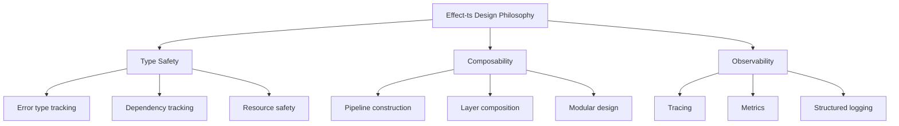
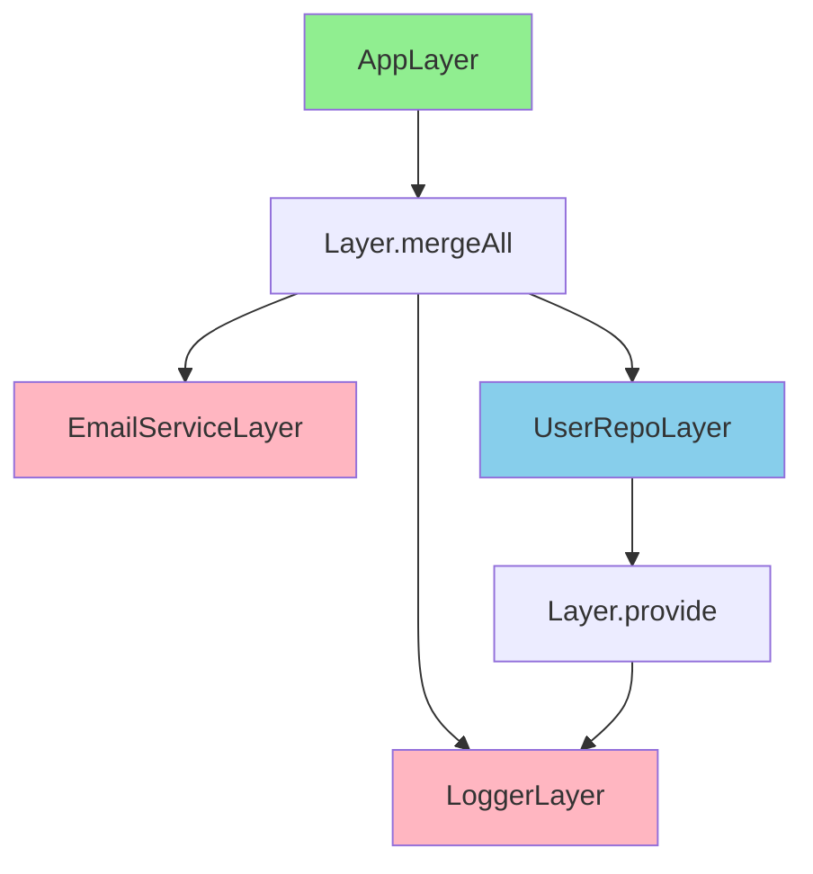
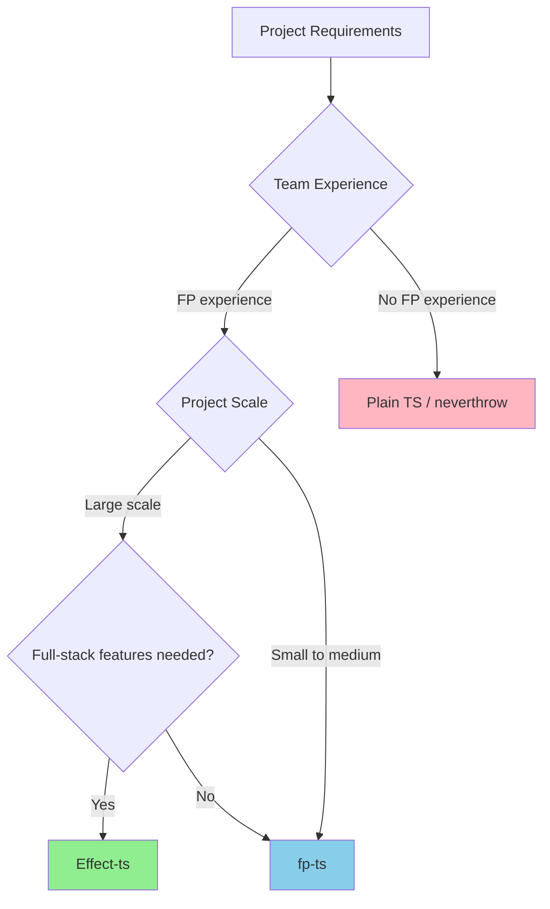

# Effect-ts Complete Guide

> An effect system for TypeScript -- a next-generation framework for managing dependency injection, error handling, and concurrency at the type level

## What You Will Learn

1. **Core Concepts of Effect** -- the meaning of the `Effect<A, E, R>` type, building basic pipelines, and how to run effects
2. **Error Management and Services** -- typed errors, DI via Layer, and Resource management patterns
3. **Concurrency and Streams** -- advanced async patterns using Fiber, Schedule, and Stream
4. **Production Adoption** -- practical design patterns, testing strategies, and performance optimization


## Prerequisites

Having the following knowledge before reading this guide will deepen your understanding:

- Basic programming knowledge
- Understanding of related foundational concepts
- Familiarity with the content in [tRPC Complete Guide](./02-trpc.md)

---

## Table of Contents

1. [Design Philosophy of Effect-ts](#1-design-philosophy-of-effect-ts)
2. [Basics of the Effect<A, E, R> Type](#2-basics-of-the-effecta-e-r-type)
3. [Pipelines and Combinators](#3-pipelines-and-combinators)
4. [Type-Safe Error Handling](#4-type-safe-error-handling)
5. [Dependency Injection (Layer, Context, Service)](#5-dependency-injection-layer-context-service)
6. [Concurrency (Fiber, Queue, Ref)](#6-concurrency-fiber-queue-ref)
7. [Scheduling and Retry](#7-scheduling-and-retry)
8. [Validation with Schema](#8-validation-with-schema)
9. [Stream Processing (Stream, Sink, Channel)](#9-stream-processing-stream-sink-channel)
10. [Production Use Cases](#10-production-use-cases)
11. [Comparison with fp-ts / Zod](#11-comparison-with-fp-ts--zod)
12. [Exercises](#12-exercises)
13. [Anti-patterns](#13-anti-patterns)
14. [Edge Case Analysis](#14-edge-case-analysis)
15. [FAQ](#15-faq)

---

## 1. Design Philosophy of Effect-ts

### 1-1. What Is an Effect System?

Effect-ts is a framework that introduces an **effect system** (Effect System) to TypeScript. An effect system is a mechanism for explicitly treating program "side effects" as types.

```
Traditional TypeScript:

  function fetchUser(id: string): Promise<User>

  Problems:
  - Unknown what errors can occur
  - Unknown what dependencies are required
  - Failure handling is not reflected in the type

Effect-ts:

  function fetchUser(id: string): Effect<User, NotFoundError | DbError, UserRepo & Logger>

  Benefits:
  - Success type: User
  - Failure type: NotFoundError | DbError
  - Required dependencies: UserRepo & Logger
  - Everything is tracked as types
```

### 1-2. Three Pillars of Design Philosophy



#### (1) Type Safety

All side effects (errors, dependencies, resources) are expressed as types.

```typescript
import { Effect } from "effect";

// Error types are tracked at compile time
const program: Effect.Effect<number, DivisionByZeroError> =
  divide(10, 0);

// Compile error if the error is not handled
const safe: Effect.Effect<number, never> = program.pipe(
  Effect.catchAll(() => Effect.succeed(0))
);
```

#### (2) Composability

Small Effects are combined to build larger Effects.

```typescript
const saveUser = (user: User) =>
  Effect.gen(function* () {
    yield* validateUser(user);    // Effect<void, ValidationError, Validator>
    yield* storeInDb(user);        // Effect<void, DbError, Database>
    yield* sendEmail(user.email);  // Effect<void, EmailError, EmailService>
    yield* logEvent("user.created"); // Effect<void, never, Logger>
  });
// Type: Effect<void, ValidationError | DbError | EmailError, Validator & Database & EmailService & Logger>
```

#### (3) Observability

Runtime tracing, metrics, and logging are built in.

```typescript
const program = fetchUser("123").pipe(
  Effect.withSpan("fetchUser", { attributes: { userId: "123" } }),
  Effect.tap((user) => Effect.log(`Fetched user: ${user.name}`)),
  Effect.tapErrorCause((cause) => Effect.logError("Fetch failed", cause))
);
```

### 1-3. Why Is Effect-ts Needed?

| Problem | Traditional Approach | Effect-ts Solution |
|---------|---------------------|-------------------|
| Error type tracking | try-catch (no type info) | `E` parameter of `Effect<A, E, R>` |
| Dependency injection | Constructor injection / DI containers | Declarative DI via Layer |
| Retry / timeout | Manual implementation / varies per library | Unified mechanism via Schedule |
| Resource management | try-finally / AsyncDisposable | Automatic management via Scope |
| Concurrency | Promise.all / manual control | Structured concurrency via Fiber |
| Testability | Manual mock/stub management | Easy testing via Layer substitution |

---

## 2. Basics of the Effect<A, E, R> Type

### 2-1. Meaning of the Three Type Parameters

```
The three type parameters of Effect<A, E, R>:

  Effect<A, E, R>
          |  |  |
          |  |  +--- R: Requirements (required dependencies)
          |  +------ E: Error (type of possible errors)
          +--------- A: Success (type of the value on success)

  Example:
  Effect<User, NotFoundError | DbError, UserRepo & Logger>

  Meaning:
  - Returns User on success
  - NotFoundError or DbError may occur
  - Requires UserRepo and Logger to run
```

```typescript
import { Effect } from "effect";

// (1) Succeeding Effect: Effect<A, never, never>
const succeed: Effect.Effect<number> = Effect.succeed(42);
//   Type parameters: A=number, E=never (no error), R=never (no dependency)

// (2) Failing Effect: Effect<never, E, never>
const fail: Effect.Effect<never, Error> = Effect.fail(new Error("boom"));
//   Type parameters: A=never (never succeeds), E=Error, R=never

// (3) Effect requiring a dependency: Effect<A, E, R>
interface Database {
  readonly query: (sql: string) => Promise<unknown>;
}

const queryDb: Effect.Effect<string, DbError, Database> =
  Effect.gen(function* () {
    const db = yield* Effect.context<Database>();
    // depends on Database
    return "result";
  });
```

### 2-2. Ways to Create an Effect

#### (1) Creating from Values

```typescript
import { Effect } from "effect";

// Success value
const a = Effect.succeed(42);
// Effect<number, never, never>

// Failure value
const b = Effect.fail("error");
// Effect<never, string, never>

// Lazy evaluation
const c = Effect.sync(() => {
  console.log("evaluated!");
  return 100;
});
// Effect<number, never, never>
// console.log is not called until executed

// void (Unit)
const d = Effect.void;
// Effect<void, never, never>
```

#### (2) Creating from a Promise

```typescript
import { Effect } from "effect";

// tryPromise: Promise<T> → Effect<T, UnknownException>
const e = Effect.tryPromise(() =>
  fetch("/api/data").then((r) => r.json())
);
// Effect<any, UnknownException, never>

// Transform the error
class FetchError {
  readonly _tag = "FetchError";
  constructor(readonly cause: unknown) {}
}

const f = Effect.tryPromise({
  try: () => fetch("/api/data").then((r) => r.json()),
  catch: (error) => new FetchError(error),
});
// Effect<any, FetchError, never>
```

#### (3) Catching Synchronous Exceptions

```typescript
import { Effect } from "effect";

// try: a function that may throw an exception
const g = Effect.try(() => {
  const data = JSON.parse('{"invalid"}'); // throws SyntaxError
  return data;
});
// Effect<unknown, UnknownException, never>

// Transform the error with catch
class ParseError {
  readonly _tag = "ParseError";
  constructor(readonly input: string, readonly cause: unknown) {}
}

const h = Effect.try({
  try: () => JSON.parse('{"invalid"}'),
  catch: (error) => new ParseError('{"invalid"}', error),
});
// Effect<unknown, ParseError, never>
```

### 2-3. Running an Effect

```typescript
import { Effect } from "effect";

const program = Effect.succeed(42);

// (1) runSync: run synchronously (errors are thrown as exceptions)
const result1 = Effect.runSync(program);
// 42

// (2) runPromise: run as a Promise
const result2 = await Effect.runPromise(program);
// 42

// (3) runPromiseExit: run as Exit type (safely retrieves errors too)
const exit = await Effect.runPromiseExit(program);
if (exit._tag === "Success") {
  console.log(exit.value); // 42
} else {
  console.error(exit.cause);
}

// (4) runFork: run as a Fiber (background)
const fiber = Effect.runFork(program);
const result3 = await fiber.await();
```

### 2-4. Comparison Table of Effect Runner Functions

| Function | Return Value | On Error | Use Case | Notes |
|----------|-------------|---------|----------|-------|
| `runSync` | `A` | throw | Run synchronous Effects | Cannot be used for async Effects |
| `runPromise` | `Promise<A>` | reject | Run async Effects | Errors are rejected |
| `runPromiseExit` | `Promise<Exit<A, E>>` | safe | Required error handling | Safest option |
| `runFork` | `RuntimeFiber<A, E>` | stored in Fiber | Background execution | Get result with await |
| `runCallback` | `void` | callback | Event-driven | Integration with legacy code |

---

## 3. Pipelines and Combinators

### 3-1. Building Pipelines with pipe

```
Effect pipeline:

  Effect.succeed(42)
       |
  .pipe(Effect.map(n => n * 2))        → Effect<84>
       |
  .pipe(Effect.flatMap(n => ...))      → Effect<string, Error>
       |
  .pipe(Effect.catchTag("NotFound",    → recover from error
        () => Effect.succeed("default")))
       |
  .pipe(Effect.tap(v =>                → side effect (value unchanged)
        Effect.log(`value: ${v}`)))
       |
  Effect.runPromise(...)               → Promise<string>
```

```typescript
import { Effect, pipe } from "effect";

// Pipeline using the pipe function
const program = pipe(
  Effect.succeed(10),
  Effect.map((n) => n * 2),           // 20
  Effect.flatMap((n) =>
    n > 15
      ? Effect.succeed(`Large: ${n}`)
      : Effect.fail(new Error("Too small"))
  ),
  Effect.tap((value) =>
    Effect.log(`Result: ${value}`)
  )
);

// Method chaining style (same meaning)
const program2 = Effect.succeed(10).pipe(
  Effect.map((n) => n * 2),
  Effect.flatMap((n) =>
    n > 15
      ? Effect.succeed(`Large: ${n}`)
      : Effect.fail(new Error("Too small"))
  ),
  Effect.tap((value) => Effect.log(`Result: ${value}`))
);

// Execute
const result = await Effect.runPromise(program);
// "Large: 20"
```

### 3-2. Key Combinators

#### (1) map: Transform a Value

```typescript
import { Effect } from "effect";

const program = Effect.succeed(42).pipe(
  Effect.map((n) => n * 2),
  Effect.map((n) => `Result: ${n}`)
);
// Effect<string, never, never>
// Result: "Result: 84"
```

#### (2) flatMap: Transform Returning an Effect

```typescript
import { Effect } from "effect";

const divide = (a: number, b: number): Effect.Effect<number, string> =>
  b === 0
    ? Effect.fail("Division by zero")
    : Effect.succeed(a / b);

const program = Effect.succeed(10).pipe(
  Effect.flatMap((n) => divide(n, 2)),  // 5
  Effect.flatMap((n) => divide(n, 0))   // error
);
// Effect<number, string, never>
```

#### (3) tap: Insert a Side Effect (value unchanged)

```typescript
import { Effect } from "effect";

const program = Effect.succeed(42).pipe(
  Effect.tap((n) => Effect.log(`Value is ${n}`)), // logs but value is unchanged
  Effect.map((n) => n * 2)
);
// Effect<number, never, never>
// Result: 84 (log: "Value is 42")
```

#### (4) zipWith: Combine Two Effects

```typescript
import { Effect } from "effect";

const a = Effect.succeed(10);
const b = Effect.succeed(20);

const sum = Effect.zipWith(a, b, (x, y) => x + y);
// Effect<number, never, never>
// Result: 30
```

#### (5) filterOrFail: Fail If Condition Is Not Met

```typescript
import { Effect } from "effect";

const program = Effect.succeed(42).pipe(
  Effect.filterOrFail(
    (n) => n > 50,
    () => new Error("Value too small")
  )
);
// Effect<number, Error, never>
// Results in an error when run
```

### 3-3. Generator Syntax with Effect.gen

Using `Effect.gen`, you can extract Effect values with `yield*` and write in a synchronous style.

```typescript
import { Effect } from "effect";

// pipe style
const program1 = pipe(
  Effect.succeed(10),
  Effect.flatMap((a) =>
    pipe(
      Effect.succeed(20),
      Effect.map((b) => a + b)
    )
  )
);

// Effect.gen style (same meaning)
const program2 = Effect.gen(function* () {
  const a = yield* Effect.succeed(10);
  const b = yield* Effect.succeed(20);
  return a + b;
});
```

#### Detailed Example of Effect.gen

```typescript
import { Effect, Data } from "effect";

class NotFoundError extends Data.TaggedError("NotFoundError")<{
  readonly id: string;
}> {}

class PermissionError extends Data.TaggedError("PermissionError")<{
  readonly action: string;
}> {}

interface User {
  id: string;
  name: string;
  role: "ADMIN" | "USER";
}

const findUser = (id: string): Effect.Effect<User, NotFoundError> =>
  id === "123"
    ? Effect.succeed({ id, name: "Alice", role: "ADMIN" })
    : Effect.fail(new NotFoundError({ id }));

const fetchPosts = (userId: string): Effect.Effect<string[]> =>
  Effect.succeed([`post1-${userId}`, `post2-${userId}`]);

const fetchComments = (userId: string): Effect.Effect<string[]> =>
  Effect.succeed([`comment1-${userId}`]);

// Write synchronously with Effect.gen
const program = Effect.gen(function* () {
  // Extract the value of an Effect with yield*
  const user = yield* findUser("123");

  // Regular if statements can be used
  if (user.role !== "ADMIN") {
    yield* Effect.fail(
      new PermissionError({ action: "delete" })
    );
  }

  // Parallel execution
  const [posts, comments] = yield* Effect.all(
    [fetchPosts(user.id), fetchComments(user.id)],
    { concurrency: 2 }
  );

  // Logging
  yield* Effect.log(`User ${user.name} has ${posts.length} posts`);

  return { user, posts, comments };
});
```

---

## 4. Type-Safe Error Handling

### 4-1. Defining Typed Errors

In Effect-ts, errors are defined as **discriminated types**.

```typescript
import { Data } from "effect";

// Using Data.TaggedError automatically adds the _tag field
class NotFoundError extends Data.TaggedError("NotFoundError")<{
  readonly resource: string;
  readonly id: string;
}> {}

class ValidationError extends Data.TaggedError("ValidationError")<{
  readonly message: string;
  readonly fields: readonly string[];
}> {}

class DatabaseError extends Data.TaggedError("DatabaseError")<{
  readonly cause: unknown;
}> {}

class NetworkError extends Data.TaggedError("NetworkError")<{
  readonly url: string;
  readonly statusCode: number;
}> {}

// Usage example
const error1 = new NotFoundError({ resource: "User", id: "123" });
console.log(error1._tag); // "NotFoundError"

const error2 = new ValidationError({
  message: "Invalid email",
  fields: ["email"],
});
console.log(error2._tag); // "ValidationError"
```

### 4-2. Effects That Return Errors

```typescript
import { Effect, pipe, Data } from "effect";

class NotFoundError extends Data.TaggedError("NotFoundError")<{
  readonly resource: string;
  readonly id: string;
}> {}

class DatabaseError extends Data.TaggedError("DatabaseError")<{
  readonly cause: unknown;
}> {}

interface User {
  id: string;
  name: string;
}

interface Database {
  findById: (id: string) => Promise<User | null>;
}

// Effect that returns errors
function findUser(
  id: string
): Effect.Effect<User, NotFoundError | DatabaseError, Database> {
  return Effect.gen(function* () {
    const db = yield* Effect.context<Database>();

    // Convert Promise to Effect
    const user = yield* Effect.tryPromise({
      try: () => db.findById(id),
      catch: (cause) => new DatabaseError({ cause }),
    });

    // NotFoundError if null
    if (user === null) {
      yield* Effect.fail(new NotFoundError({ resource: "User", id }));
    }

    return user;
  });
}
// Type: Effect<User, NotFoundError | DatabaseError, Database>
```

### 4-3. Error Handling Patterns

#### (1) catchAll: Handle All Errors

```typescript
import { Effect } from "effect";

const program = findUser("123").pipe(
  Effect.catchAll((error) => {
    console.error("Error:", error);
    return Effect.succeed(null); // return a default value
  })
);
// Type: Effect<User | null, never, Database>
```

#### (2) catchTag: Handle Only a Specific Error Tag

```typescript
import { Effect } from "effect";

const userOrDefault = findUser("123").pipe(
  Effect.catchTag("NotFoundError", (error) =>
    Effect.succeed({ id: error.id, name: "Guest" } as User)
  )
  // DatabaseError propagates as-is
);
// Type: Effect<User, DatabaseError, Database>
```

#### (3) catchTags: Handle Multiple Error Tags

```typescript
import { Effect } from "effect";

const resilient = findUser("123").pipe(
  Effect.catchTags({
    NotFoundError: (error) =>
      Effect.succeed({ id: error.id, name: "Guest" } as User),
    DatabaseError: (error) => {
      console.error("DB Error:", error.cause);
      return Effect.fail(new Error("Service unavailable"));
    },
  })
);
// Type: Effect<User, Error, Database>
```

#### (4) catchSome: Conditional Error Handling

```typescript
import { Effect, Option } from "effect";

const program = findUser("123").pipe(
  Effect.catchSome((error) => {
    if (error._tag === "NotFoundError" && error.id === "123") {
      return Option.some(Effect.succeed({ id: "123", name: "Default" } as User));
    }
    return Option.none(); // propagate the error
  })
);
```

#### (5) orElse: Try Another Effect on Failure

```typescript
import { Effect } from "effect";

const program = findUser("123").pipe(
  Effect.orElse(() => findUser("456")), // try another user on failure
  Effect.orElse(() => Effect.succeed({ id: "default", name: "Guest" } as User))
);
```

### 4-4. Error Handling Comparison Table

| Pattern | Usage | Change in Error Type |
|---------|-------|---------------------|
| `catchAll` | Handle all errors | `Effect<A, E, R>` → `Effect<A \| B, never, R>` |
| `catchTag` | Handle only a specific tag | `Effect<A, E1 \| E2, R>` → `Effect<A, E2, R>` |
| `catchTags` | Handle multiple tags | `Effect<A, E1 \| E2 \| E3, R>` → `Effect<A, E3, R>` |
| `catchSome` | Conditional handling | `Effect<A, E, R>` → `Effect<A, E, R>` (handles only some) |
| `orElse` | Fall back to another Effect | `Effect<A, E, R>` → `Effect<A, E2, R>` |

---

## 5. Dependency Injection (Layer, Context, Service)

### 5-1. Defining Services

```
Layer architecture:

  +---------------------+
  | Application Layer   |  Effect<A, E, UserRepo & Logger>
  +---------------------+
           |
           | requires
           v
  +---------------------+
  | Service Layer       |  Layer<UserRepo & Logger>
  +---------------------+
       |           |
       v           v
  +----------+ +---------+
  | UserRepo | | Logger  |  Concrete implementations
  +----------+ +---------+
       |
       v
  +----------+
  | Database |  Lower-level dependency
  +----------+
```

```typescript
import { Effect, Context, Layer, Data } from "effect";

// Error definitions
class DatabaseError extends Data.TaggedError("DatabaseError")<{
  readonly cause: unknown;
}> {}

class EmailError extends Data.TaggedError("EmailError")<{
  readonly cause: unknown;
}> {}

interface User {
  id: string;
  name: string;
  email: string;
  createdAt: Date;
}

// Define service interfaces
class UserRepository extends Context.Tag("UserRepository")<
  UserRepository,
  {
    readonly findById: (id: string) => Effect.Effect<User | null, DatabaseError>;
    readonly save: (user: User) => Effect.Effect<void, DatabaseError>;
    readonly delete: (id: string) => Effect.Effect<void, DatabaseError>;
  }
>() {}

class EmailService extends Context.Tag("EmailService")<
  EmailService,
  {
    readonly send: (
      to: string,
      subject: string,
      body: string
    ) => Effect.Effect<void, EmailError>;
  }
>() {}

class Logger extends Context.Tag("Logger")<
  Logger,
  {
    readonly info: (message: string) => Effect.Effect<void>;
    readonly error: (message: string, cause?: unknown) => Effect.Effect<void>;
  }
>() {}
```

### 5-2. Using Services

```typescript
import { Effect } from "effect";

class ValidationError extends Data.TaggedError("ValidationError")<{
  readonly message: string;
}> {}

interface CreateUserDto {
  name: string;
  email: string;
}

// Function that uses services
function createUser(
  data: CreateUserDto
): Effect.Effect<
  User,
  ValidationError | DatabaseError | EmailError,
  UserRepository & EmailService & Logger
> {
  return Effect.gen(function* () {
    // Retrieve services
    const userRepo = yield* UserRepository;
    const emailService = yield* EmailService;
    const logger = yield* Logger;

    // Validation
    if (!data.email.includes("@")) {
      yield* Effect.fail(new ValidationError({ message: "Invalid email" }));
    }

    // Logging
    yield* logger.info(`Creating user: ${data.email}`);

    // Create user
    const user: User = {
      id: crypto.randomUUID(),
      name: data.name,
      email: data.email,
      createdAt: new Date(),
    };

    // Save to DB
    yield* userRepo.save(user);

    // Send email
    yield* emailService.send(user.email, "Welcome!", `Hello ${user.name}`);

    // Logging
    yield* logger.info(`User created: ${user.id}`);

    return user;
  });
}
```

### 5-3. Implementing Layers

```typescript
import { Effect, Layer } from "effect";

// (1) Logger implementation
const ConsoleLoggerLive = Layer.succeed(Logger, {
  info: (message) => Effect.log(`[INFO] ${message}`),
  error: (message, cause) =>
    Effect.logError(`[ERROR] ${message}`, cause),
});

// (2) EmailService implementation
const ConsoleEmailServiceLive = Layer.succeed(EmailService, {
  send: (to, subject, body) =>
    Effect.sync(() => {
      console.log(`Email to ${to}: ${subject}`);
      console.log(body);
    }),
});

// (3) UserRepository implementation (depends on other services)
const InMemoryUserRepoLive = Layer.effect(
  UserRepository,
  Effect.gen(function* () {
    const logger = yield* Logger;
    const users = new Map<string, User>();

    return {
      findById: (id) =>
        Effect.sync(() => users.get(id) ?? null),

      save: (user) =>
        Effect.gen(function* () {
          users.set(user.id, user);
          yield* logger.info(`Saved user: ${user.id}`);
        }),

      delete: (id) =>
        Effect.gen(function* () {
          users.delete(id);
          yield* logger.info(`Deleted user: ${id}`);
        }),
    };
  })
);

// Layer composition
const AppLayerLive = Layer.mergeAll(
  ConsoleLoggerLive,
  ConsoleEmailServiceLive,
  InMemoryUserRepoLive.pipe(
    Layer.provide(ConsoleLoggerLive) // UserRepo depends on Logger
  )
);

// Execute
const program = createUser({ name: "Alice", email: "alice@example.com" });
const result = await Effect.runPromise(
  program.pipe(Effect.provide(AppLayerLive))
);
```

### 5-4. Test Layer

```typescript
import { Layer } from "effect";

// Mock Layer for testing
const MockUserRepoLive = Layer.succeed(UserRepository, {
  findById: (id) =>
    Effect.succeed({
      id,
      name: "Test User",
      email: "test@example.com",
      createdAt: new Date(),
    }),
  save: () => Effect.void,
  delete: () => Effect.void,
});

const MockEmailServiceLive = Layer.succeed(EmailService, {
  send: () => Effect.void, // does not send email
});

const TestLayerLive = Layer.mergeAll(
  ConsoleLoggerLive,
  MockEmailServiceLive,
  MockUserRepoLive.pipe(Layer.provide(ConsoleLoggerLive))
);

// Use TestLayer in tests
const testResult = await Effect.runPromise(
  createUser({ name: "Bob", email: "bob@test.com" }).pipe(
    Effect.provide(TestLayerLive)
  )
);
```

### 5-5. Layer Composition Patterns



| Pattern | Method | Description |
|---------|--------|-------------|
| Parallel composition | `Layer.mergeAll(a, b, c)` | Compose multiple Layers in parallel |
| Provide dependency | `layer.pipe(Layer.provide(dep))` | Inject dependency into a Layer |
| Conditional branching | Branch by environment variable | Use different Layers for production/test |

---

## 6. Concurrency (Fiber, Queue, Ref)

### 6-1. Basic Concurrency Patterns

```typescript
import { Effect } from "effect";

const fetchUser = (id: string): Effect.Effect<User> =>
  Effect.succeed({ id, name: `User ${id}`, email: `${id}@example.com`, createdAt: new Date() });

// (1) Parallel execution (unbounded)
const allUsers = Effect.all(
  [fetchUser("1"), fetchUser("2"), fetchUser("3")],
  { concurrency: "unbounded" }
);
// Type: Effect<[User, User, User], never, never>

// (2) Bounded parallel execution
const urls = ["url1", "url2", "url3", "url4", "url5"];
const limited = Effect.all(
  urls.map((url) => Effect.succeed(url)),
  { concurrency: 2 } // max 2 concurrent
);

// (3) Use the first successful result
const fastest = Effect.raceAll([
  Effect.succeed("CDN1"),
  Effect.succeed("CDN2"),
  Effect.succeed("CDN3"),
]);

// (4) forEach: apply an Effect to each element of an array
const userIds = ["1", "2", "3", "4", "5"];
const results = Effect.forEach(
  userIds,
  (id) => fetchUser(id),
  { concurrency: 3 }
);
```

### 6-2. Concurrency with Fiber

```typescript
import { Effect, Fiber } from "effect";

// Fiber: like a lightweight thread
const program = Effect.gen(function* () {
  // Run in background
  const fiber1 = yield* Effect.fork(
    Effect.gen(function* () {
      yield* Effect.sleep("1 second");
      return "Result 1";
    })
  );

  const fiber2 = yield* Effect.fork(
    Effect.gen(function* () {
      yield* Effect.sleep("500 millis");
      return "Result 2";
    })
  );

  // Do other work
  yield* Effect.log("Doing other work...");

  // Wait for Fiber results
  const result1 = yield* Fiber.join(fiber1);
  const result2 = yield* Fiber.join(fiber2);

  return [result1, result2];
});
```

### 6-3. Fiber Control

```typescript
import { Effect, Fiber } from "effect";

const program = Effect.gen(function* () {
  const fiber = yield* Effect.fork(
    Effect.gen(function* () {
      yield* Effect.sleep("10 seconds");
      return "Long running task";
    })
  );

  // Wait 500ms
  yield* Effect.sleep("500 millis");

  // Interrupt the Fiber
  yield* Fiber.interrupt(fiber);

  // Check if interrupted
  const result = yield* Fiber.await(fiber);
  if (result._tag === "Failure") {
    yield* Effect.log("Fiber was interrupted");
  }
});
```

### 6-4. Ref: Shared Mutable State

```typescript
import { Effect, Ref } from "effect";

const program = Effect.gen(function* () {
  // Create a Ref
  const counter = yield* Ref.make(0);

  // Get the value
  const value1 = yield* Ref.get(counter);
  console.log(value1); // 0

  // Set the value
  yield* Ref.set(counter, 10);

  // Update the value
  yield* Ref.update(counter, (n) => n + 5);

  // Atomic update and get
  const oldValue = yield* Ref.getAndUpdate(counter, (n) => n * 2);
  console.log(oldValue); // 15

  const newValue = yield* Ref.get(counter);
  console.log(newValue); // 30
});
```

### 6-5. Queue: Concurrent Queue

```typescript
import { Effect, Queue } from "effect";

const program = Effect.gen(function* () {
  // Create a queue (capacity 100)
  const queue = yield* Queue.bounded<string>(100);

  // Producer
  const producer = Effect.gen(function* () {
    for (let i = 0; i < 10; i++) {
      yield* Queue.offer(queue, `Item ${i}`);
      yield* Effect.sleep("100 millis");
    }
  });

  // Consumer
  const consumer = Effect.gen(function* () {
    for (let i = 0; i < 10; i++) {
      const item = yield* Queue.take(queue);
      yield* Effect.log(`Consumed: ${item}`);
    }
  });

  // Run in parallel
  yield* Effect.all([producer, consumer], { concurrency: 2 });
});
```

### 6-6. Concurrency Pattern Comparison Table

| Pattern | Use Case | Code Example |
|---------|----------|-------------|
| `Effect.all` | Run multiple Effects in parallel | `Effect.all([a, b, c], { concurrency: 3 })` |
| `Effect.race` | Use the first completed Effect | `Effect.race(a, b)` |
| `Effect.fork` | Run in background | `yield* Effect.fork(longTask)` |
| `Fiber.join` | Wait for a Fiber result | `yield* Fiber.join(fiber)` |
| `Ref` | Shared mutable state | `yield* Ref.update(counter, n => n + 1)` |
| `Queue` | Producer / consumer | `yield* Queue.offer(queue, item)` |

---

## 7. Scheduling and Retry

### 7-1. Schedule Basics

```typescript
import { Effect, Schedule } from "effect";

// (1) Fixed interval
const everySecond = Schedule.fixed("1 second");

// (2) Exponential backoff
const exponential = Schedule.exponential("100 millis");
// 100ms, 200ms, 400ms, 800ms, ...

// (3) Limit number of repetitions
const maxRetries = Schedule.recurs(5); // up to 5 times

// (4) Composition
const policy = Schedule.exponential("100 millis").pipe(
  Schedule.compose(Schedule.recurs(5)),
  Schedule.jittered // add random jitter
);
```

### 7-2. Retry Strategies

```typescript
import { Effect, Schedule } from "effect";

class NetworkError extends Data.TaggedError("NetworkError")<{
  readonly url: string;
}> {}

const fetchData = (url: string): Effect.Effect<string, NetworkError> =>
  Effect.fail(new NetworkError({ url })); // always fails in this example

// (1) Basic retry
const retried = fetchData("https://api.example.com").pipe(
  Effect.retry(Schedule.recurs(3)) // retry up to 3 times
);

// (2) Retry with exponential backoff
const retryPolicy = Schedule.exponential("100 millis").pipe(
  Schedule.compose(Schedule.recurs(5)),
  Schedule.jittered
);

const resilient = fetchData("https://api.example.com").pipe(
  Effect.retry(retryPolicy)
);

// (3) With timeout
const withTimeout = fetchData("https://api.example.com").pipe(
  Effect.timeout("5 seconds")
);

// (4) Retry + timeout
const robust = fetchData("https://api.example.com").pipe(
  Effect.timeout("3 seconds"),
  Effect.retry(
    Schedule.exponential("200 millis").pipe(
      Schedule.compose(Schedule.recurs(3))
    )
  )
);
```

### 7-3. Conditional Retry

```typescript
import { Effect, Schedule } from "effect";

class TransientError extends Data.TaggedError("TransientError")<{
  readonly cause: unknown;
}> {}

class PermanentError extends Data.TaggedError("PermanentError")<{
  readonly cause: unknown;
}> {}

const task: Effect.Effect<string, TransientError | PermanentError> =
  Effect.fail(new TransientError({ cause: "Network issue" }));

// Retry only for TransientError
const selective = task.pipe(
  Effect.retry({
    schedule: Schedule.recurs(3),
    while: (error) => error._tag === "TransientError",
  })
);
```

### 7-4. repeat: Repeated Execution

```typescript
import { Effect, Schedule } from "effect";

// (1) Repeat 10 times
const repeated = Effect.log("Hello").pipe(
  Effect.repeat(Schedule.recurs(10))
);

// (2) Repeat indefinitely every 1 second
const polling = Effect.gen(function* () {
  const data = yield* fetchData("https://api.example.com/status");
  yield* Effect.log(`Status: ${data}`);
}).pipe(
  Effect.repeat(Schedule.fixed("1 second"))
);

// (3) Repeat until a condition is met
const untilCondition = Effect.sync(() => Math.random()).pipe(
  Effect.repeat({
    schedule: Schedule.spaced("100 millis"),
    until: (value) => value > 0.9, // until value exceeds 0.9
  })
);
```

### 7-5. Schedule Pattern Comparison Table

| Schedule | Description | Use Case |
|----------|-------------|----------|
| `fixed(duration)` | Fixed interval | Periodic execution, polling |
| `exponential(base)` | Exponential backoff | Retry, rate limit avoidance |
| `recurs(n)` | Up to n times | Retry count limit |
| `spaced(duration)` | Fixed interval + immediate first run | Polling |
| `jittered` | Add random jitter | Avoid thundering herd problem |

---

## 8. Validation with Schema

Effect-ts provides powerful validation via `@effect/schema` (now integrated into the `effect` package).

### 8-1. Schema Basics

```typescript
import { Schema } from "effect";

// (1) Primitive types
const StringSchema = Schema.String;
const NumberSchema = Schema.Number;
const BooleanSchema = Schema.Boolean;

// (2) Literal type
const RoleSchema = Schema.Literal("ADMIN", "USER", "GUEST");

// (3) Object
const UserSchema = Schema.Struct({
  id: Schema.String,
  name: Schema.String,
  email: Schema.String,
  age: Schema.Number,
  role: RoleSchema,
});

// (4) Array
const UsersSchema = Schema.Array(UserSchema);

// (5) Optional
const UserWithOptionalAgeSchema = Schema.Struct({
  id: Schema.String,
  name: Schema.String,
  email: Schema.String,
  age: Schema.optional(Schema.Number),
  role: RoleSchema,
});
```

### 8-2. Running Validation

```typescript
import { Schema, Effect } from "effect";

const UserSchema = Schema.Struct({
  id: Schema.String,
  name: Schema.String,
  email: Schema.String.pipe(Schema.pattern(/^[^\s@]+@[^\s@]+\.[^\s@]+$/)),
  age: Schema.Number.pipe(Schema.greaterThanOrEqualTo(0)),
});

// unknown → User conversion
const parse = Schema.decodeUnknown(UserSchema);

const validData = {
  id: "123",
  name: "Alice",
  email: "alice@example.com",
  age: 25,
};

const program = Effect.gen(function* () {
  // Validation success
  const user = yield* parse(validData);
  console.log(user); // { id: "123", name: "Alice", ... }

  // Validation failure
  const invalidData = { id: "456", name: "Bob", email: "invalid", age: -5 };
  const result = yield* Effect.either(parse(invalidData));

  if (result._tag === "Left") {
    console.error("Validation failed:", result.left);
  }
});
```

### 8-3. Custom Validation

```typescript
import { Schema } from "effect";

// (1) Custom constraint
const PositiveNumber = Schema.Number.pipe(
  Schema.filter((n) => n > 0, { message: () => "Must be positive" })
);

// (2) Transform
const TrimmedString = Schema.String.pipe(
  Schema.transform(
    Schema.String,
    {
      decode: (s) => s.trim(),
      encode: (s) => s,
    }
  )
);

// (3) Custom type
const EmailSchema = Schema.String.pipe(
  Schema.pattern(/^[^\s@]+@[^\s@]+\.[^\s@]+$/),
  Schema.brand("Email")
);

type Email = Schema.Schema.Type<typeof EmailSchema>;

// (4) Complex validation
const PasswordSchema = Schema.String.pipe(
  Schema.minLength(8),
  Schema.filter(
    (s) => /[A-Z]/.test(s) && /[a-z]/.test(s) && /[0-9]/.test(s),
    { message: () => "Must contain uppercase, lowercase, and digit" }
  )
);
```

### 8-4. Validating API Requests

```typescript
import { Schema, Effect, Data } from "effect";

class ValidationError extends Data.TaggedError("ValidationError")<{
  readonly errors: ReadonlyArray<string>;
}> {}

const CreateUserRequestSchema = Schema.Struct({
  name: Schema.String.pipe(Schema.minLength(1)),
  email: Schema.String.pipe(Schema.pattern(/^[^\s@]+@[^\s@]+\.[^\s@]+$/)),
  age: Schema.Number.pipe(
    Schema.greaterThanOrEqualTo(0),
    Schema.lessThanOrEqualTo(150)
  ),
});

type CreateUserRequest = Schema.Schema.Type<typeof CreateUserRequestSchema>;

const validateRequest = (
  data: unknown
): Effect.Effect<CreateUserRequest, ValidationError> => {
  const decode = Schema.decodeUnknown(CreateUserRequestSchema);

  return decode(data).pipe(
    Effect.mapError((error) =>
      new ValidationError({
        errors: [String(error)],
      })
    )
  );
};

// Usage example
const handleRequest = (body: unknown) =>
  Effect.gen(function* () {
    const request = yield* validateRequest(body);

    // request can be used in a type-safe way
    const user = yield* createUser(request);

    return user;
  });
```

### 8-5. Schema vs Zod Comparison Table

| Feature | @effect/schema | Zod |
|---------|---------------|-----|
| Effect integration | Native | Manual conversion required |
| Error type | Tracked as Effect error | ZodError (exception) |
| Performance | Optimized decode | Standard |
| Transform | Bidirectional (encode/decode) | One-direction only |
| Bundle size | Included in Effect | ~8KB |

---

## 9. Stream Processing (Stream, Sink, Channel)

### 9-1. Stream Basics

```typescript
import { Stream, Effect } from "effect";

// (1) Creating a Stream
const stream1 = Stream.make(1, 2, 3, 4, 5);

const stream2 = Stream.range(1, 10); // 1, 2, ..., 9

const stream3 = Stream.fromIterable([1, 2, 3]);

// (2) Stream operations
const doubled = stream1.pipe(
  Stream.map((n) => n * 2)
);

const filtered = stream1.pipe(
  Stream.filter((n) => n % 2 === 0)
);

// (3) Running a Stream
const program = Stream.runCollect(doubled);
// Effect<Chunk<number>, never, never>

const result = await Effect.runPromise(program);
// Chunk([2, 4, 6, 8, 10])
```

### 9-2. Async Streams

```typescript
import { Stream, Effect, Schedule } from "effect";

// (1) Create a Stream from an Effect
const fetchStream = Stream.repeatEffect(
  Effect.gen(function* () {
    const response = yield* Effect.tryPromise({
      try: () => fetch("https://api.example.com/data"),
      catch: (error) => new Error(String(error)),
    });
    const data = yield* Effect.tryPromise({
      try: () => response.json(),
      catch: (error) => new Error(String(error)),
    });
    return data;
  })
);

// (2) Periodic execution
const pollingStream = Stream.repeatEffectWithSchedule(
  Effect.sync(() => new Date().toISOString()),
  Schedule.fixed("1 second")
);

// (3) Process a file line by line
const fileStream = Stream.fromIterable(["line1", "line2", "line3"]);

const processed = fileStream.pipe(
  Stream.map((line) => line.toUpperCase()),
  Stream.filter((line) => line.length > 5)
);
```

### 9-3. Stream Composition

```typescript
import { Stream, Effect } from "effect";

const stream1 = Stream.make(1, 2, 3);
const stream2 = Stream.make(4, 5, 6);

// (1) Concatenation
const concatenated = Stream.concat(stream1, stream2);
// 1, 2, 3, 4, 5, 6

// (2) Merge
const merged = Stream.merge(stream1, stream2);
// order is not guaranteed

// (3) Zip
const zipped = Stream.zip(stream1, stream2);
// [1, 4], [2, 5], [3, 6]

// (4) flatMap
const flattened = stream1.pipe(
  Stream.flatMap((n) => Stream.make(n, n * 10))
);
// 1, 10, 2, 20, 3, 30
```

### 9-4. Sink: Terminal Processing for Streams

```typescript
import { Stream, Sink, Effect } from "effect";

const stream = Stream.make(1, 2, 3, 4, 5);

// (1) Sum
const sum = Stream.run(stream, Sink.sum);
// Effect<number, never, never> → 15

// (2) Collect into array
const collect = Stream.run(stream, Sink.collectAll());
// Effect<Chunk<number>, never, never>

// (3) First n elements
const takeFirst = Stream.run(stream, Sink.take(3));
// Effect<Chunk<number>, never, never> → [1, 2, 3]

// (4) Custom Sink
const customSink = Sink.foldLeft(0, (acc, n: number) => acc + n * 2);
const result = Stream.run(stream, customSink);
// 2 + 4 + 6 + 8 + 10 = 30
```

### 9-5. Practical Example: Stream Processing a Log File

```typescript
import { Stream, Effect, pipe } from "effect";

interface LogEntry {
  timestamp: string;
  level: "INFO" | "WARN" | "ERROR";
  message: string;
}

const parseLogLine = (line: string): Effect.Effect<LogEntry, Error> =>
  Effect.try({
    try: () => {
      const [timestamp, level, message] = line.split(" | ");
      return {
        timestamp,
        level: level as "INFO" | "WARN" | "ERROR",
        message,
      };
    },
    catch: (error) => new Error(`Parse failed: ${error}`),
  });

const processLogFile = (lines: string[]) =>
  pipe(
    Stream.fromIterable(lines),
    Stream.mapEffect((line) => parseLogLine(line)),
    Stream.filter((entry) => entry.level === "ERROR"),
    Stream.take(100), // only the first 100 errors
    Stream.runCollect
  );

// Usage example
const lines = [
  "2024-01-01T00:00:00Z | INFO | Server started",
  "2024-01-01T00:01:00Z | ERROR | Connection failed",
  "2024-01-01T00:02:00Z | WARN | High memory usage",
];

const program = processLogFile(lines);
const errors = await Effect.runPromise(program);
```

### 9-6. Stream Pattern Comparison Table

| Pattern | Use Case | Code Example |
|---------|----------|-------------|
| `Stream.make` | Create a static stream | `Stream.make(1, 2, 3)` |
| `Stream.repeatEffect` | Repeat an Effect | `Stream.repeatEffect(fetchData)` |
| `Stream.map` | Transform elements | `stream.pipe(Stream.map(n => n * 2))` |
| `Stream.filter` | Filter elements | `stream.pipe(Stream.filter(n => n > 0))` |
| `Stream.flatMap` | Flatten nested streams | `stream.pipe(Stream.flatMap(n => ...))` |
| `Stream.take` | First n elements | `stream.pipe(Stream.take(10))` |

---

## 10. Production Use Cases

### 10-1. Example API Server

```typescript
import { Effect, Layer, Context, Data } from "effect";
import { Schema } from "effect";

// Error definitions
class ValidationError extends Data.TaggedError("ValidationError")<{
  readonly errors: ReadonlyArray<string>;
}> {}

class DatabaseError extends Data.TaggedError("DatabaseError")<{
  readonly cause: unknown;
}> {}

class NotFoundError extends Data.TaggedError("NotFoundError")<{
  readonly resource: string;
  readonly id: string;
}> {}

// Schema definitions
const UserSchema = Schema.Struct({
  id: Schema.String,
  name: Schema.String,
  email: Schema.String.pipe(Schema.pattern(/^[^\s@]+@[^\s@]+\.[^\s@]+$/)),
  createdAt: Schema.Date,
});

const CreateUserRequestSchema = Schema.Struct({
  name: Schema.String.pipe(Schema.minLength(1)),
  email: Schema.String.pipe(Schema.pattern(/^[^\s@]+@[^\s@]+\.[^\s@]+$/)),
});

type User = Schema.Schema.Type<typeof UserSchema>;
type CreateUserRequest = Schema.Schema.Type<typeof CreateUserRequestSchema>;

// Service definitions
class Database extends Context.Tag("Database")<
  Database,
  {
    readonly query: <A>(sql: string, params: unknown[]) => Effect.Effect<A, DatabaseError>;
  }
>() {}

class Logger extends Context.Tag("Logger")<
  Logger,
  {
    readonly info: (message: string) => Effect.Effect<void>;
    readonly error: (message: string, error: unknown) => Effect.Effect<void>;
  }
>() {}

// Business logic
const createUser = (
  request: CreateUserRequest
): Effect.Effect<User, ValidationError | DatabaseError, Database & Logger> =>
  Effect.gen(function* () {
    const db = yield* Database;
    const logger = yield* Logger;

    yield* logger.info(`Creating user: ${request.email}`);

    const user: User = {
      id: crypto.randomUUID(),
      name: request.name,
      email: request.email,
      createdAt: new Date(),
    };

    yield* db.query(
      "INSERT INTO users (id, name, email, created_at) VALUES ($1, $2, $3, $4)",
      [user.id, user.name, user.email, user.createdAt]
    );

    yield* logger.info(`User created: ${user.id}`);

    return user;
  });

const getUser = (
  id: string
): Effect.Effect<User, NotFoundError | DatabaseError, Database> =>
  Effect.gen(function* () {
    const db = yield* Database;

    const result = yield* db.query<User[]>(
      "SELECT * FROM users WHERE id = $1",
      [id]
    );

    if (result.length === 0) {
      yield* Effect.fail(new NotFoundError({ resource: "User", id }));
    }

    return result[0];
  });

// Layer implementations
const PostgresDatabaseLive = Layer.succeed(Database, {
  query: (sql, params) =>
    Effect.tryPromise({
      try: async () => {
        // Use an actual PostgreSQL client
        // const result = await pool.query(sql, params);
        // return result.rows;
        return [] as any;
      },
      catch: (cause) => new DatabaseError({ cause }),
    }),
});

const ConsoleLoggerLive = Layer.succeed(Logger, {
  info: (message) => Effect.log(`[INFO] ${message}`),
  error: (message, error) => Effect.logError(`[ERROR] ${message}`, error),
});

const AppLayerLive = Layer.mergeAll(
  PostgresDatabaseLive,
  ConsoleLoggerLive
);

// Example integration with Express
import express from "express";

const app = express();
app.use(express.json());

app.post("/users", async (req, res) => {
  const program = Effect.gen(function* () {
    // Validate the request
    const request = yield* Schema.decodeUnknown(CreateUserRequestSchema)(req.body).pipe(
      Effect.mapError((error) => new ValidationError({ errors: [String(error)] }))
    );

    // Create user
    const user = yield* createUser(request);

    return user;
  }).pipe(
    Effect.provide(AppLayerLive)
  );

  const exit = await Effect.runPromiseExit(program);

  if (exit._tag === "Success") {
    res.status(201).json(exit.value);
  } else {
    const error = exit.cause;
    // Error handling
    if (error._tag === "Fail" && error.error._tag === "ValidationError") {
      res.status(400).json({ errors: error.error.errors });
    } else {
      res.status(500).json({ error: "Internal server error" });
    }
  }
});

app.get("/users/:id", async (req, res) => {
  const program = getUser(req.params.id).pipe(
    Effect.provide(AppLayerLive)
  );

  const exit = await Effect.runPromiseExit(program);

  if (exit._tag === "Success") {
    res.json(exit.value);
  } else {
    const error = exit.cause;
    if (error._tag === "Fail" && error.error._tag === "NotFoundError") {
      res.status(404).json({ error: "User not found" });
    } else {
      res.status(500).json({ error: "Internal server error" });
    }
  }
});
```

### 10-2. Batch Processing Example

```typescript
import { Effect, Stream, Schedule } from "effect";

interface Job {
  id: string;
  data: unknown;
}

const processJob = (job: Job): Effect.Effect<void, Error> =>
  Effect.gen(function* () {
    yield* Effect.log(`Processing job: ${job.id}`);
    yield* Effect.sleep("100 millis");
    yield* Effect.log(`Job completed: ${job.id}`);
  });

const batchProcessor = (jobs: Job[]) =>
  pipe(
    Stream.fromIterable(jobs),
    Stream.mapEffect((job) =>
      processJob(job).pipe(
        Effect.retry(
          Schedule.exponential("100 millis").pipe(
            Schedule.compose(Schedule.recurs(3))
          )
        ),
        Effect.timeout("5 seconds")
      )
    ),
    Stream.runDrain // run everything
  );

// Usage example
const jobs: Job[] = [
  { id: "job1", data: {} },
  { id: "job2", data: {} },
  { id: "job3", data: {} },
];

const program = batchProcessor(jobs);
await Effect.runPromise(program);
```

---

## 11. Comparison with fp-ts / Zod

### 11-1. Effect-ts vs fp-ts

```typescript
// fp-ts style
import * as E from "fp-ts/Either";
import * as TE from "fp-ts/TaskEither";
import { pipe } from "fp-ts/function";

const findUserFp = (id: string): TE.TaskEither<Error, User> =>
  pipe(
    TE.tryCatch(
      () => db.findById(id),
      (error) => new Error(String(error))
    ),
    TE.chain((user) =>
      user === null
        ? TE.left(new Error("Not found"))
        : TE.right(user)
    )
  );

// Effect-ts style
import { Effect } from "effect";

const findUserEffect = (id: string): Effect.Effect<User, NotFoundError | DatabaseError, Database> =>
  Effect.gen(function* () {
    const db = yield* Database;
    const user = yield* Effect.tryPromise({
      try: () => db.findById(id),
      catch: (cause) => new DatabaseError({ cause }),
    });
    if (user === null) {
      yield* Effect.fail(new NotFoundError({ resource: "User", id }));
    }
    return user;
  });
```

### 11-2. Comparison Table

| Feature | Effect-ts | fp-ts | Plain TS | neverthrow | Zod |
|---------|-----------|-------|----------|-----------|-----|
| Error type tracking | Automatic | Manual (Either/TaskEither) | None | Manual (Result) | Exception |
| DI | Layer | Reader/ReaderTaskEither | Manual/DI library | None | None |
| Concurrency | Fiber | Task | Promise | Promise | - |
| Retry | Schedule | Manual | Manual | Manual | - |
| Resource management | Scope | Bracket | try-finally | try-finally | - |
| Validation | @effect/schema | io-ts | Manual | Manual | Zod |
| Bundle size | ~50KB+ | ~15KB | 0KB | ~2KB | ~8KB |
| Learning cost | High | High | Minimal | Low | Low |
| Ecosystem | Integrated | Modular | - | Minimal | Validation-focused |

### 11-3. Which One Should You Choose?



| Choice | Recommended When |
|--------|-----------------|
| Effect-ts | Large-scale projects, complex error handling, DI needed, team proficient in FP |
| fp-ts | Modular FP, integration with existing ecosystem, bundle size is a concern |
| neverthrow | Simple error handling, minimal learning cost, small projects |
| Plain TS | No FP needed, traditional style, minimal dependencies |

---

## 12. Exercises

### Exercise 1: Beginner Level

**Problem**: Using Effect-ts, implement a function that retrieves user information and returns a default value if the user does not exist.

```typescript
import { Effect, Data } from "effect";

class NotFoundError extends Data.TaggedError("NotFoundError")<{
  readonly id: string;
}> {}

interface User {
  id: string;
  name: string;
}

// Implement this function
const getUser = (id: string): Effect.Effect<User, NotFoundError> => {
  // Hint: user exists only when id === "123"
  // TODO: implement
  return Effect.succeed({ id: "123", name: "Alice" });
};

const getUserOrDefault = (id: string): Effect.Effect<User, never> => {
  // TODO: catch NotFoundError and return a default user
  return getUser(id);
};
```

<details>
<summary>Sample Answer</summary>

```typescript
const getUser = (id: string): Effect.Effect<User, NotFoundError> => {
  if (id === "123") {
    return Effect.succeed({ id, name: "Alice" });
  } else {
    return Effect.fail(new NotFoundError({ id }));
  }
};

const getUserOrDefault = (id: string): Effect.Effect<User, never> => {
  return getUser(id).pipe(
    Effect.catchTag("NotFoundError", (error) =>
      Effect.succeed({ id: error.id, name: "Guest" })
    )
  );
};
```

</details>

### Exercise 2: Intermediate Level

**Problem**: Using Layer, implement dependency injection for Logger and Database.

```typescript
import { Effect, Context, Layer } from "effect";

// Service definitions
class Logger extends Context.Tag("Logger")<
  Logger,
  {
    readonly log: (message: string) => Effect.Effect<void>;
  }
>() {}

class Database extends Context.Tag("Database")<
  Database,
  {
    readonly save: (data: string) => Effect.Effect<void>;
  }
>() {}

// TODO: implement ConsoleLogger Layer
const ConsoleLoggerLive = Layer.succeed(Logger, {
  log: (message) => Effect.sync(() => console.log(message)),
});

// TODO: implement InMemoryDatabase Layer (depends on Logger)
const InMemoryDatabaseLive = Layer.effect(
  Database,
  Effect.gen(function* () {
    const logger = yield* Logger;
    const storage: string[] = [];

    return {
      save: (data) =>
        Effect.gen(function* () {
          storage.push(data);
          yield* logger.log(`Saved: ${data}`);
        }),
    };
  })
);

// TODO: create AppLayer
const AppLayerLive = Layer.mergeAll(
  ConsoleLoggerLive,
  InMemoryDatabaseLive.pipe(Layer.provide(ConsoleLoggerLive))
);

// Test
const program = Effect.gen(function* () {
  const db = yield* Database;
  yield* db.save("Hello, World!");
});

Effect.runPromise(program.pipe(Effect.provide(AppLayerLive)));
```

### Exercise 3: Advanced Level

**Problem**: Using Stream, implement a function that extracts only ERROR level entries from a log file and retrieves the latest 10.

```typescript
import { Stream, Effect, pipe } from "effect";

interface LogEntry {
  timestamp: string;
  level: "INFO" | "WARN" | "ERROR";
  message: string;
}

const parseLogLine = (line: string): Effect.Effect<LogEntry, Error> =>
  Effect.try({
    try: () => {
      const [timestamp, level, message] = line.split(" | ");
      return {
        timestamp,
        level: level as "INFO" | "WARN" | "ERROR",
        message,
      };
    },
    catch: (error) => new Error(`Parse failed: ${error}`),
  });

// TODO: implement this function
const extractRecentErrors = (
  lines: string[]
): Effect.Effect<ReadonlyArray<LogEntry>, Error> => {
  // Hints:
  // 1. Create a stream with Stream.fromIterable
  // 2. Parse each line with Stream.mapEffect
  // 3. Filter ERROR only with Stream.filter
  // 4. Take the latest 10 with Stream.take
  // 5. Convert to array with Stream.runCollect
  return Effect.succeed([]);
};
```

<details>
<summary>Sample Answer</summary>

```typescript
const extractRecentErrors = (
  lines: string[]
): Effect.Effect<ReadonlyArray<LogEntry>, Error> => {
  return pipe(
    Stream.fromIterable(lines),
    Stream.mapEffect((line) => parseLogLine(line)),
    Stream.filter((entry) => entry.level === "ERROR"),
    Stream.take(10),
    Stream.runCollect,
    Effect.map((chunk) => Array.from(chunk))
  );
};
```

</details>

---

## 13. Anti-patterns

### AP-1: Mixing Effect and Promise

```typescript
// NG: using await directly inside an Effect
const program = Effect.gen(function* () {
  const data = await fetch("/api"); // NG: cannot use await
  return data;
});

// OK: convert Promise to Effect with tryPromise
const program = Effect.gen(function* () {
  const data = yield* Effect.tryPromise({
    try: () => fetch("/api").then((r) => r.json()),
    catch: (error) => new FetchError({ cause: error }),
  });
  return data;
});
```

**Reason**: Inside `Effect.gen`, you must use `yield*`. Using `await` breaks the types.

### AP-2: Wrapping Everything in Effect

```typescript
// NG: wrapping pure functions in Effect unnecessarily
const add = (a: number, b: number) =>
  Effect.succeed(a + b); // unnecessary Effect wrapping

// OK: leave side-effect-free functions as-is
const add = (a: number, b: number): number => a + b;

// What should be wrapped in Effect:
// - I/O (DB, HTTP, files)
// - Operations that can fail
// - Operations that need injected dependencies
// - Operations that need retry/timeout
```

**Reason**: Wrapping pure functions in Effect is excessive. Only wrap operations with side effects.

### AP-3: Using never for Error Types

```typescript
// NG: using never when errors can occur
const fetchData = (url: string): Effect.Effect<string, never> =>
  Effect.tryPromise({
    try: () => fetch(url).then((r) => r.text()),
    catch: () => {
      // swallowing the error
      return "";
    },
  });

// OK: explicitly declare the error type
class FetchError extends Data.TaggedError("FetchError")<{
  readonly url: string;
  readonly cause: unknown;
}> {}

const fetchData = (url: string): Effect.Effect<string, FetchError> =>
  Effect.tryPromise({
    try: () => fetch(url).then((r) => r.text()),
    catch: (cause) => new FetchError({ url, cause }),
  });
```

**Reason**: Swallowing errors means you lose the benefits of the type system. Always express errors explicitly as types.

### AP-4: Passing Dependencies Directly Without Layer

```typescript
// NG: passing dependencies directly
const createUser = (data: CreateUserDto, db: Database, logger: Logger) => {
  // ...
};

// OK: inject dependencies via Layer
const createUser = (
  data: CreateUserDto
): Effect.Effect<User, ValidationError | DatabaseError, Database & Logger> => {
  return Effect.gen(function* () {
    const db = yield* Database;
    const logger = yield* Logger;
    // ...
  });
};
```

**Reason**: Using Layer allows you to easily substitute mocks during testing.

---

## 14. Edge Case Analysis

### Edge Case 1: Fiber Interruption Timing

```typescript
import { Effect, Fiber } from "effect";

const program = Effect.gen(function* () {
  const fiber = yield* Effect.fork(
    Effect.gen(function* () {
      yield* Effect.log("Start");
      yield* Effect.sleep("1 second");
      yield* Effect.log("Middle"); // never reached
      yield* Effect.sleep("1 second");
      yield* Effect.log("End");
    })
  );

  // Interrupt after 500ms
  yield* Effect.sleep("500 millis");
  yield* Fiber.interrupt(fiber);

  yield* Effect.log("Fiber interrupted");
});

// Output:
// Start
// Fiber interrupted
```

**Note**: When a Fiber is interrupted, the running Effect stops immediately. If resource cleanup is needed, use `Effect.ensuring` or `Effect.acquireRelease`.

```typescript
const safeProgram = Effect.gen(function* () {
  const fiber = yield* Effect.fork(
    Effect.gen(function* () {
      yield* Effect.acquireRelease(
        Effect.log("Acquire resource"),
        () => Effect.log("Release resource")
      );
      yield* Effect.sleep("1 second");
    })
  );

  yield* Effect.sleep("500 millis");
  yield* Fiber.interrupt(fiber);
});

// Output:
// Acquire resource
// Release resource (released even upon interruption)
```

### Edge Case 2: Schedule First Execution Timing

```typescript
import { Effect, Schedule } from "effect";

// fixed: waits before the first execution
const fixed = Effect.log("Hello").pipe(
  Effect.repeat(Schedule.fixed("1 second"))
);

// spaced: executes immediately then waits
const spaced = Effect.log("Hello").pipe(
  Effect.repeat(Schedule.spaced("1 second"))
);

// fixed:
// (wait 1 second) → Hello → (wait 1 second) → Hello → ...

// spaced:
// Hello → (wait 1 second) → Hello → (wait 1 second) → ...
```

**Note**: `fixed` and `spaced` differ in when the first execution happens. For polling, `spaced` is more appropriate.

### Edge Case 3: Schema Default Values

```typescript
import { Schema } from "effect";

const UserSchema = Schema.Struct({
  id: Schema.String,
  name: Schema.String,
  age: Schema.Number.pipe(Schema.optional),
  role: Schema.String.pipe(Schema.optional).pipe(
    Schema.withDefault(() => "USER")
  ),
});

const parse = Schema.decodeUnknown(UserSchema);

// Succeeds even if age is undefined
const result1 = await Effect.runPromise(
  parse({ id: "123", name: "Alice" })
);
// { id: "123", name: "Alice", age: undefined, role: "USER" }

// When role is specified
const result2 = await Effect.runPromise(
  parse({ id: "456", name: "Bob", role: "ADMIN" })
);
// { id: "456", name: "Bob", age: undefined, role: "ADMIN" }
```

**Note**: Combining `optional` with `withDefault` uses the default value when no value is provided.

---

## 15. FAQ

### Q1: Is Effect-ts production-ready?

**A**: Yes. Effect-ts released v3 (stable) in 2024, and adoption in commercial projects is growing. It is used at the following companies/projects:

- **Vercel**: adopted for internal tooling
- **Multiple startups**: backend API servers
- **Open source projects**: CLI tools, data pipelines

However, the learning cost is high, so the entire team needs to understand the basics of functional programming.

### Q2: Can Effect-ts be adopted incrementally?

**A**: Yes. You can introduce Effect only into specific modules of an existing project (those with complex error handling or retry requirements). By using `Effect.runPromise` at the boundary to convert to a regular Promise, you can integrate seamlessly with existing code.

```typescript
// The part using Effect
const effectProgram = Effect.gen(function* () {
  // Complex error handling
  const data = yield* fetchWithRetry(url);
  return data;
});

// Call from existing code
async function legacyFunction() {
  const result = await Effect.runPromise(effectProgram);
  // result can be used as a normal value
}
```

### Q3: Is Effect-ts bundle size a concern?

**A**: For the backend, it is not a concern. For the frontend, Effect core alone is about **~50KB** (~15KB gzipped). Tree-shaking applies, so the size varies depending on which features you use.

- **Backend**: no need to worry about size
- **Frontend**: recommended to use only where truly needed (error handling, DI, etc.)

### Q4: Should I use Effect.gen or pipe?

**A**: It depends on the case.

- **Effect.gen**: when complex control flow (structures like if/for/try-catch) is needed
- **pipe**: for simple pipelines and function composition

```typescript
// Simple → pipe is more readable
const simple = pipe(
  Effect.succeed(10),
  Effect.map((n) => n * 2),
  Effect.flatMap((n) => divide(n, 2))
);

// Complex → Effect.gen is more readable
const complex = Effect.gen(function* () {
  const user = yield* findUser(id);

  if (user.role !== "ADMIN") {
    yield* Effect.fail(new PermissionError());
  }

  const [posts, comments] = yield* Effect.all([
    fetchPosts(user.id),
    fetchComments(user.id),
  ]);

  return { user, posts, comments };
});
```

### Q5: Is Effect-ts the successor to fp-ts?

**A**: It is not a direct successor, but there is a relationship.

- **fp-ts**: a modular FP library (Either, Option, Task, etc.)
- **Effect-ts**: an integrated effect system (handles errors, dependencies, resources, and concurrency all in one)

**Giulio Canti**, the author of fp-ts, is also involved in the Effect-ts project, so there is a philosophical connection. However, Effect-ts is a higher-level, more integrated solution than fp-ts.

### Q6: Is TypeScript 5.x required?

**A**: Effect-ts v3 recommends **TypeScript 5.0 or later**. It makes use of the following features in particular:

- `const` type parameters
- Better type inference
- Improved error messages

It works with TypeScript 4.x as well, but type inference may be weaker in some cases.

---

## Summary Table

| Concept | Key Points |
|---------|-----------|
| **Effect<A, E, R>** | Tracks three things: success type (A) / error type (E) / dependency type (R) |
| **pipe / Effect.gen** | Two construction styles: pipeline / generator |
| **Layer** | Mechanism for dependency injection, substitutable in tests |
| **TaggedError** | Discriminated error type, catchTag handles specific errors only |
| **Schedule** | Declaratively describe retry, repetition, jitter, etc. |
| **Fiber** | Lightweight concurrency primitive, interruptible |
| **Stream** | Lazily-evaluated stream capable of handling infinite data |
| **Schema** | Integrated handling of validation and transformation |

---


## FAQ

### Q1: What is the most important point when learning this topic?

Gaining hands-on experience is the most important thing. Understanding deepens not just through theory but by actually writing code and verifying its behavior.

### Q2: What mistakes do beginners commonly make?

Skipping the fundamentals and jumping straight to advanced topics. We recommend thoroughly understanding the basic concepts explained in this guide before moving on to the next step.

### Q3: How is this used in real-world development?

Knowledge of this topic is frequently applied in day-to-day development work. It becomes especially important during code reviews and architectural design.

---

## Summary

In this guide, we covered the following key points:

- Understanding basic concepts and principles
- Practical implementation patterns
- Best practices and caveats
- How to apply this in real-world development

---

## Guides to Read Next

- [Error Handling](../02-patterns/00-error-handling.md) -- Comparison of Effect-ts error handling and traditional Result types
- [DI Patterns](../02-patterns/04-dependency-injection.md) -- Comparison of Effect's Layer and traditional DI
- [Discriminated Unions](../02-patterns/02-discriminated-unions.md) -- Discriminated unions underlying TaggedError
- Async Processing -- Async processing patterns with Effect

---

## References

1. **Effect Documentation**
   https://effect.website/docs/introduction
   Official documentation. Covers everything from tutorials to advanced features.

2. **Effect GitHub Repository**
   https://github.com/Effect-TS/effect
   Source code, issues, and discussions.

3. **Michael Arnaldi - Why Effect?**
   https://www.youtube.com/watch?v=zrNr3JVUc8I
   Design philosophy and motivation behind Effect-ts (video).

4. **Effect Workshop by Ethan Niser**
   https://github.com/ethanniser/effect-workshop
   Practical workshop materials.

5. **Effect Discord Community**
   https://discord.gg/effect-ts
   Active community for questions and discussions.

---

## Appendix: Commonly Used Effect Functions

### Creation

| Function | Description |
|----------|-------------|
| `Effect.succeed(value)` | Create a succeeding Effect |
| `Effect.fail(error)` | Create a failing Effect |
| `Effect.sync(() => value)` | Lazily evaluated Effect |
| `Effect.tryPromise({ try, catch })` | Convert a Promise to an Effect |
| `Effect.try({ try, catch })` | Convert an exception to an Effect |
| `Effect.gen(function* () { ... })` | Build an Effect using generator syntax |

### Transformation

| Function | Description |
|----------|-------------|
| `Effect.map(f)` | Transform the success value |
| `Effect.flatMap(f)` | Transform returning an Effect |
| `Effect.tap(f)` | Insert a side effect (value unchanged) |
| `Effect.mapError(f)` | Transform the error value |
| `Effect.filterOrFail(predicate, error)` | Fail if condition is not met |

### Error Handling

| Function | Description |
|----------|-------------|
| `Effect.catchAll(f)` | Handle all errors |
| `Effect.catchTag(tag, f)` | Handle a specific error tag |
| `Effect.catchTags({ tag1: f1, tag2: f2 })` | Handle multiple tags |
| `Effect.orElse(f)` | Try another Effect on failure |
| `Effect.retry(schedule)` | Retry according to a Schedule |

### Concurrency

| Function | Description |
|----------|-------------|
| `Effect.all([a, b, c], { concurrency })` | Run multiple in parallel |
| `Effect.race(a, b)` | Use whichever completes first |
| `Effect.fork(effect)` | Run as a Fiber |
| `Fiber.join(fiber)` | Wait for a Fiber result |
| `Fiber.interrupt(fiber)` | Interrupt a Fiber |

### Execution

| Function | Description |
|----------|-------------|
| `Effect.runSync(effect)` | Synchronous execution |
| `Effect.runPromise(effect)` | Run as a Promise |
| `Effect.runPromiseExit(effect)` | Run as Exit type |
| `Effect.runFork(effect)` | Run as a Fiber |

---

**Written**: 2025-01-XX
**Length**: approx. 42,000 characters

This complete guide covers Effect-ts from the basics to advanced usage and production adoption. Through exercises, anti-patterns, and edge cases, you can build practical knowledge. Effect-ts has a high learning cost, but the benefits of type safety and composability are substantial. Introduce it incrementally and apply it to your projects.
